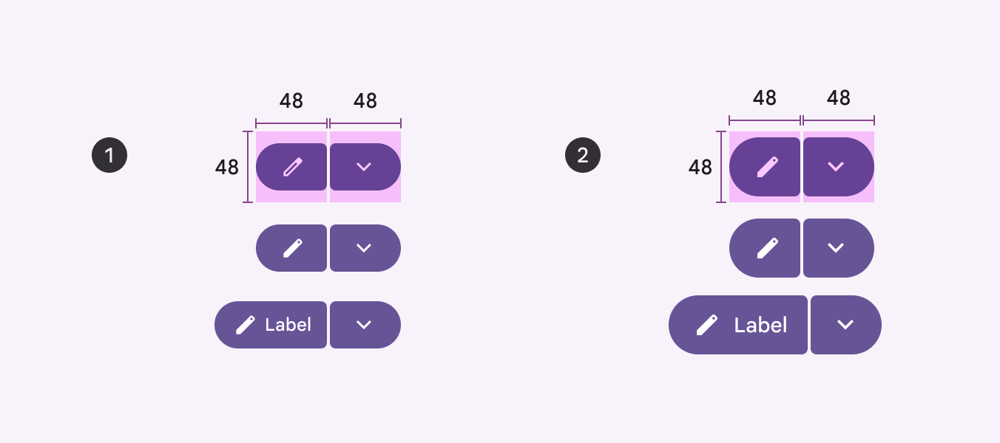
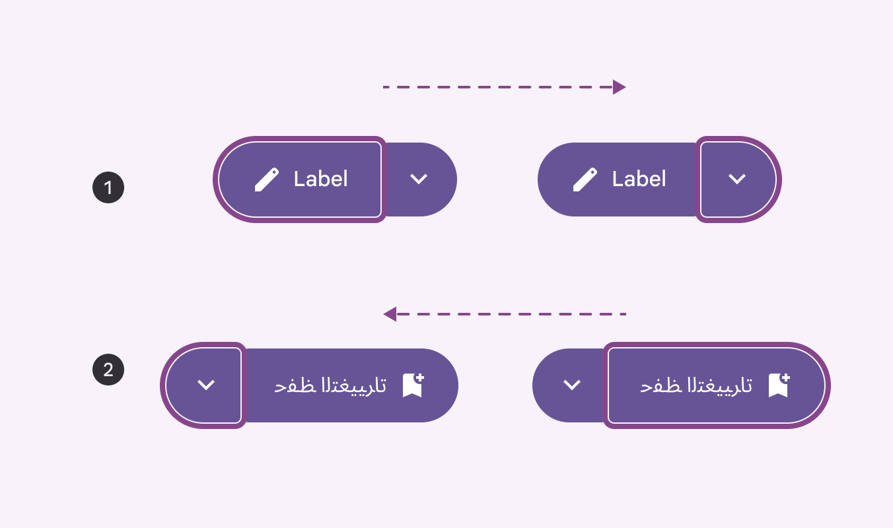
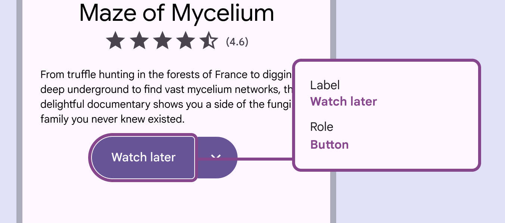

# Split buttons

Split buttons open a menu to give people more options related to an action

## Use cases

People should be able to do the following using assistive technology:

- Navigate to each button and interact with them
- Navigate to any element opened by the trailing button
- Understand the current selection state of the button

## Interaction & style

Each button in the split button needs a minimum target area of 48x48dp. Extra small and small split buttons are shorter than 48dp, so the target areas around them need to be at least 48dp tall.

Target areas should be at least 48x48dp 

1. Extra small
2. Small

## Initial focus

Focus should land on the leading button then move to the trailing button. This can depend on the operating system’s settings.

1. Left to right
2. Right to left

## Keyboard navigation

| Keys
 | Actions
 |
| --- | --- |
| Tab | Navigate between buttons |
| Space or enter | Activate focused button |

## Labeling elements

The accessibility label for the leading button is the same as buttons.

Leading buttons should have the same labels as common buttons

The trailing icon button should have an extra state or similar label indicating that the menu is expanded or collapsed. Label the button to clearly indicate that there are more options. The label of the secondary button should indicate that it provides additional choices related to the action of the main button. For instance, if the main button says "Watch later," the secondary button should be something like "More watch options."

Label the opened menu according to the [menu accessibility guidance](/m3/pages/menus/accessibility/).

Trailing buttons should communicate the state of the menu and that more options are available

