# Split buttons

Split buttons open a menu to give people more options related to an action

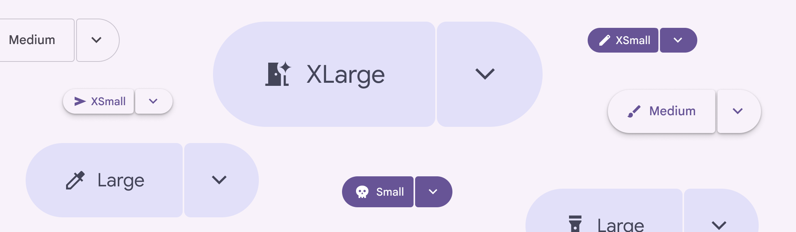

Split buttons come in many sizes and colors

## Usage

Split buttons are used to add a Menus display a list of choices on a temporary surface. More on menus [More on menus](/m3/pages/menus/overview) of actions alongside a main action. This reduces visual complexity by hiding extra options. Split buttons work well alone or alongside common buttons [More on buttons](/m3/pages/common-buttons/overview) and icon buttons [More on icon buttons](/m3/pages/icon-buttons/overview).

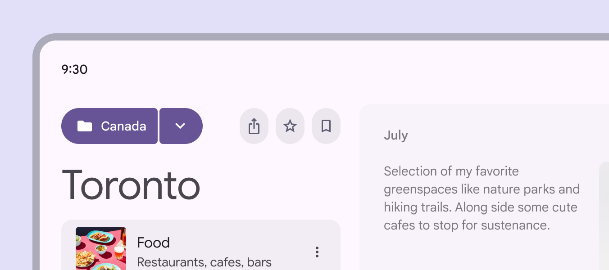

Split buttons on their own can grab attention

Split buttons have five recommended sizes. These sizes match the sizes offered on buttons and icon buttons:

- Extra small
- Small (default)
- Medium
- Large
- Extra large

Scale up the split button in large window sizes, or to create more emphasis in smaller windows.

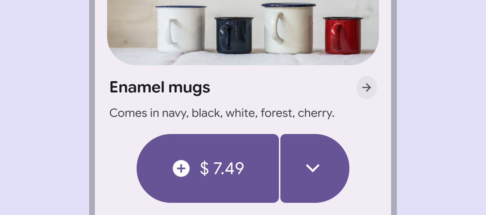

Using large split buttons on small screens can add extra emphasis for hero moments

Split buttons can be used alongside other buttons and button groups.

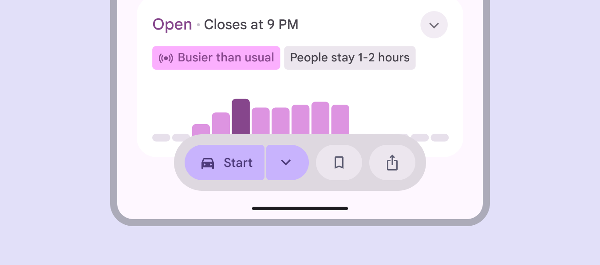

Split buttons work harmoniously with regular buttons

Split buttons can be of different sizes from other buttons on the page, especially since they take up more space.

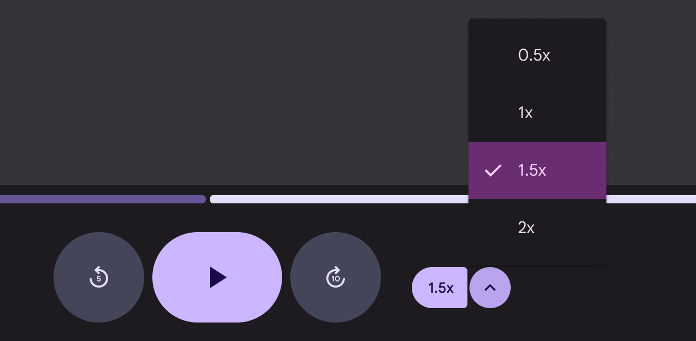

The most prominent controls can be larger while secondary controls in a split button can be smaller

The split button typically opens a Menus display a list of choices on a temporary surface. More on menus [More on menus](/m3/pages/menus/overview), but can be customized to open other components like cards [More on cards](/m3/pages/cards/overview).

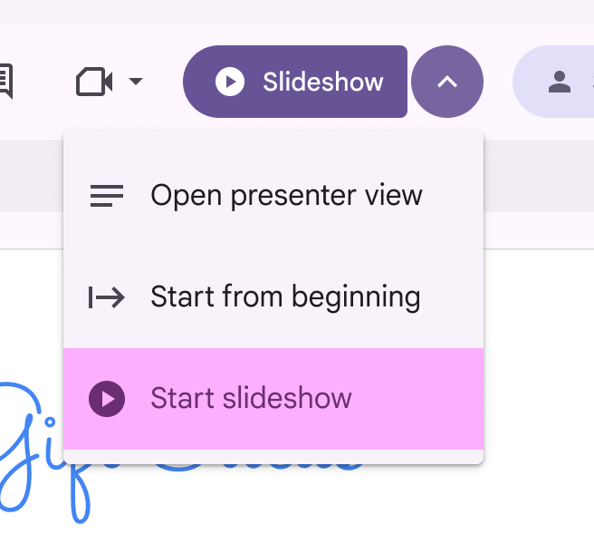

check Do

Open a menu from a split button

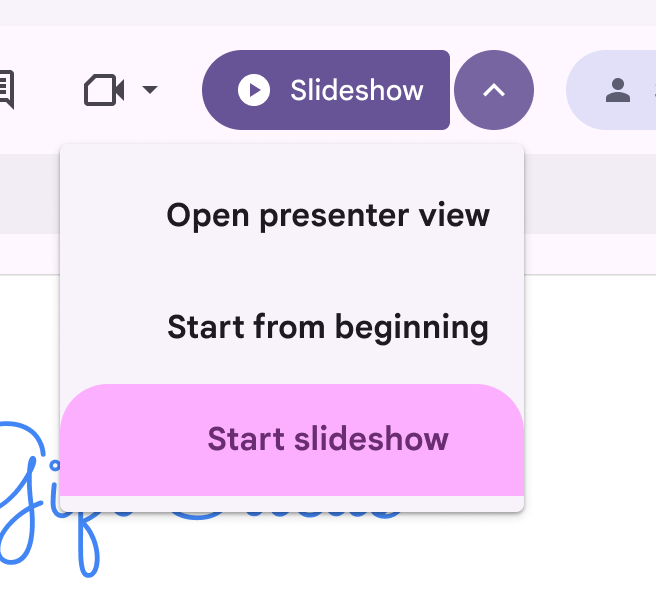

close Don’t

Avoid modifying the menu in unusual ways

## Anatomy

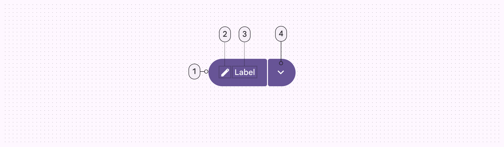

1. Leading button
2. Icon
3. Label text
4. Trailing button

The leading button should be brief, just one or two words, with an icon that best matches the action. The trailing button should always have the expand and collapse icon since it rotates when selected. Avoid modifying the icon.

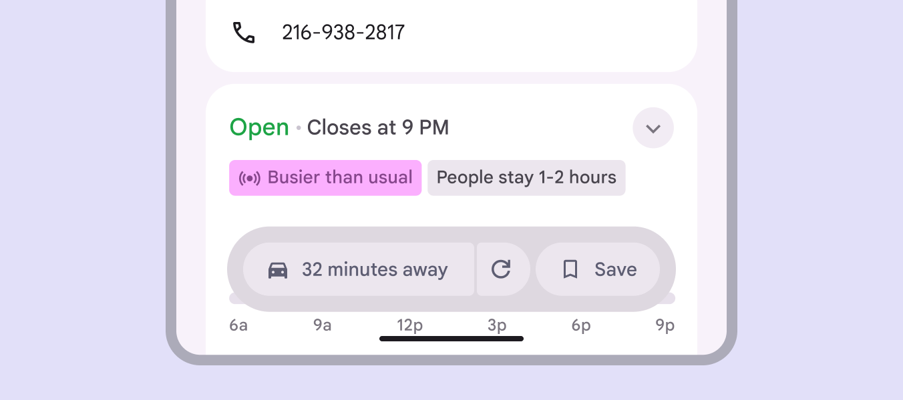

close Don’t

Avoid using very long labels or changing the trailing icon

In right-to-left languages, the component layout is mirrored.

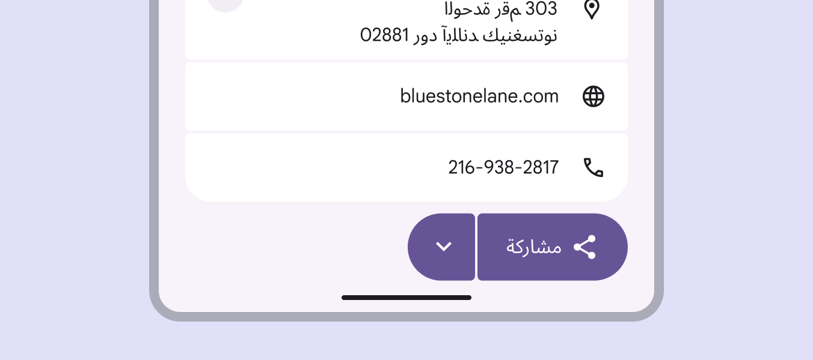

Split buttons mirror the order of elements in right-to-left languages

## Behavior

The split button uses the standard motion scheme (not the expressive motion scheme) when rotating the menu button. The menu button rotates inwards 180° when opened and closed. Selecting the menu button rotates the icon inwards and applies shape morph

### Menu placement

When using the split button with a Menus display a list of choices on a temporary surface. More on menus [More on menus](/m3/pages/menus/overview), align the menu with the trailing button when possible.

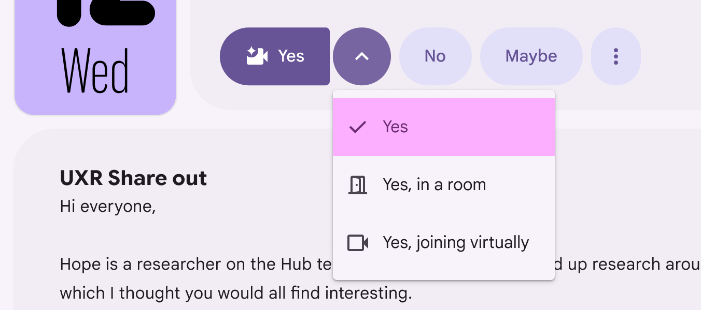

Align the menu with the trailing button

If there’s not enough room, align the menu to one of the sides of the button.

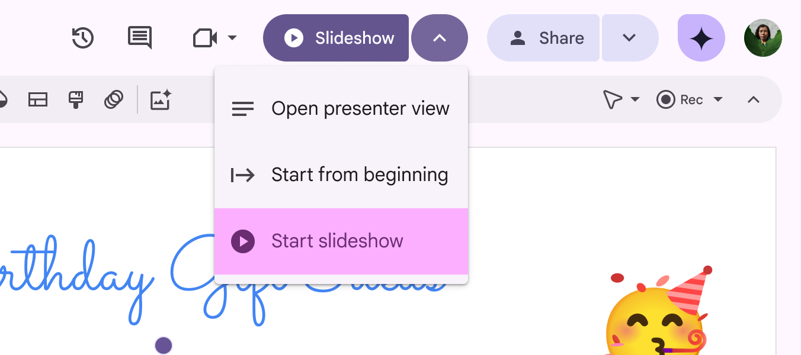

If not possible, align the menu to the side of the leading or trailing button

Depending on window size, scroll position, and other factors, the menu may need to appear elsewhere around the button. Always try to align it with one of the edges of the button. The menu should be 4dp from the split button.

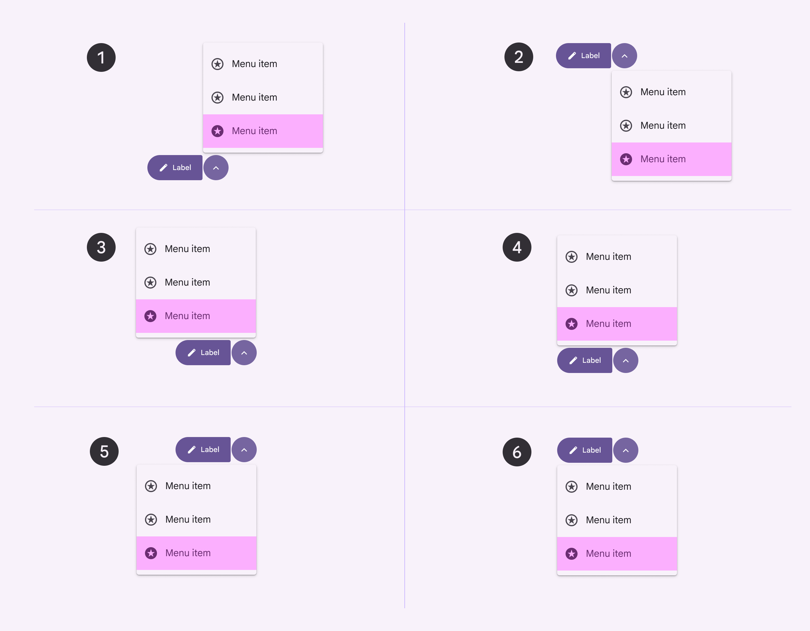

1. Top aligned to trailing button
2. Bottom aligned to trailing button
3. Top right-aligned
4. Top left-aligned
5. Bottom right-aligned
6. Bottom left-aligned

