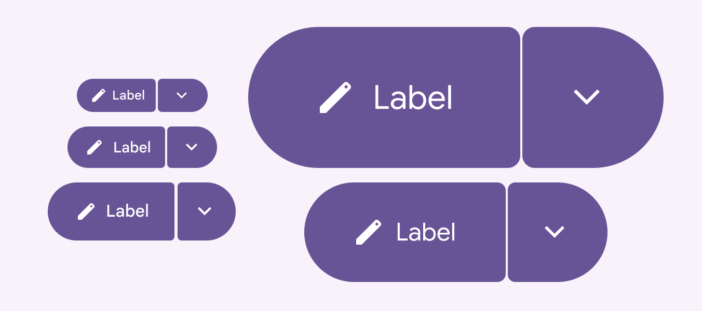

# Split buttons

Split buttons open a menu to give people more options related to an action

- Use to show an action with a menu of related actions
- Same size range as buttons and icon buttons: XS, S, M, L, XL

Split buttons are made of a common button and a menu icon button

## Availability & resources

| Type | Resource | Status |
| --- | --- | --- |
| Design | [Design Kit (Figma)](https://www.figma.com/community/file/1035203688168086460) | Available |
| Implementation | [Jetpack Compose: Expressive](https://developer.android.com/reference/kotlin/androidx/compose/material3/package-summary#SplitButtonLayout\(kotlin.Function0,kotlin.Function0,androidx.compose.ui.Modifier,androidx.compose.ui.unit.Dp\)) | Available |
| Implementation |  | Available |

## M3 Expressive update

**May 2025**

The split button has a separate menu button that spins and changes shape when activated. It can be used alongside other buttons of the same size. [More on M3 Expressive](https://m3.material.io/blog/building-with-m3-expressive)

New component added to catalog. Sizes:

- Extra small
- Small
- Medium
- Large
- Extra large

Color styles:

- Elevated
- Filled
- Tonal
- Outlined

Split buttons have the same five recommended sizes as label and icon buttons

