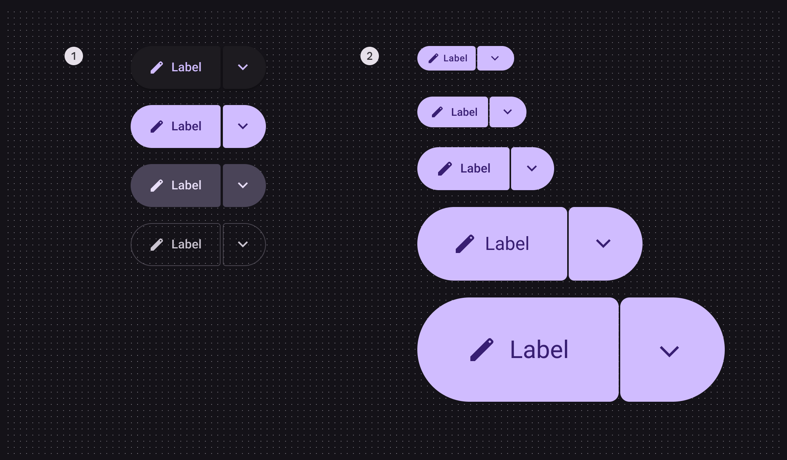
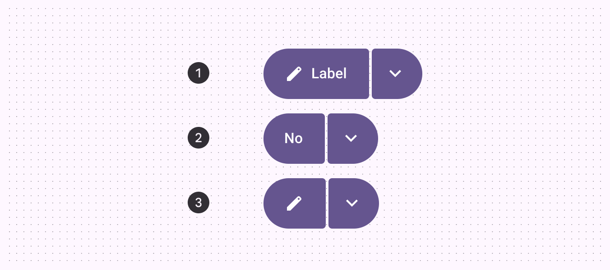
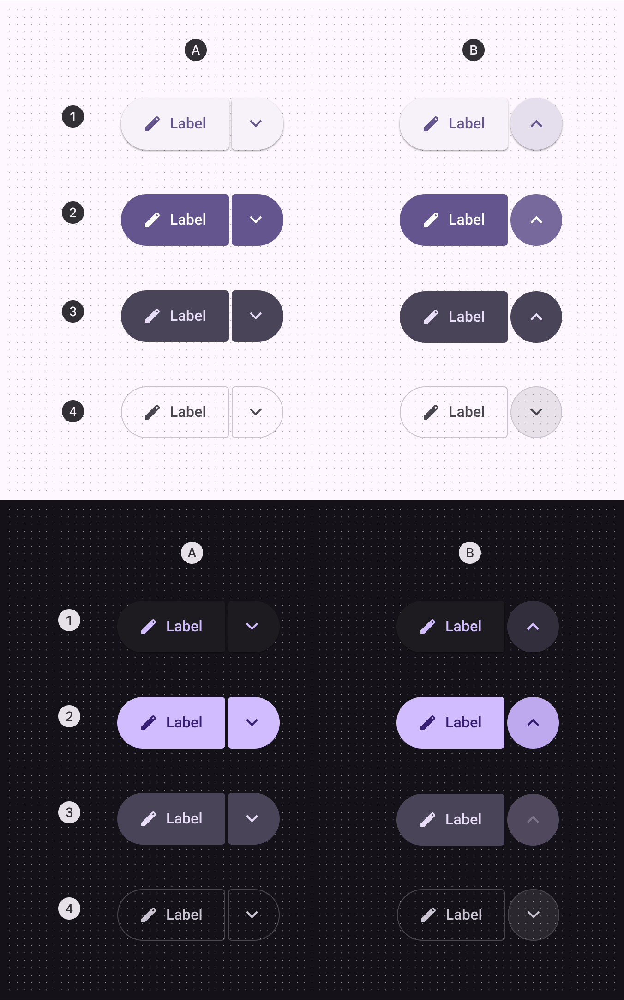
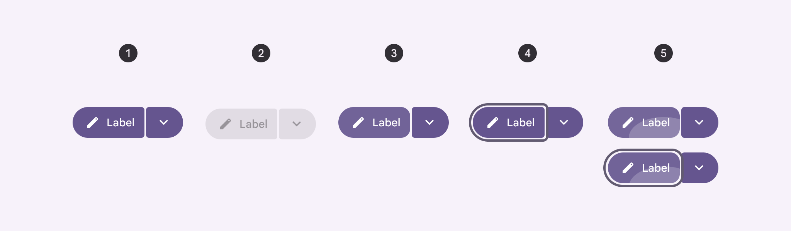
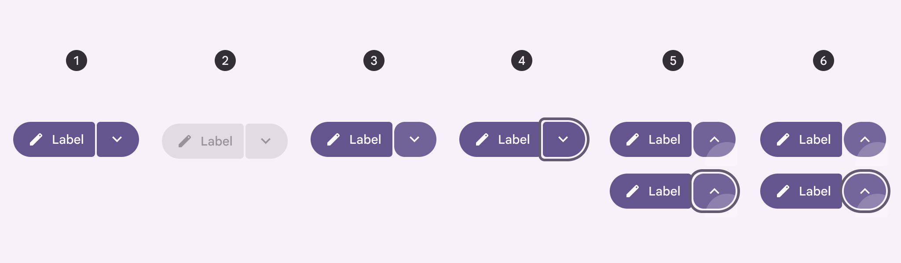
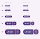
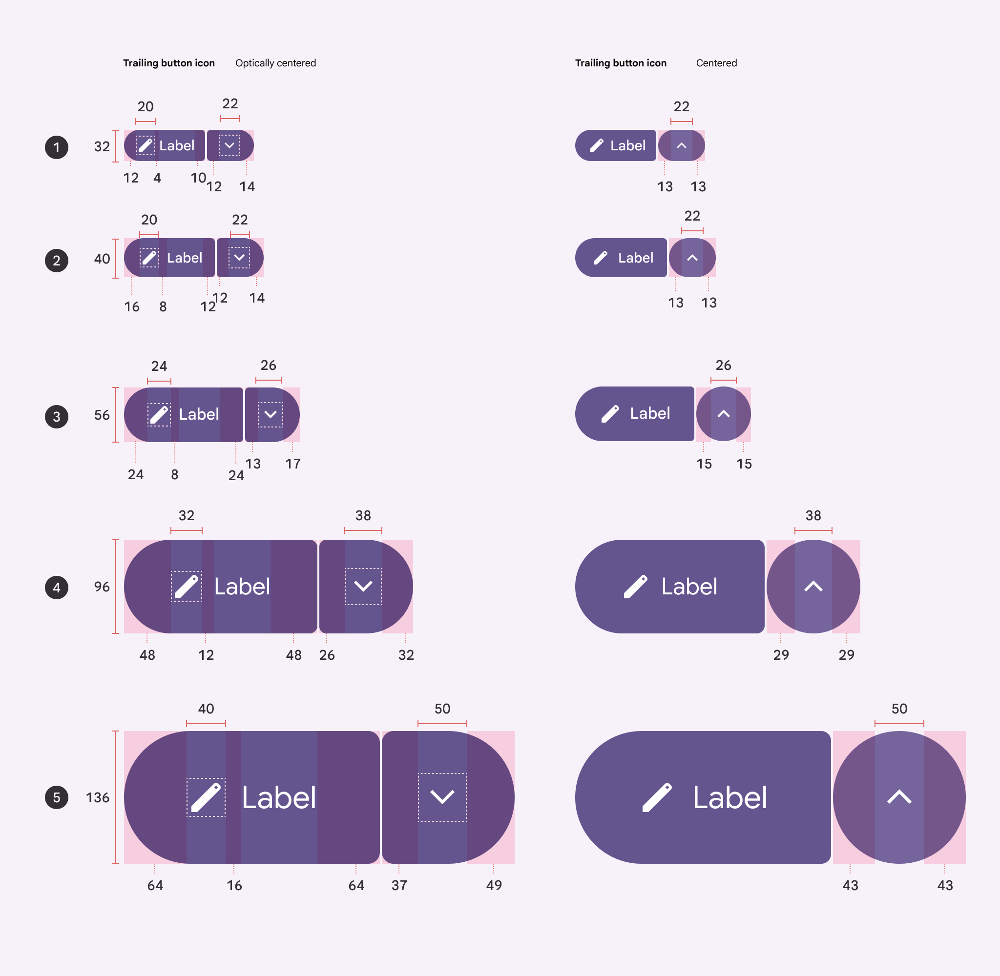
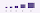

# Split buttons

Split buttons open a menu to give people more options related to an action

## Variants


|
Variant

 |

M3

 |

M3 Expressive

 |
| --- | --- | --- |
|

Split button

 |

\--

 |

Available

 |

## Configurations



1. Color configurations: Elevated, filled, tonal, outlined
2. Size configurations: XS, S, M, L, XL

|
Category

 |

Configuration

 |

M3

 |

M3 Expressive

 |
| --- | --- | --- | --- |
|

Size

 |

XS, S, M, L, XL

 |

\--

 |

Available

 |
|

Color

 |

Elevated, filled, tonal, outlined

 |

\--

 |

Available

 |

## Tokens & specs

Use the table's menu to select a token set. Split button token sets are organized by size. [Learn about design tokens](/m3/pages/design-tokens/overview/)

```
Split button - Size - XsmallTokenValueSplit button xsmall container heightmd.comp.split-button.xsmall.container.height32dpSplit button xsmall between spacemd.comp.split-button.xsmall.between-space2dpSplit button xsmall container shapemd.comp.split-button.xsmall.container.shapeSplit button xsmall inner corner sizemd.comp.split-button.xsmall.inner-corner.corner-size4dpSplit button xsmall outer corner sizemd.comp.split-button.xsmall.outer-corner.corner-size50%Split button xsmall leading button leading spacemd.comp.split-button.xsmall.leading-button.leading-space12dpSplit button xsmall leading button trailing spacemd.comp.split-button.xsmall.leading-button.trailing-space10dpSplit button xsmall trailing button icon sizemd.comp.split-button.xsmall.trailing-button.icon.size22dpSplit button xsmall trailing button leading spacemd.comp.split-button.xsmall.trailing-button.leading-space13dpSplit button xsmall trailing button trailing spacemd.comp.split-button.xsmall.trailing-button.trailing-space13dpSplit button xsmall inner corner hovered sizemd.comp.split-button.xsmall.inner-corner.hovered.corner-size8dpSplit button xsmall inner corner pressed sizemd.comp.split-button.xsmall.inner-corner.pressed.corner-size8dpSplit button xsmall trailing button inner corner selected sizemd.comp.split-button.xsmall.trailing-button.inner-corner.selected.corner-size50%
```

```
Split button - Size - XsmallTokenValueSplit button xsmall container heightmd.comp.split-button.xsmall.container.height32dpSplit button xsmall between spacemd.comp.split-button.xsmall.between-space2dpSplit button xsmall container shapemd.comp.split-button.xsmall.container.shapeSplit button xsmall inner corner sizemd.comp.split-button.xsmall.inner-corner.corner-size4dpSplit button xsmall outer corner sizemd.comp.split-button.xsmall.outer-corner.corner-size50%Split button xsmall leading button leading spacemd.comp.split-button.xsmall.leading-button.leading-space12dpSplit button xsmall leading button trailing spacemd.comp.split-button.xsmall.leading-button.trailing-space10dpSplit button xsmall trailing button icon sizemd.comp.split-button.xsmall.trailing-button.icon.size22dpSplit button xsmall trailing button leading spacemd.comp.split-button.xsmall.trailing-button.leading-space13dpSplit button xsmall trailing button trailing spacemd.comp.split-button.xsmall.trailing-button.trailing-space13dpSplit button xsmall inner corner hovered sizemd.comp.split-button.xsmall.inner-corner.hovered.corner-size8dpSplit button xsmall inner corner pressed sizemd.comp.split-button.xsmall.inner-corner.pressed.corner-size8dpSplit button xsmall trailing button inner corner selected sizemd.comp.split-button.xsmall.trailing-button.inner-corner.selected.corner-size50%
```

```
Split button - Size - XsmallTokenValueSplit button xsmall container heightmd.comp.split-button.xsmall.container.height32dpSplit button xsmall between spacemd.comp.split-button.xsmall.between-space2dpSplit button xsmall container shapemd.comp.split-button.xsmall.container.shapeSplit button xsmall inner corner sizemd.comp.split-button.xsmall.inner-corner.corner-size4dpSplit button xsmall outer corner sizemd.comp.split-button.xsmall.outer-corner.corner-size50%Split button xsmall leading button leading spacemd.comp.split-button.xsmall.leading-button.leading-space12dpSplit button xsmall leading button trailing spacemd.comp.split-button.xsmall.leading-button.trailing-space10dpSplit button xsmall trailing button icon sizemd.comp.split-button.xsmall.trailing-button.icon.size22dpSplit button xsmall trailing button leading spacemd.comp.split-button.xsmall.trailing-button.leading-space13dpSplit button xsmall trailing button trailing spacemd.comp.split-button.xsmall.trailing-button.trailing-space13dpSplit button xsmall inner corner hovered sizemd.comp.split-button.xsmall.inner-corner.hovered.corner-size8dpSplit button xsmall inner corner pressed sizemd.comp.split-button.xsmall.inner-corner.pressed.corner-size8dpSplit button xsmall trailing button inner corner selected sizemd.comp.split-button.xsmall.trailing-button.inner-corner.selected.corner-size50%
```

```
Split button - Size - Xsmall
```

```
Split button - Size - Xsmall
```

```
Split button - Size - Xsmall
```

```
Split button - Size - Xsmall
```

Split button - Size - Xsmall

Token

Value

Split button xsmall container height

md.comp.split-button.xsmall.container.height

32dp

Split button xsmall between space

md.comp.split-button.xsmall.between-space

2dp

Split button xsmall container shape

md.comp.split-button.xsmall.container.shape

Split button xsmall inner corner size

md.comp.split-button.xsmall.inner-corner.corner-size

4dp

Split button xsmall outer corner size

md.comp.split-button.xsmall.outer-corner.corner-size

50%

Split button xsmall leading button leading space

md.comp.split-button.xsmall.leading-button.leading-space

12dp

Split button xsmall leading button trailing space

md.comp.split-button.xsmall.leading-button.trailing-space

10dp

Split button xsmall trailing button icon size

md.comp.split-button.xsmall.trailing-button.icon.size

22dp

Split button xsmall trailing button leading space

md.comp.split-button.xsmall.trailing-button.leading-space

13dp

Split button xsmall trailing button trailing space

md.comp.split-button.xsmall.trailing-button.trailing-space

13dp

Split button xsmall inner corner hovered size

md.comp.split-button.xsmall.inner-corner.hovered.corner-size

8dp

Split button xsmall inner corner pressed size

md.comp.split-button.xsmall.inner-corner.pressed.corner-size

8dp

Split button xsmall trailing button inner corner selected size

md.comp.split-button.xsmall.trailing-button.inner-corner.selected.corner-size

50%

## Anatomy


1. Leading button
2. Icon
3. Label text
4. Trailing button

The leading button in split buttons can have an icon, label text, or both. The trailing button should always have a menu icon.



1. Label + icon
2. Label
3. Icon

## Color

Color values are implemented through design tokens [More on tokens](/m3/pages/design-tokens/overview). For designers, this means working with color values that correspond with tokens; in implementation, a color value will be a token that references a value. Split buttons use the same color schemes as standard buttons [More on buttons](/m3/pages/common-buttons/overview). However, unlike toggle buttons, the split button color doesn’t change when selected—only a state layer is applied. Split buttons use the same colors and state layers as buttons, shown in the following token module. [Go to buttons](/m3/pages/common-buttons/overview) for more details.



A: Unselected, B: Selected trailing icon

1. Elevated
2. Filled
3. Tonal
4. Outlined

```
Button - Color - Elevated
```

```
Button - Color - Elevated
```

```
Button - Color - Elevated
```

```
Button - Color - Elevated
```

Button - Color - Elevated

Token

Default, Light

Enabled

Disabled

Hovered

Focused

Pressed

## States [More on states](/m3/pages/interaction-states/overview) are visual representations used to communicate the status of a component or an interactive element. Split button states use the same colors and state layers as buttons [More on buttons](/m3/pages/common-buttons/specs) and icon buttons [More on icon buttons](/m3/pages/icon-buttons/specs). Go to those specs for details. 

### Leading button shape

The inner corners change shape for hovered, focused, and pressed states.



1. Enabled
2. Disabled
3. Hovered
4. Focused
5. Pressed, pressed with focus

### Trailing button shape

The inner corners change shape for hovered, focused, and pressed states, and the icon becomes centered when selected.



1. Enabled
2. Disabled
3. Hovered
4. Focused
5. Pressed, pressed with focus
6. Selected, selected with focus

## Measurements

Text and icons are optically centered when the buttons are asymmetrical. They’re centered normally when symmetrical.



Menu icon offset when unselected:

1. XS: -1dp from center
2. S: -1dp from center
3. M: -2dp from center
4. L: -3dp from center
5. XL: -6dp from center

The inner corner radius changes depending on button sizing. The space should always be 2dp.



1. Extra small 4dp
2. Small 4dp
3. Medium 4dp
4. Large 8dp
5. Extra large 12dp

