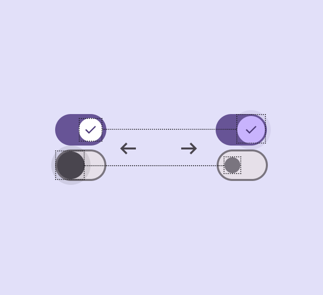
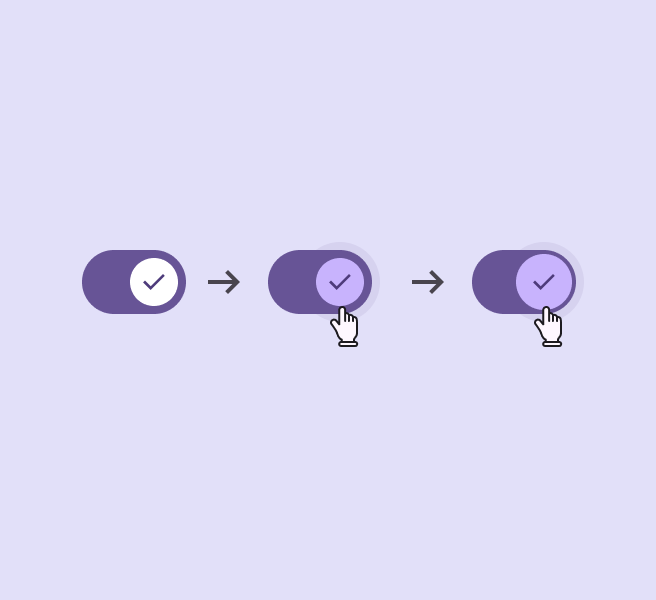
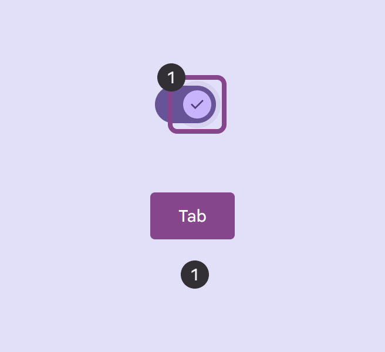
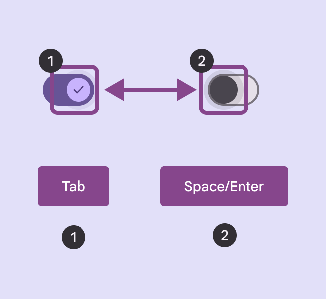
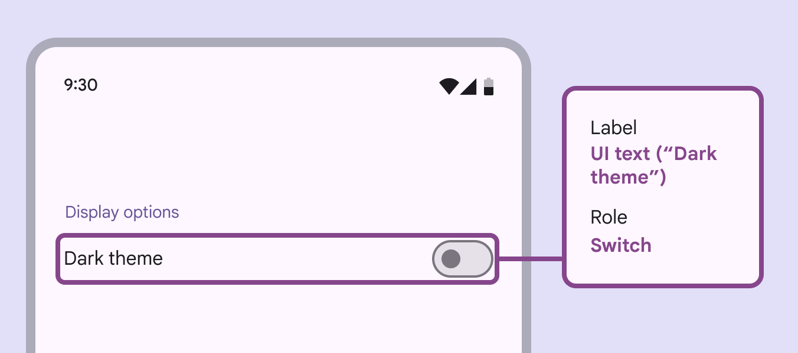
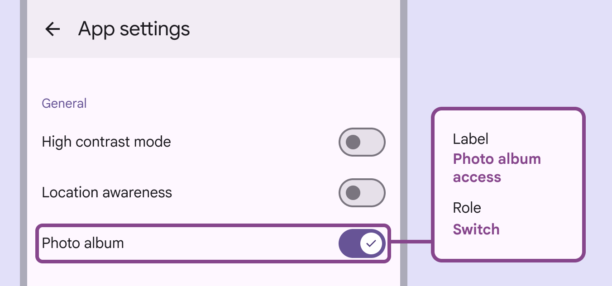

# Switch

Switches toggle the selection of an item on and off

## Use cases

People should be able to do the following with assistive technology:

- Navigate to a switch with a keyboard or switch input
- Toggle the switch on and off
- Get appropriate feedback based on input type documented under [Interaction & style](/m3/pages/switch/accessibility#c0e9fae1-48df-428b-b028-4f7be071ada3)

## Interaction & style

The switch handle increases in size to indicate interactivity for both touch and cursor control interactions.

**Touch**
When tapped or dragged [More on dragged state](/m3/pages/interaction-states/applying-states#c97582c4-5fef-42ce-9c34-71f8dcc5b8ad), the handle size grows, providing interaction feedback.

**Cursor**
When hovered (in both on and off states [More on states](/m3/pages/interaction-states/overview)), the hover [More on hover state](/m3/pages/interaction-states/applying-states#71c347c2-dd75-485b-892e-04d2900bd844) area grows, providing a visual cue that the handle is interactive. When clicked, the handle size grows.

Touch: Tap, Drag

Cursor: Hover, Click

### Avoid applying density by default

Don't apply density to switches by default — this lowers their targets below our best practice of 48x48 CSS pixels. Instead, give people a way to choose a higher density, like selecting a denser layout or changing the theme. To ensure that this density setting can easily be reverted when it's active, keep all targets to change it at a minimum 48x48 CSS pixels each.

## Initial focus

Initial focus lands directly on the switch’s handle, since it’s the primary interactive element of the component. 

Focus lands on the switch handle

The switch is toggled using **Space** or **Enter**

## Keyboard navigation

| Keys | Actions |
| --- | --- |
| **Tab** | Focus lands on the switch handle |
| **Space** or **Enter** | Toggles the handle on and off |

## Labeling elements

The accessibility [More on accessibility](/m3/pages/overview) label for a switch uses the adjacent label text if implemented correctly. Assistive tech such as a screen reader will read the UI text followed by the component’s role.

A switch’s accessibility label can incorporate its adjacent UI text

When the visible UI text is ambiguous, accessibility labels need to be more descriptive. For example, a switch visibly labelled **Photo album** would benefit from additional information to clarify the switch’s function. Consider making the adjacent label text more descriptive when possible. This reduces the need for different accessibility text.

While the visible label text reads **Photo album**, the accessibility label for this switch clarifies its function: **Photo album access**

