# Switch

Switches toggle the selection of an item on and off

Switches change settings and other options immediately

## Usage

Switches are best used to adjust settings and other standalone options. They make a binary selection [More on selection](/m3/pages/selection):

- On and off
- True and false

The effects of a switch should start immediately, without needing to save. Use a switch to turn an option on and off

Use switches to:

- Toggle a single item on or off
- Immediately activate or deactivate something

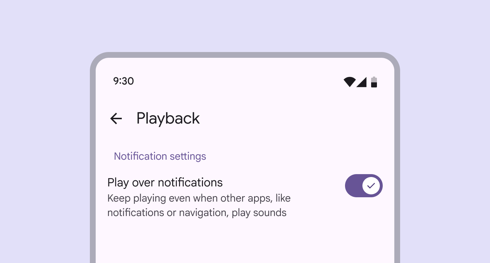

Switches are commonly used on mobile to turn settings on or off

Switches control binary options, not opposing ones. A binary option represents a single selection [More on selection](/m3/pages/selection) that's either on or off. Opposing options are when only one option in a set can be selected at a time, like a list [More on lists](/m3/pages/lists/overview) or map view. Use a connected button group [More on button groups](/m3/pages/button-groups/overview) instead.

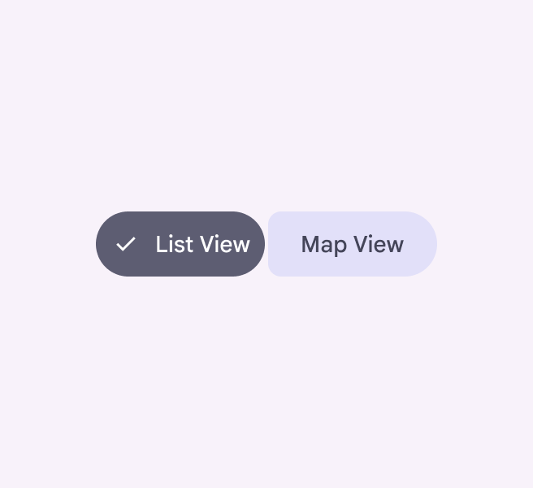

check Do

Use a connected button group to choose between opposing options

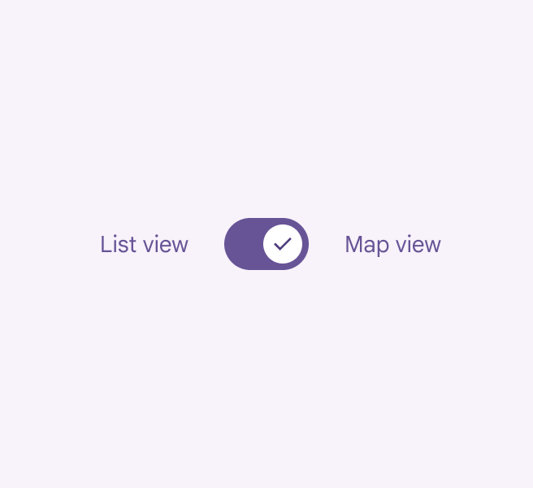

close Don’t

Avoid using switches to toggle between opposing options

### Alternate selection controls

Checkboxes [More on checkboxes](/m3/pages/checkbox/overview), radio buttons [More on radio buttons](/m3/pages/radio-button/overview), and switches are the three main kinds of selection controls. They help people make choices, like selecting options or turning settings on and off. Use checkboxes to select multiple related options in a list. Use radio buttons to select a single option in a list. Use switches to select standalone or more verbose options in a list, like settings.

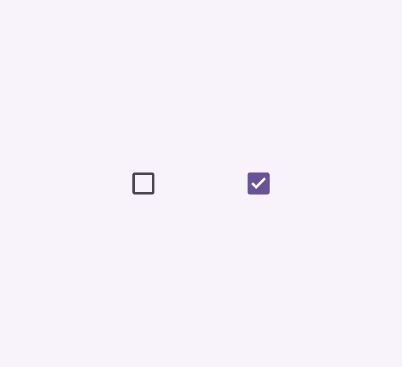

Checkboxes

Radio buttons

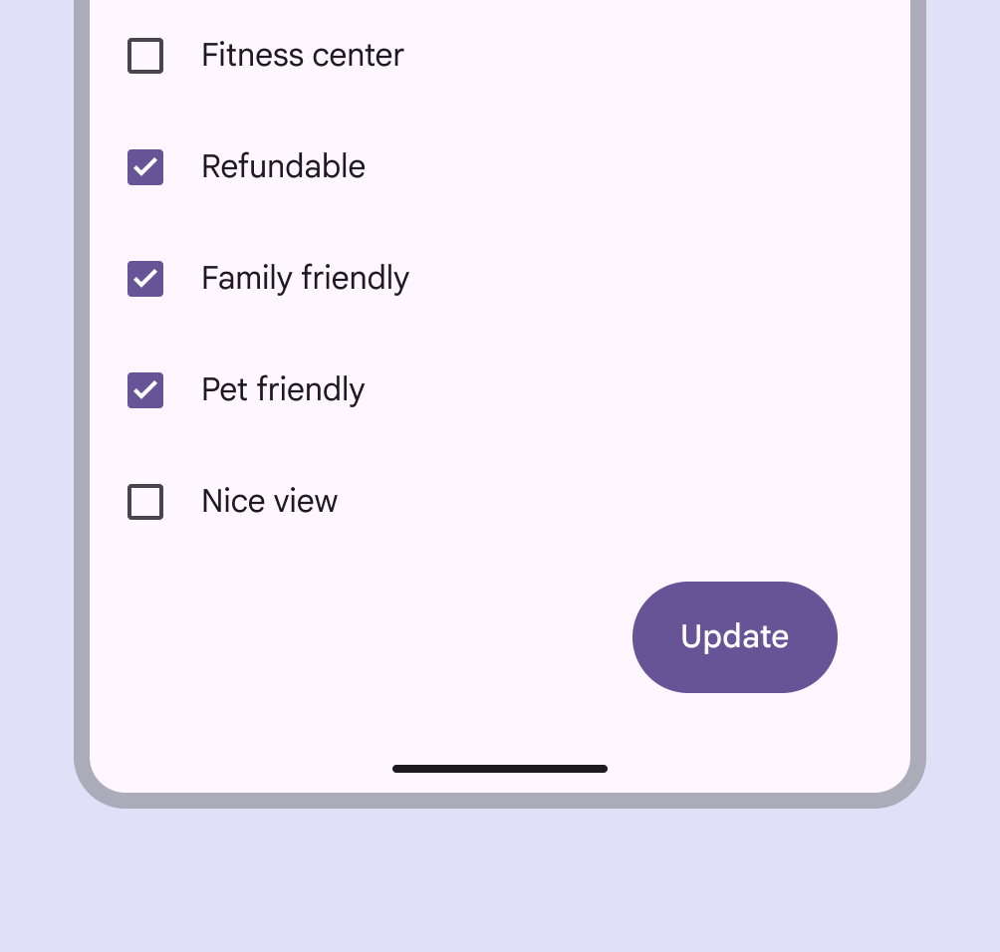

check Do

Use checkboxes (not switches) to let people select one or more options from a list

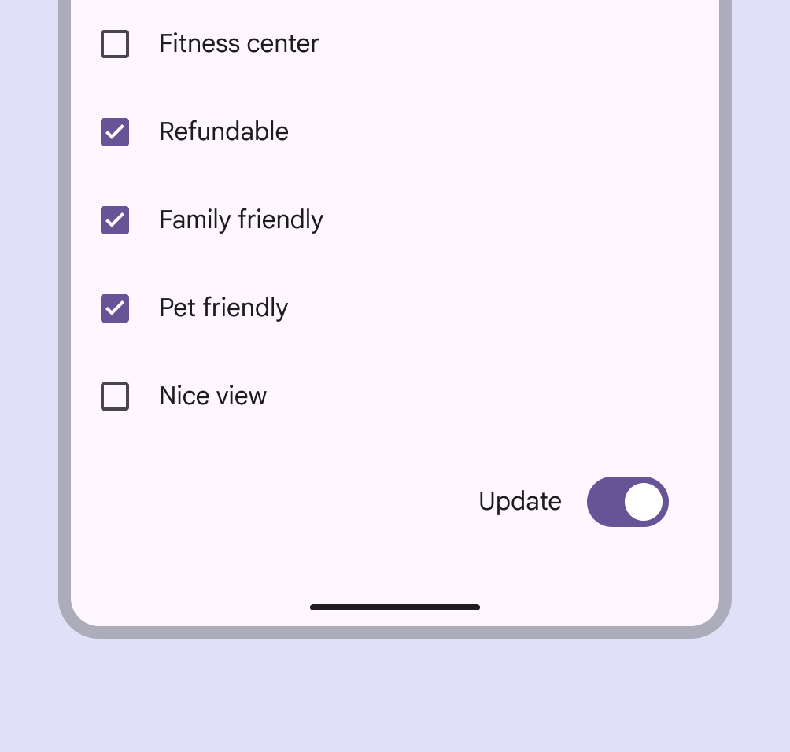

close Don’t

A switch can't replace a button. People expect a call to action to be a button, not a switch.

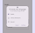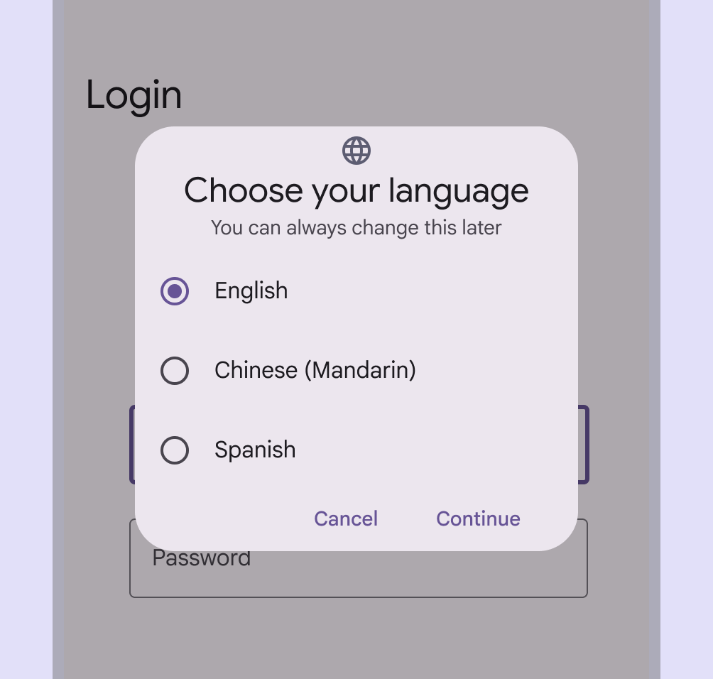

check Do

Use radio buttons (not switches) when only one item can be selected from a list

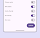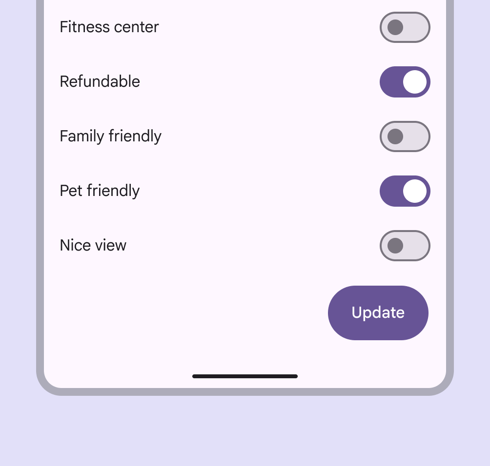

close Don’t

Avoid using a switch to select multiple options that require people to save. Switches should be immediate. Use checkboxes instead.

## Anatomy

1. Track
2. Handle
3. Icon (optional)

### Icon (optional)

The switch handle can contain an optional icon. The icon within the handle should always communicate the switch's selection

Icons can be used to visually emphasize the switch’s selection [More on selection](/m3/pages/selection). The icon’s meaning should be clear and unambiguous to help the people understand whether switch is on or off.

check Do

Use icons that clearly communicate whether the switch is on or off, such as an X and a checkmark

close Don’t

Avoid using more ambiguous or non-binary icons, such as a moon or edit icon

### Label text

Switches should always be paired with an inline label describing what the switch controls when selected.

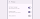

check Do

Keep labels short and direct. A label should describe what the control does when the switch is on.

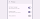

close Don’t

Don't add label text into the switch; the font size would be too small to be accessible. Use an appropriate icon instead.

## Placement

Switches are often arranged in stacked layouts [More on layout](/m3/pages/understanding-layout/overview).

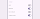

Settings screens are common places to use switches

## Behavior

A switch is successfully toggled when the handle slides to the other side of the track after an interaction. When selected, the switch handle slides to the opposite end of the track

When a person toggles a switch, its handle size changes and the corresponding action takes effect immediately. The **on** state of the switch is indicated by a larger handle size

