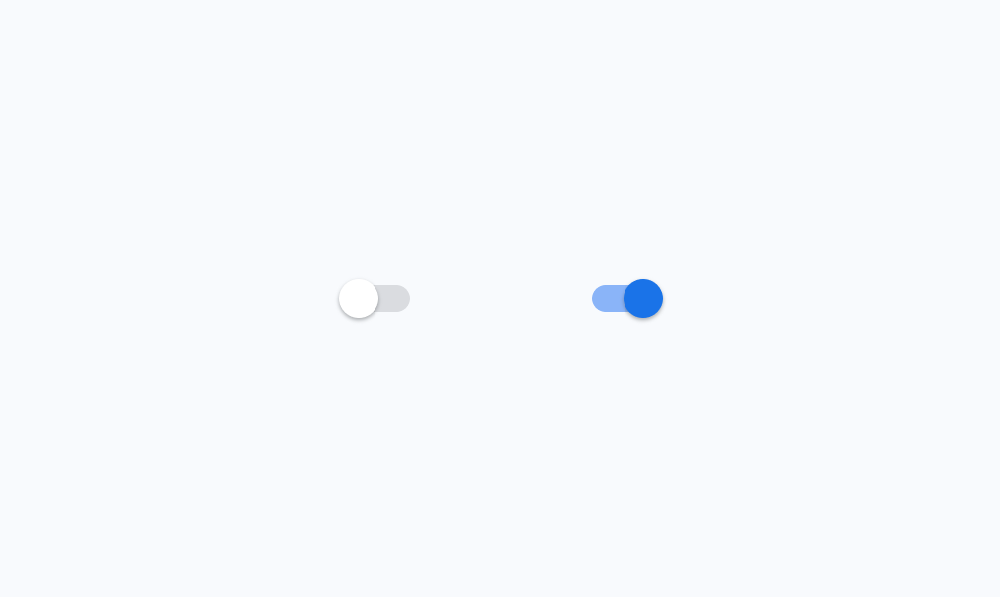
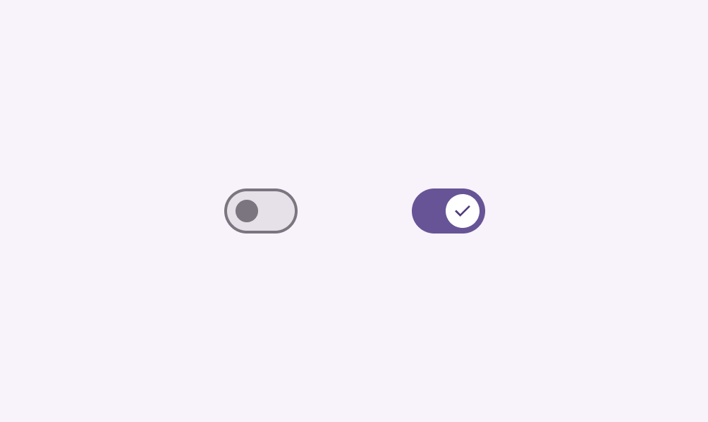

# Switch

Switches toggle the selection of an item on and off

- Use switches (not radio buttons [More on radio buttons](/m3/pages/radio-button/overview)) if the items in a list [More on lists](/m3/pages/lists/overview) can be independently controlled
- Switches are the best way to let people adjust settings
- Make sure the switch’s selection [More on selection](/m3/pages/selection) (on or off) is visible at a glance

Switches can be toggled on and off

## Availability & resources

| Type | Resource | Status |
| --- | --- | --- |
| Design | [Design Kit (Figma)](https://www.figma.com/community/file/1035203688168086460) | Available |
| Implementation |  | Available |
| Implementation | [Jetpack Compose](https://developer.android.com/develop/ui/compose/components/switch) | Available |
| Implementation |  | Available |
| Implementation |  | Available |

## Differences from M2

- Accessibility: Visual presentation is more accessible
- Color: New color mappings meet Material's non-text-contrast requirements in addition to compatibility with dynamic color [More on dynamic color](/m3/pages/dynamic/choosing-a-source)
- Icons: Ability to have an optional icon within the switch handle
- Layout: Track is taller and wider

M2: Switches have a circular handle that extends beyond the edge of the track

M3: Switches have a taller and wider track, new color mappings, and the ability to show an icon in the handle

