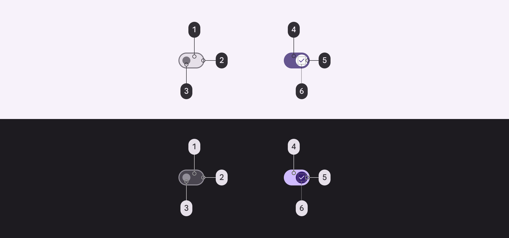
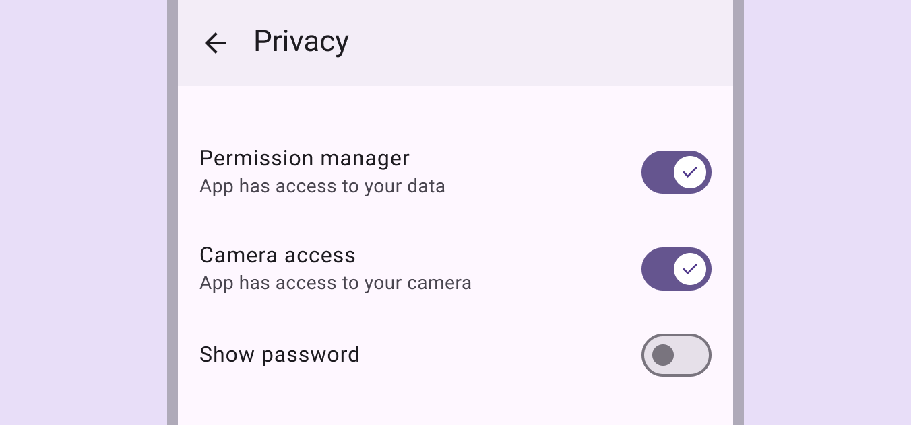
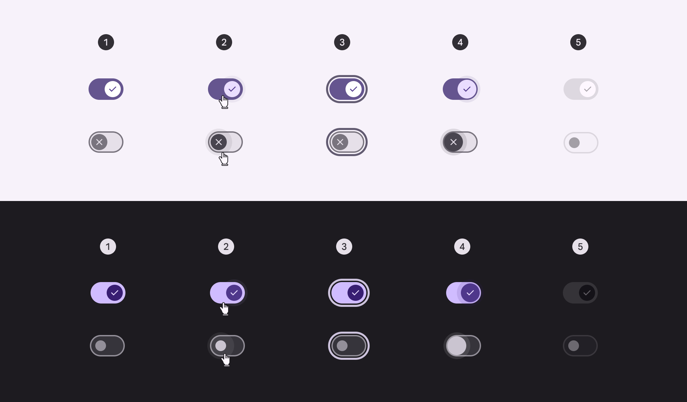
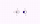
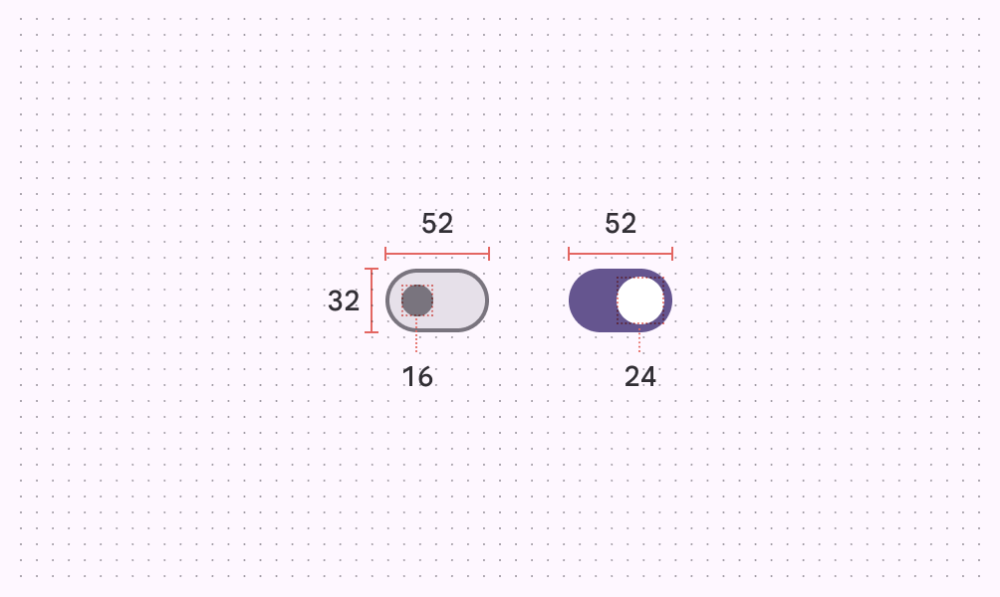
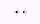
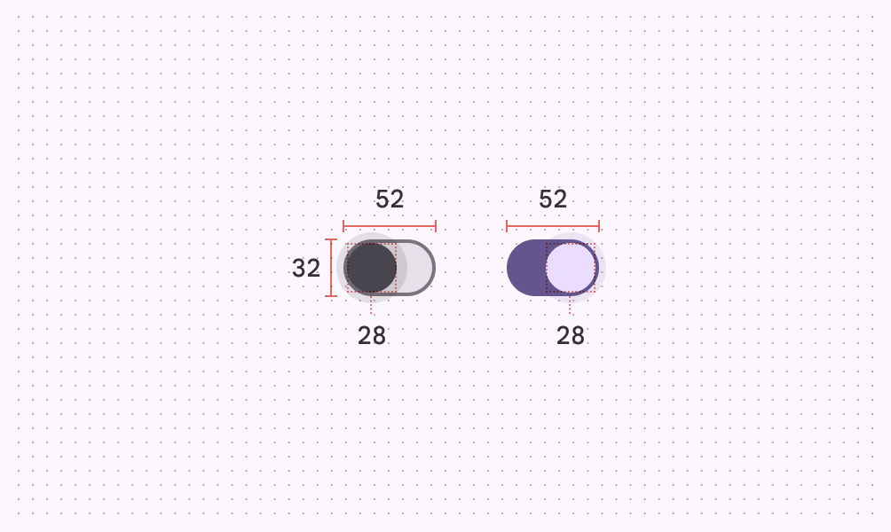
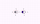
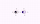
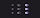

# Switch

Switches toggle the selection of an item on and off

1. Track
2. Handle (formerly "thumb")
3. Icon

## Tokens & specs

Browse the component elements, attributes, tokens, and their values. [Learn more about design tokens](/m3/pages/design-tokens/overview)

Switch

Token

Default, Light

Enabled

Disabled

Hovered

Focused

Pressed (ripple)

## Color

Color values are implemented through design tokens [More on tokens](/m3/pages/design-tokens/overview). For design, this means working with color values that correspond with tokens. For implementation, a color value will be a token that references a value. [Learn more about design tokens](/m3/pages/design-tokens/overview/)

Switch color roles used for light and dark themes:

1. Surface container highest
2. Outline
3. Outline
4. Primary
5. On primary
6. On primary container

### Adjacent text label color

Use the color role [More on color roles](/m3/pages/color-roles) **on surface** for adjacent text labels. This remains the same even if interacting with the label or component.

The text label uses **on surface**. Supporting text may use **on surface variant**.

## States [More on states](/m3/pages/interaction-states/overview) are visual representations used to communicate the status of a component or interactive element. [Learn more about interaction states](/m3/pages/interaction-states)

1. Enabled
2. Hovered
3. Focused
4. Pressed
5. Disabled

[State specs are in the token module above](/m3/pages/switch/specs#3708644e-b4d7-4237-bb0a-7afeeae4a9b0)

## Measurements

Switches without icons

Pressed switches without icons

Switches with icons

Pressed switches with icons

|
Element

 |

Attribute

 |

Value

 |
| --- | --- | --- |
|

Track

 |

Height

 |

32dp

 |
|

Width

 |

52dp

 |
|

Outline width

 |

2dp

 |
|

Shape

 |

[md.sys.shape.corner.full](/m3/pages/shape/corner-radius-scale#56e2bfb5-4bec-49bd-b3a3-bd822c8ab88e)

 |
|

Handle

 |

Height (unselected)

 |

16dp

 |
|

Height - with icon

 |

24dp

 |
|

Height (selected)

 |

24dp

 |
|

Height (pressed)

 |

28dp

 |
|

Width (unselected)

 |

16dp

 |
|

Width - with icon

 |

24dp

 |
|

Width (selected)

 |

24dp

 |
|

Width (pressed)

 |

28dp

 |
|

Shape

 |

[md.sys.shape.corner.full](/m3/pages/shape/corner-radius-scale#56e2bfb5-4bec-49bd-b3a3-bd822c8ab88e)

 |
|

State layer

 |

Size

 |

40dp

 |
|

Shape

 |

[md.sys.shape.corner.full](/m3/pages/shape/corner-radius-scale#56e2bfb5-4bec-49bd-b3a3-bd822c8ab88e)

 |
|

Target

 |

Size

 |

48dp

 |
|

Icon

 |

Size (selected)

 |

16dp

 |
|

Icon

 |

Size (unselected)

 |

16dp

 |

## Configurations

1. Without icons
2. Icon on selected switch
3. Icon on selected and unselected switch

