# Tabs

Tabs organize content across different screens and views

## Usage

Tabs organize groups of related content that are at the same level of hierarchy.

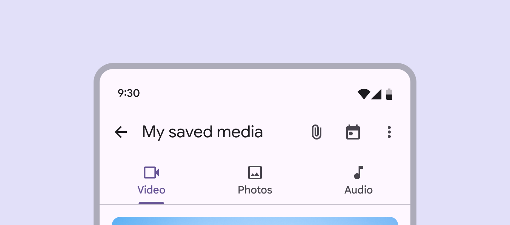

Tab labels can include icons and text. Text labels should be short. There are two variants of tabs:

1. Primary tabs
2. Secondary tabs

Primary tabs are placed at the top of the content pane [More on panes](/m3/pages/understanding-layout/parts-of-layout#667b32c0-56e2-4fc2-a618-4066c79a894e) under an app bar [More on app bars](/m3/pages/app-bars/overview). They display the main content destinations. Secondary tabs are used within a content area to further separate related content and establish hierarchy.

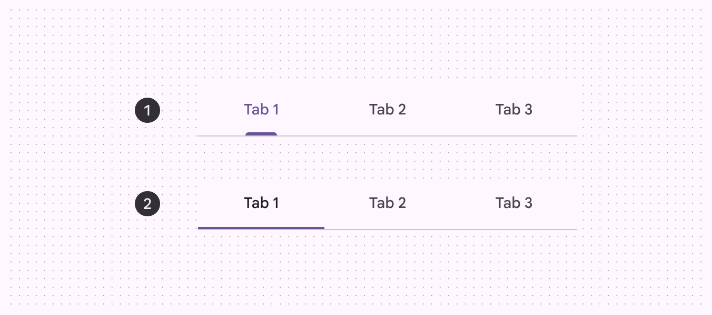

1. Primary tabs
2. Secondary tabs

### Related content

Use tabs to group related content, not _sequential_ content.

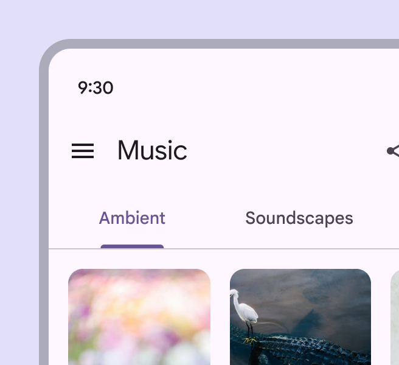

check Do

Utilize tabs to categorize related groups of content into clearly defined sets

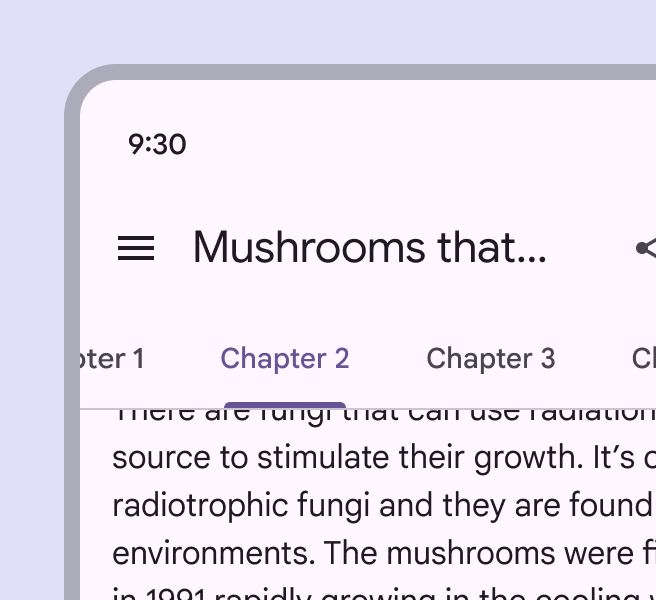

close Don’t Don’t use tabs to move through sequential content that needs to be read in a particular order. Instead, create hierarchy within the content using techniques like typography style and open space.

## Anatomy

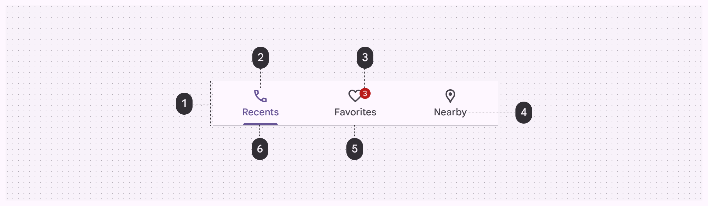

1. Container
2. Icon (optional)
3. Badge (optional)
4. Label
5. Divider
6. Active indicator

### Container

The container holds multiple tabs. Its contents can be fixed or scrollable. The container should always extend the full width of the window and be divided into equal sections, one for each tab. The container is defined by a divider [More on dividers](/m3/pages/divider/overview) on the bottom edge to separate it from the content below. Content may scroll under the container.

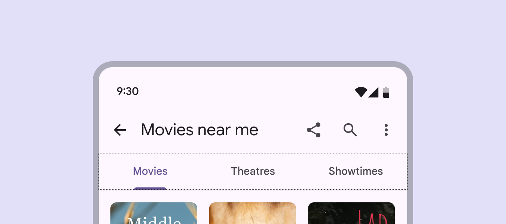

The container is the area that contains the tabs directly under the title above

### Icon (optional)

Icons communicate the kind of content within a tab. Icons should be simple and recognizable.

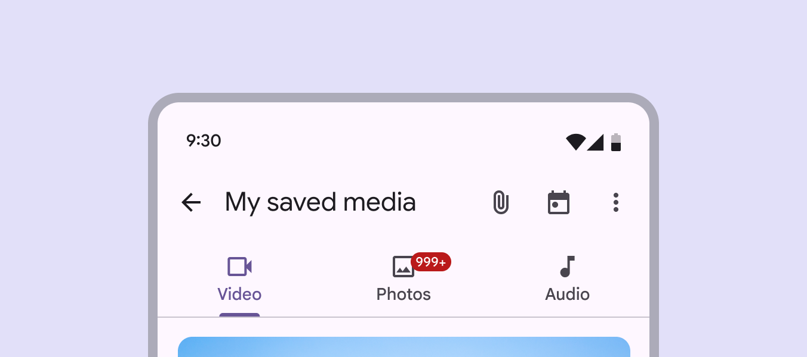

Tabs can use a combination of labels and icons

Icons alone aren’t as effective as text labels at communicating complex content. Use caution when representing tab content with icons alone, as an icon’s meaning may not be clear.

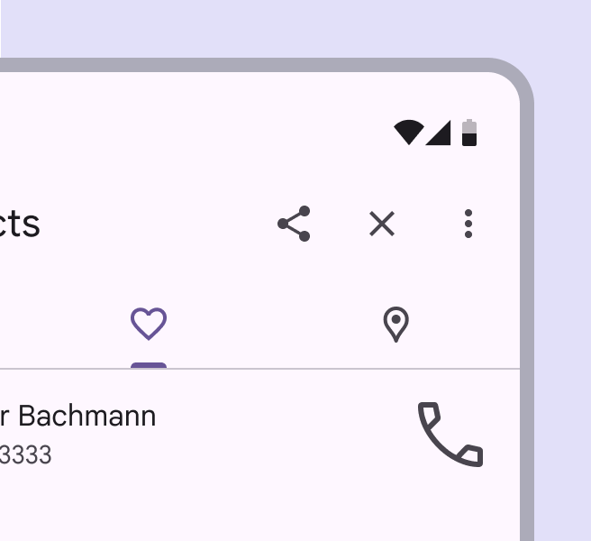

check Do

Use icons that are globally recognized when using icons alone

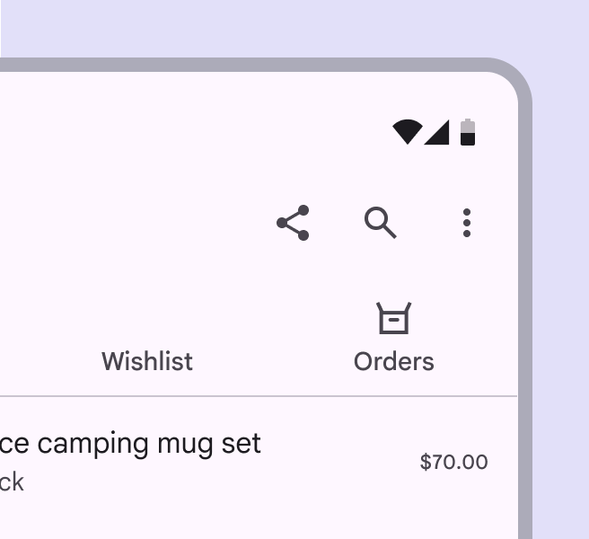

close Don’t

Don’t use tabs with both icons and text labels on only some tabs, but not others

### Label

Text labels should clearly and succinctly describe the content within the tab. Tab labels appear in a single row. Labels can use a second line if needed, with truncated text. Alternatively, scrollable tabs can allow room for longer titles.

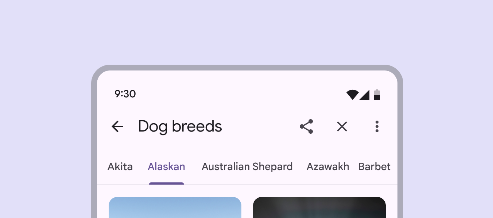

Tab labels should be short and succinct. There should be a clear relationship to the title above. When using scrollable tabs, the first visible tab should be offset by 52dp from the left side of the device for both web and mobile. The width of each tab is defined by the length of its text label. Avoid using inconsistent padding on each tab.

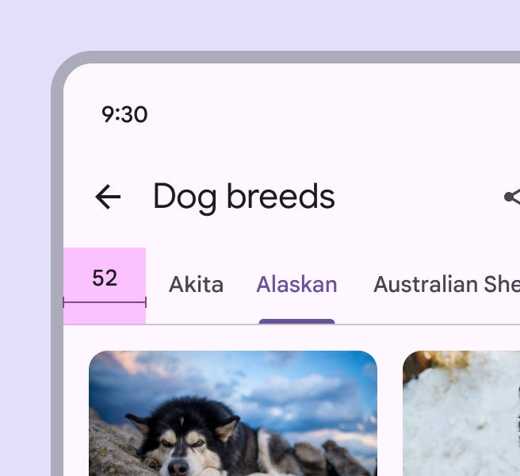

check Do

Offset the first scrollable tab 52dp from the leading edge so it's clear that more content is available

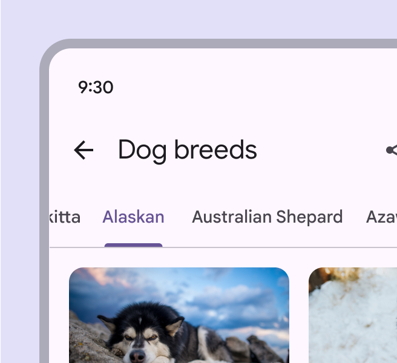

close Don’t

Don’t truncate labels unless required, as truncated text can impede comprehension

### Badges (optional) 

Badges [More on badges](/m3/pages/badges/overview) can be used on primary or secondary tabs to show notifications or updates related to a specific tab. Limit badge content to four characters, including a "+". Once the user views the relevant content in the tab, the badge value should update or the badge should disappear entirely. Small and large badges can both be used with tabs. Read the [badge guidance](/m3/pages/badges/overview) for more details. 

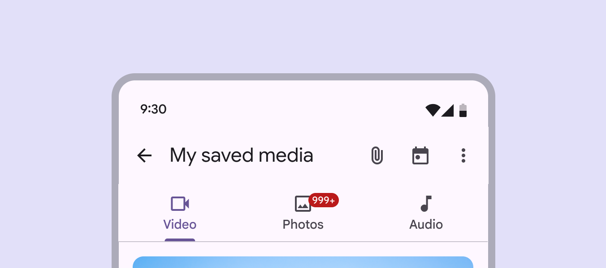

Badges are used to highlight notifications related to tab specific content

### Active indicator

To differentiate an active tab from an inactive tab, apply an underline and color change to the active tab’s text and icon. An underline and color change differentiate an active tab from the inactive ones

## Choosing the tab variant

Primary tabs should be used when just one set of tabs are needed. Secondary tabs are necessary when a screen requires more than one level of tabs. These tabs use a simpler style of indicator, but their function is identical to primary tabs.

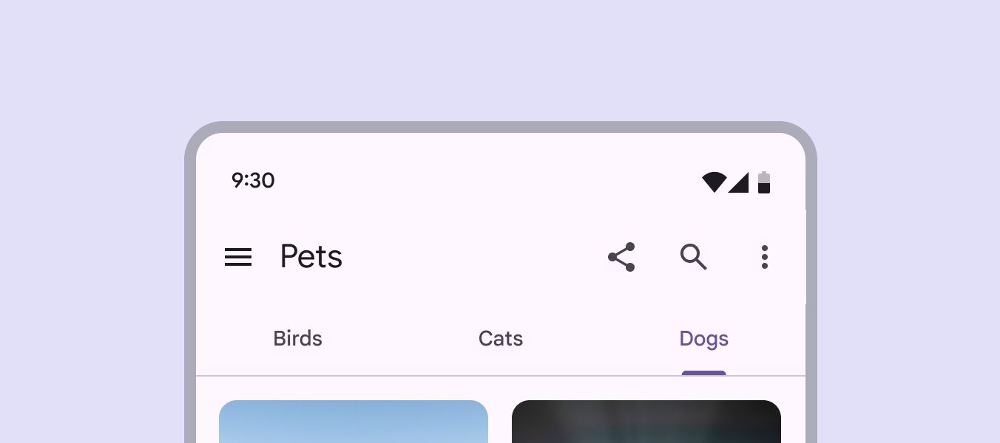

Tabs can be joined with components like app bars, embedded in a specific UI region, or nested within components like cards and sheets. Tabs control the UI region displayed below them.

## Placement

Tabs are displayed in a single row, with each tab connected to the content it represents. As a set, all tabs are unified by a shared topic. Secondary tabs should always be placed below primary tabs .

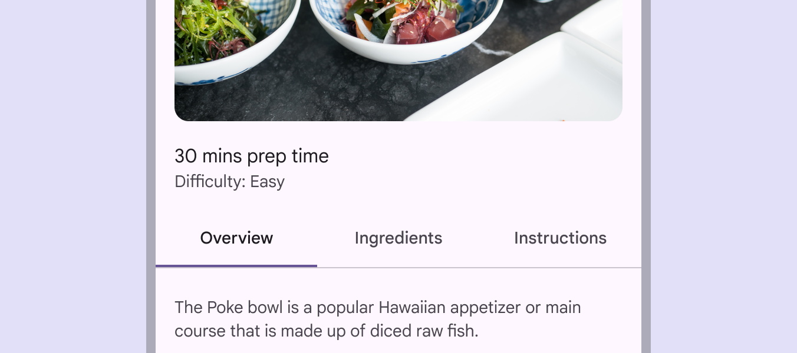

Secondary tabs are found within other content to assist users with greater detail

## Responsive layout

For fixed tabs, the maximum width for each tab should be determined by the width of the widest tab. The group of tabs should use a fluid margin [More on margins](/m3/pages/understanding-layout/spacing#38a538d7-991f-4c39-8449-195d32caf397) and align to the center or leading edge of the body region. Avoid using more than four tabs at once. At five or more tabs, the container becomes cramped.

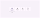

Tabs can grow in width in relation to the number of items contained within

## Behavior

### States

By default, tabs inherit enabled [More on enabled state](/m3/pages/interaction-states/applying-states#39b2fc90-01db-41b5-b6f8-47be61ed1479) states [More on states](/m3/pages/interaction-states/overview) with one active state.The inactive and active states of a tab can inherit a hover [More on hover state](/m3/pages/interaction-states/applying-states#71c347c2-dd75-485b-892e-04d2900bd844), focus [More on focused state](/m3/pages/interaction-states/applying-states#bc6d6853-48ef-490e-8076-448e89e69f0f), and pressed [More on pressed state](/m3/pages/interaction-states/applying-states#c3690714-b741-492d-97b0-5fc1960e43e6) states.

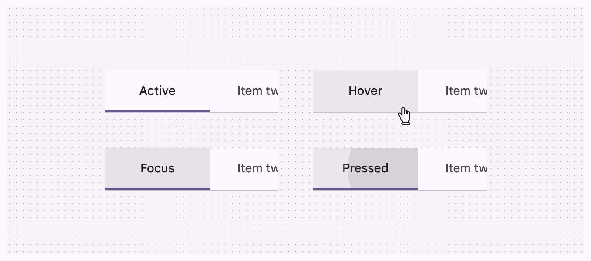

Active, hover, focused, and pressed states

### Fixed tabs

Fixed tabs display all tabs in a set simultaneously. They are best for switching between related content quickly, such as between transportation methods in a map. To navigate between fixed tabs, tap an individual tab, or swipe left or right in the content area. Fixed tabs allow users to see all possible kinds of content available

#### Tap a tab

Navigate to a tab by tapping on it. Tapping on a tab directly

#### Swipe within the content area

To navigate between tabs, users can swipe left or right within the content area. Users can swipe between fixed tabs to see related content quickly

Use caution when placing other swipeable content (such as interactive maps or list [More on lists](/m3/pages/lists/overview) items) in the content area.

check Do

Use different gesture directions when using tabs

close Don’t

Avoid placing swipeable items in the content area of a UI that has tabs, as the user may mistakenly swipe the wrong component

### Scrollable tabs

When a set of tabs cannot fit on screen, use scrollable tabs. Scrollable tabs can use longer text labels and a larger number of tabs. They are best used for browsing on touch interfaces. Padding should remain the same when using scrolllable tabs and long labels

### Scrolling content

When a screen scrolls up and down through content, tabs can either be fixed to the top of the screen, or scroll off the screen. If they scroll off the screen, they will return when the user scrolls upward. Tabs can be use to create elevation

check Do

Tabs can scroll offscreen on scroll, and reappear when the page is scrolled up

close Don’t

Don’t scroll tabs behind an app bar. When tabs are attached to a component, they should appear and move as a single unit.

