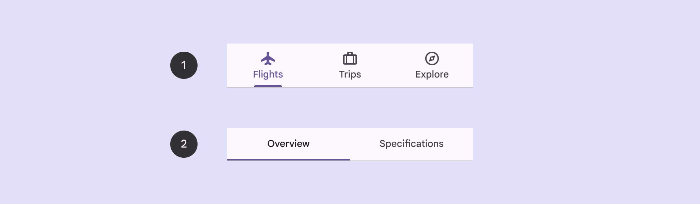
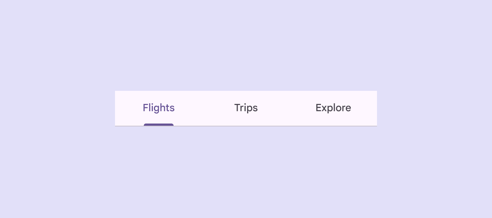

# Tabs

Tabs organize content across different screens and views

- Use tabs to group content into helpful categories
- Two variants: primary and secondary
- Tabs can horizontally scroll, so a UI can have as many tabs as needed
- Place tabs next to each other as peers

1. Primary tabs
2. Secondary tabs

## Availability & resources

| Type | Resource | Status |
| --- | --- | --- |
| Design | [Design Kit (Figma)](https://www.figma.com/community/file/1035203688168086460) | Available |
| Implementation |  | Available |
| Implementation | [Jetpack Compose](https://developer.android.com/develop/ui/compose/components/tabs) | Available |
| Implementation |  | Available |
| Implementation |  | Available |

## Differences from M2

- Color: New color mappings and compatibility with dynamic color [More on dynamic color](/m3/pages/dynamic/choosing-a-source)
- Layout: Icons and labels are now vertically centered within the container

Tab icons and labels are positioned in the vertical center of the container

