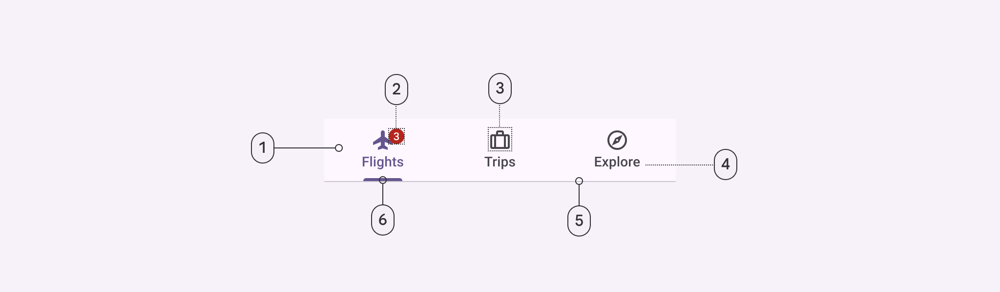
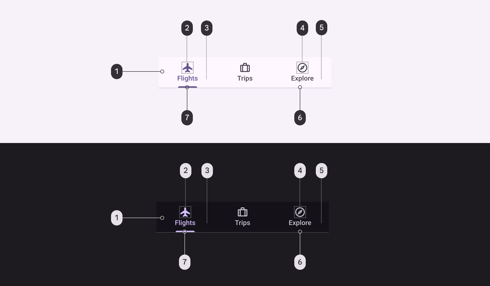
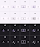
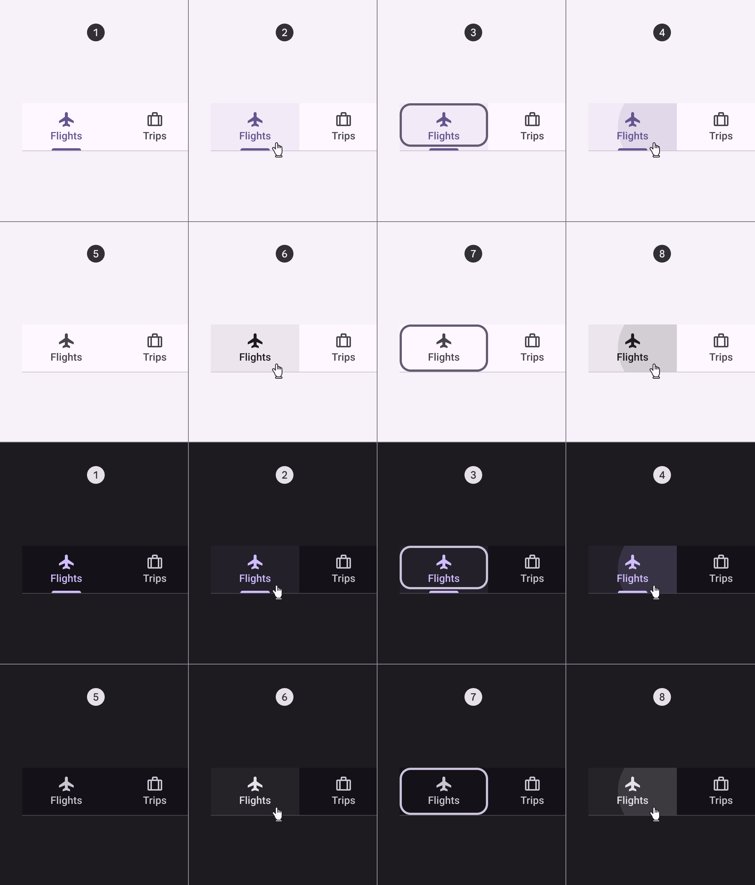
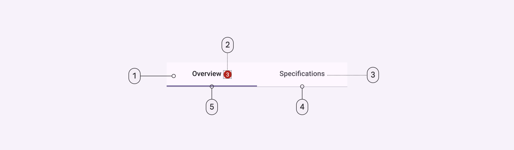
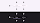
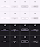
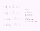

# Tabs

Tabs organize content across different screens and views

## Tokens and specs

Select a component variant below to see its elements, attributes, tokens, and their values.

```
Tabs - Primary navigation
```

```
Tabs - Primary navigation
```

```
Tabs - Primary navigation
```

```
Tabs - Primary navigation
```

Tabs - Primary navigation

Token

Default, Light

Enabled

Hovered

Focused

Pressed (ripple)

## Primary tabs



1. Container
2. Badge (optional)
3. Icon (optional)
4. Label
5. Divider
6. Active indicator

### Primary tabs color

Color values are implemented through design tokens [More on tokens](/m3/pages/design-tokens/overview). For design, this means working with color values that correspond with tokens. For implementation, a color value will be a token that references a value. [Learn more about design tokens](/m3/pages/design-tokens/overview)



Primary tab color roles used for light and dark schemes:

1. Surface
2. Primary
3. Primary
4. On surface variant
5. On surface variant
6. Outline variant
7. Primary

### Primary tabs states



1. Enabled (active destination)
2. Hover (active destination)
3. Focused (active destination)
4. Pressed (active destination)
5. Enabled (inactive destination)
6. Hover (inactive destination)
7. Focused (inactive destination)
8. Pressed (inactive destination)

## Secondary tabs



1. Container
2. Badge (optional)
3. Label
4. Divider
5. Active indicator

### Secondary tabs color

Color values are implemented through design tokens [More on tokens](/m3/pages/design-tokens/overview). For design, this means working with color values that correspond with tokens. For implementation, a color value will be a token that references a value. [Learn more about design tokens](/m3/pages/design-tokens/overview)



Secondary tab color roles used for light and dark schemes:

1. Surface
2. On surface
3. On surface variant
4. Outline variant
5. Primary

### Secondary tabs states



1. Enabled (active destination)
2. Hover (active destination)
3. Focused (active destination)
4. Pressed  (active destination)
5. Enabled (inactive destination)
6. Hover (inactive destination)
7. Focused (inactive destination)
8. Pressed (inactive destination)

## Measurements



Tabs are divided into equal sections, with labels and icons positioned vertically centered. The divider is included in the height, placed inside the container.


Primary tab active indicators are inset 2dp on each side, have a fully rounded corner radius, and a minimum length of 24dp.

| Attribute
 | Value
 |
| --- | --- |
| Container height (label text only) | 48dp |
| Container height (icon and label text) | 64dp |
| Icon size | 24dp |
| Divider height | 1dp |
| Primary active indicator height | 3dp |
| Secondary active indicator height | 2dp |
| Active indicator shape | 3, 3, 0, 0 |
| Active indicator minimum length | 24dp |
| Padding between inline icon and text | 8dp |
| Padding between inline text and badge | 4dp |
| Overlap of badge on stacked icon | 6dp |

