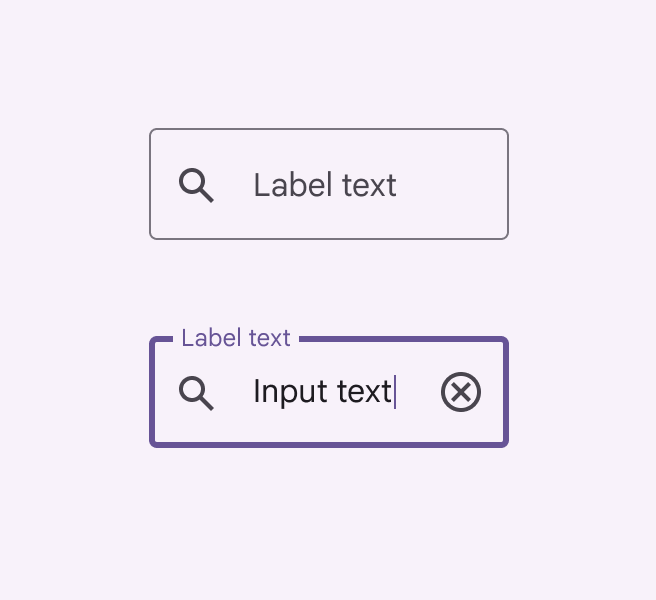
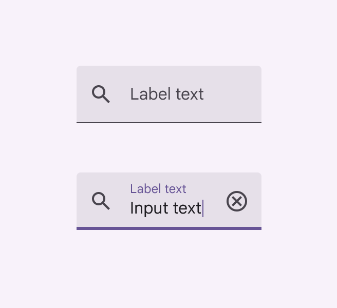
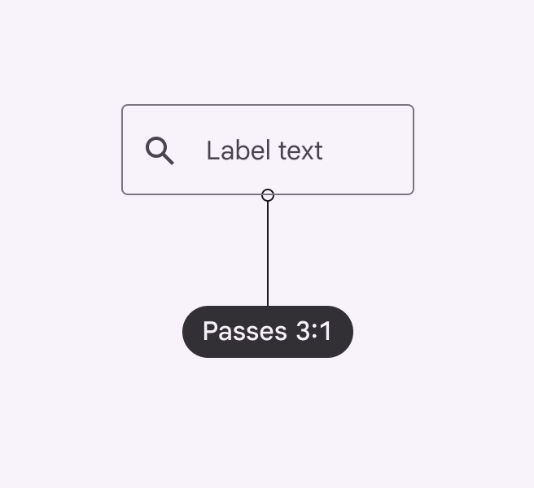
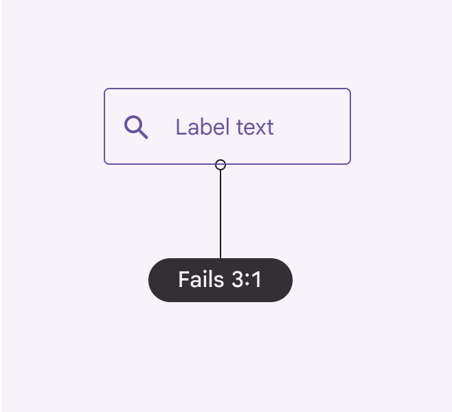
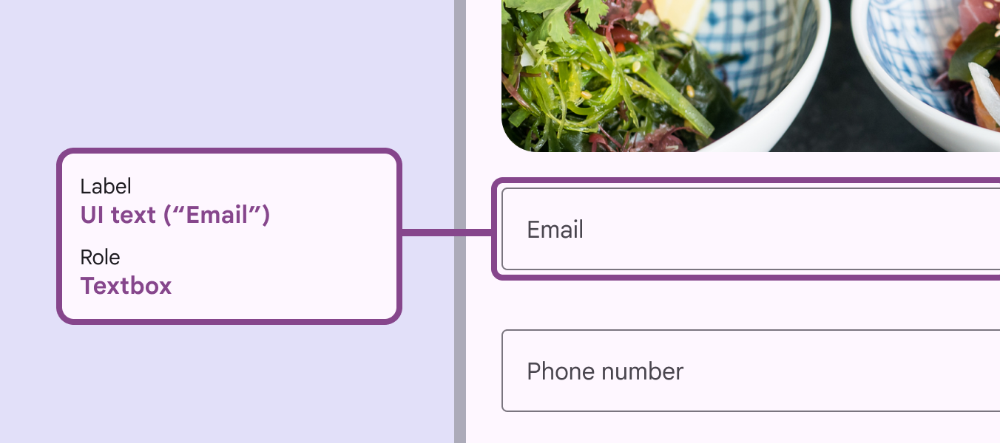
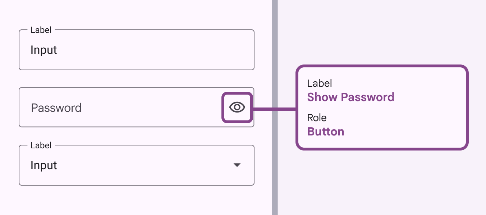
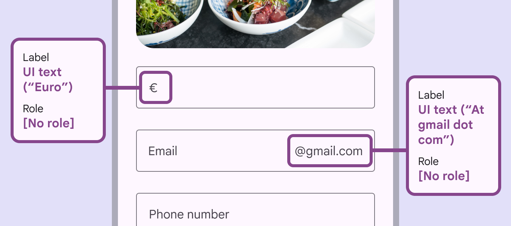
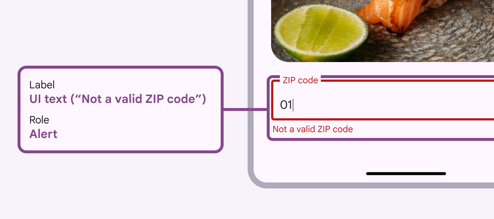
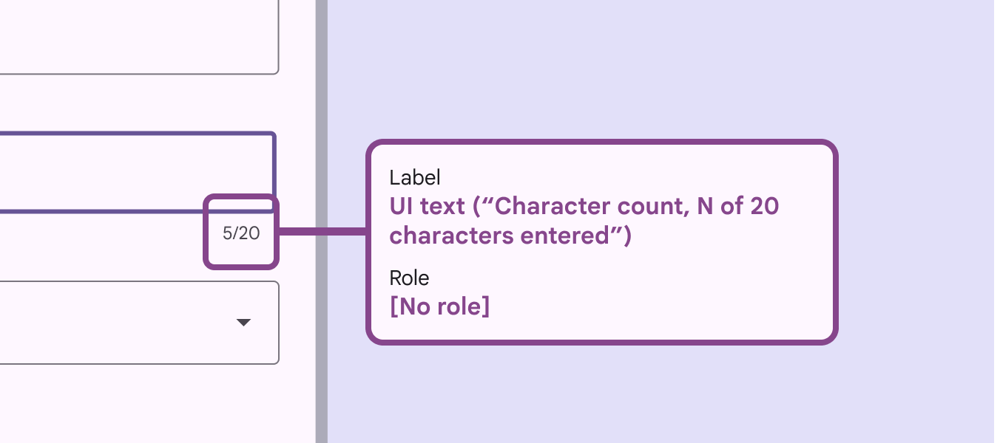
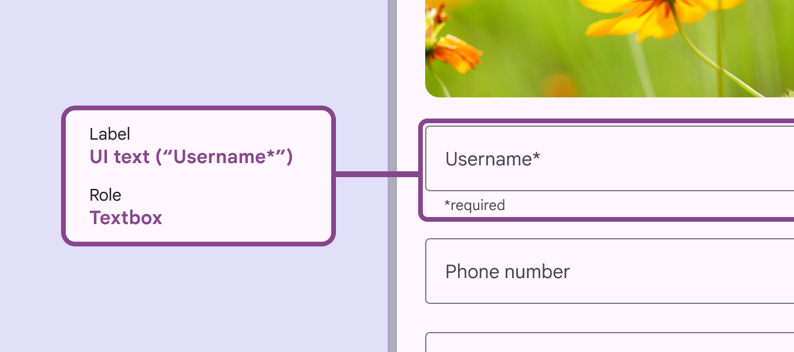

# Text fields

Text fields let users enter text into a UI

## Use cases

User should be able to:

- Navigate to and activate a text field with assistive technology
- Input information into the text field
- Receive and understand supporting text and error messages
- Navigate to and select interactive icons

## Interaction & style

The containers for both filled and outlined text fields provide the same functionality. Changes to color and thickness of stroke help provide clear visual cues for interaction.

Filled text fields

Outlined text fields

Containers improve the discoverability of text fields by creating contrast between the text field and surrounding content. In some contexts, outlined text fields can improve the perception of the fields with a 3:1 or greater contrast ratio between the container outline and the background.

check Do

Make sure the container outline has a minimum contrast of 3:1 to the background

close Don’t

Don't choose colors that won't pass Material's minimum contrast of 3:1

## Keyboard navigation

|
Keys

 |

Actions

 |
| --- | --- |
| Tab | Focus lands on (non-disabled) text field |

## Labeling elements

If the UI text is correctly linked, assistive tech (such as a screenreader) will read the UI text followed by the component’s role. The accessibility [More on accessibility](/m3/pages/overview) label for a text field is the same as the text field label.

A text field’s label should include its UI text

For text fields with interactive trailing icons, the accessibility label clarifies its function. For example, when a password is hidden, the label for the view icon is "Show password," and when the password is visible, the label is "Hide password."

When an icon has no actionable role, like an error icon, the label is "Error."

When a trailing icon in the field acts as a button, the label should clarify function, while the role explains the component type

The prefix and suffix of a text field provides symbols and abbreviations to help users enter the correct values. The accessibility [More on accessibility](/m3/pages/overview) label for prefix and suffix needs to have a unique id attribute, for example, the currency name for a currency symbol prefix.

A form containing fields with both a prefix for currency, and a suffix for email address

When there is an error, "alert" is applied to the role and the error message to the text label. If a text field displays both supporting text and error text, the label should include the supporting text first, followed by the error text.

Text field error messages should be given an “alert” role in accessibility labels

The accessibility label for the character counter clarifies the number of characters that can be entered into the text field. 

The remaining character counter should be called “character count” within the label

The text displayed in the supporting text is also used for its accessibility label.

![The accessibility label uses the supporting text. It reads: UI text (“Please use the company email address”). Role \[No role\].](https://firebasestorage.googleapis.com/v0/b/design-spec/o/projects%2Fgoogle-material-3%2Fimages%2Flx32meu7-10.png?alt=media&token=4caf165e-0a75-4e05-8be8-410f681c8874)

Text field supporting text should have its own accessibility label

If a text field requires input, indicate so with an asterisk at the end of the text field label. The accessibility label must include the asterisk.

A required text field’s accessibility label should include any supporting text

