# Text fields

Text fields let users enter text into a UI

.png?alt=media&token=3e8505af-c89e-46f1-a165-4150245058a6)

Filled and outlined text fields

## Usage

Use a text field when someone needs to enter text into a UI, such as filling in contact or payment information.

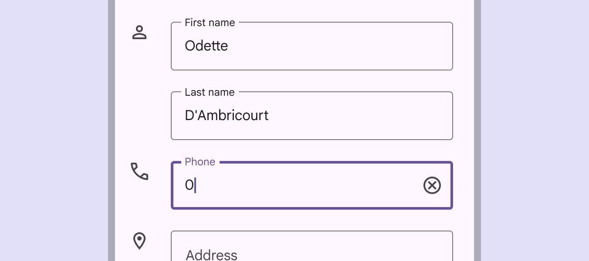

Contact form using outlined text fields

There are two variants of text fields:

1. Filled text fields
2. Outlined text fields

Both variants of text fields use a container to provide a visual cue for interaction and provide the same functionality.

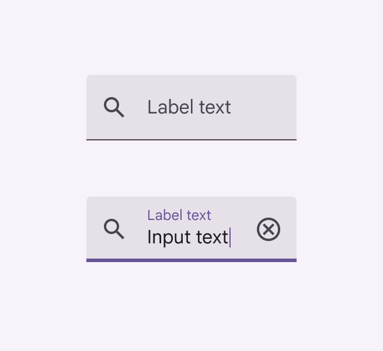

Filled text field

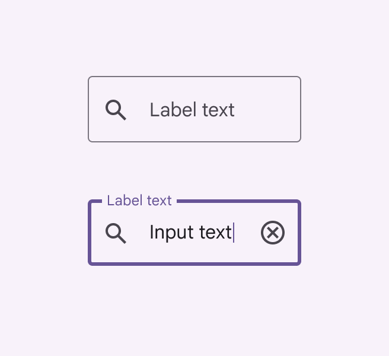

Outlined text field

### Outlined text fields

Outlined text fields have less visual emphasis than filled text fields . When they appear in places like forms (where many text fields are placed together), their reduced emphasis helps simplify the layout [More on layout](/m3/pages/understanding-layout/overview).

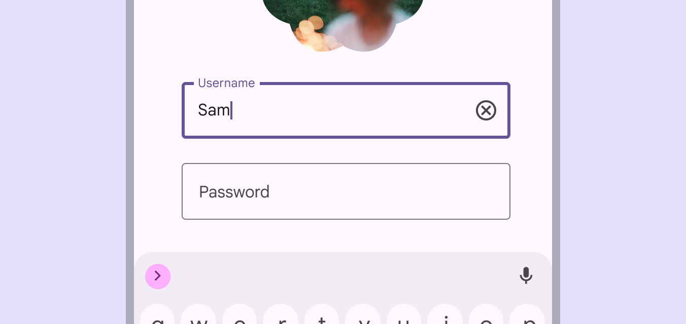

Login screen with outlined text fields

## Choosing text fields

### Choosing text fields

Both variants of text field provide the same functionality. The variant of text field used can depend on style alone. Choose the variant that:

- Works best with an app’s visual style
- Best accommodates the UI's goals
- Is most distinct from other components (like buttons [More on buttons](/m3/pages/common-buttons/overview)) and surrounding content

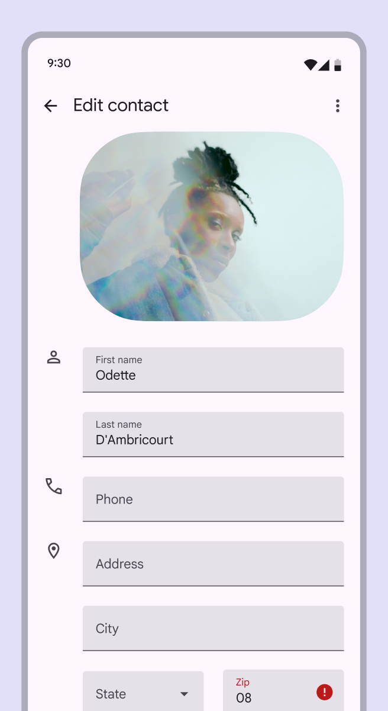

Mobile form using filled text fields

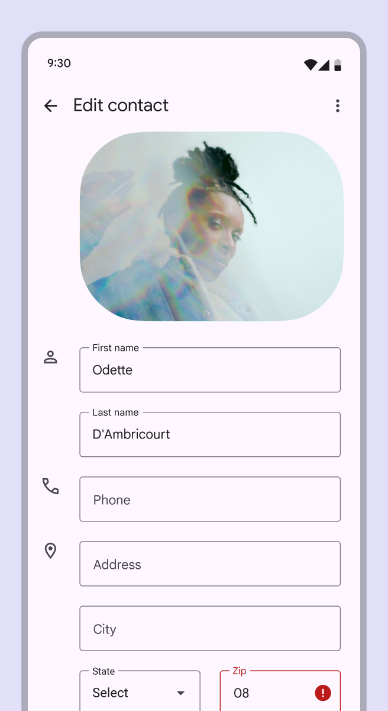

The same mobile form using outlined text fields

### Using both text field variants on the same screen

If both variants of text field are used in a UI, they should be used consistently within different sections, and not intermixed within the same region. For example, use outlined text fields in one section and filled text fields in another.

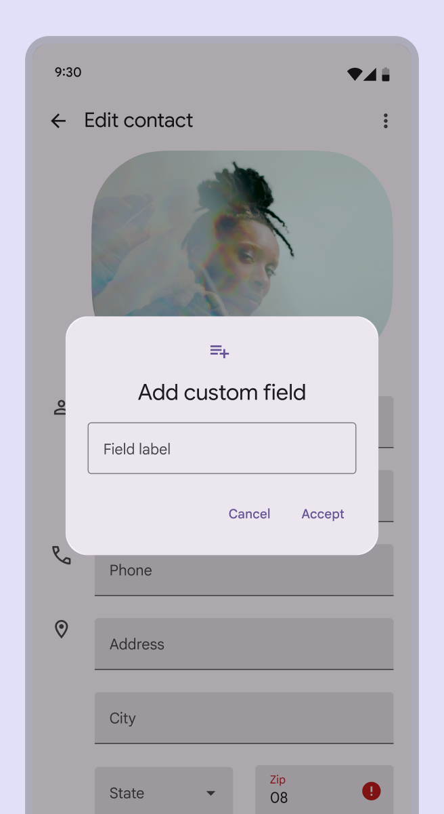

check Do

When using both variants of text fields in a UI, separate them by region

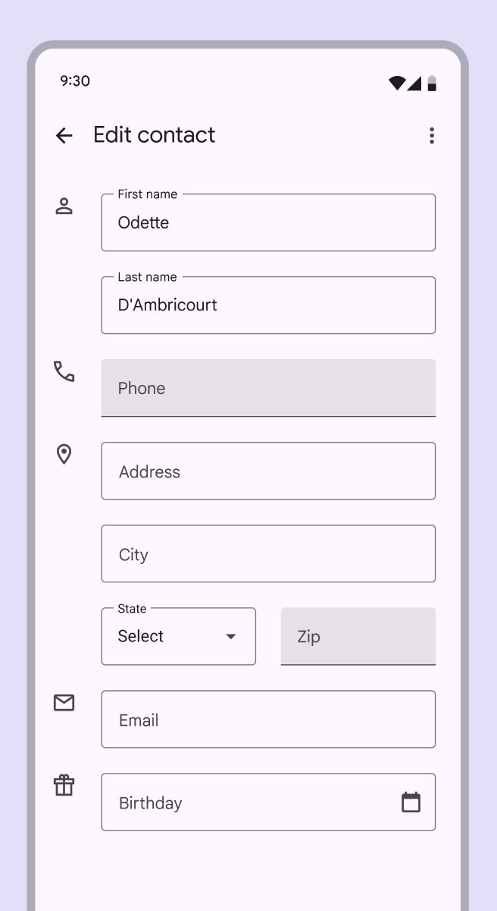

close Don’t

When using both variants of text fields, don't use both next to each other or within the same form

## Anatomy

### Filled text field

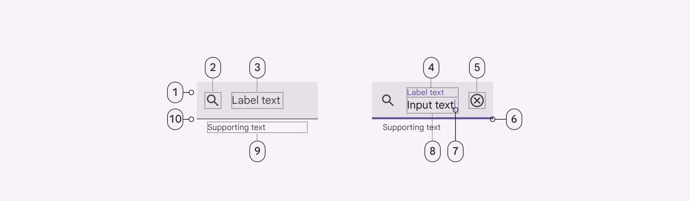

1. Container
2. Leading icon (optional)
3. Label text in empty field
4. Label text in populated field
5. Trailing icon (optional)
6. Focused active Indicator
7. Caret
8. Input text
9. Supporting text (optional)
10. Enabled active Indicator

### Outlined text field

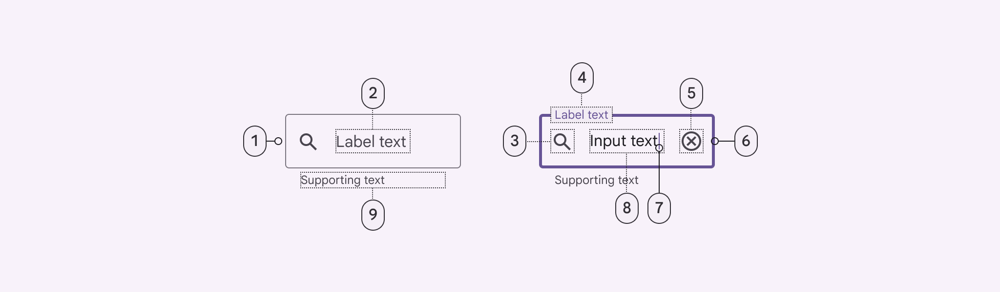

1. Enabled container outline
2. Label text in empty field
3. Leading icon (optional)
4. Label text in populated field
5. Trailing icon (optional)
6. Focused container outline
7. Caret
8. Input text
9. Supporting text (optional)

### Containers

Containers improve the discoverability of text fields by creating contrast between the text field and surrounding content.

**Fill and stroke**
A text field container has a fill and a stroke either around the entire container, or just the bottom edge. The color and thickness of a stroke can change to indicate when the text field is active. 

**Rounded corners**
The container of an outlined text field has rounded corners, while the container of a filled text field has rounded top corners and square bottom corners.

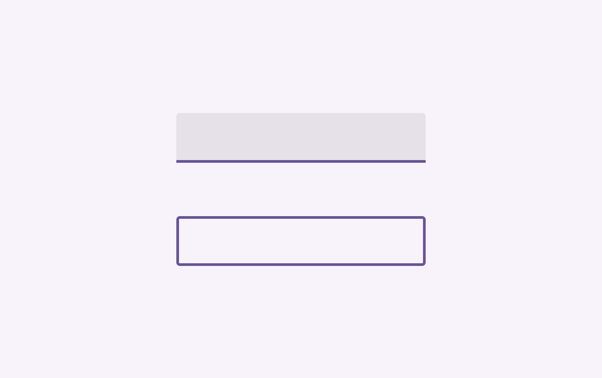

Text field containers

### Label text

Label text tells people what information is requested. Every text field should have a label. Label text should be aligned with the input text, and always visible. It can be placed in the middle of a text field, or rest near the top of the container. Label text shouldn't be truncated or take up multiple lines. Keep it short, clear, and fully visible. Label text should always be visible. When the field is selected, the label text moves from the middle of the text field to the top.

close Don’t Don’t truncate label text. Keep it short, clear, and fully visible.

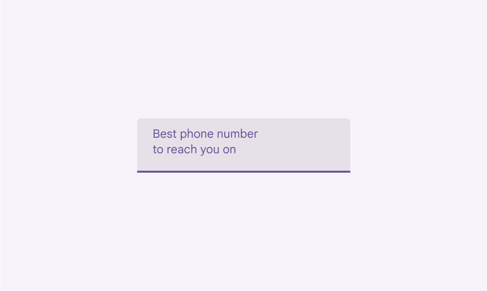

close Don’t

Label text shouldn’t take up multiple lines

### Adjacent label

A text field doesn't require a label if the field's purpose is indicated by a separate, adjacent label. Adjacent labels should be aligned to the leading edge of the text field container.

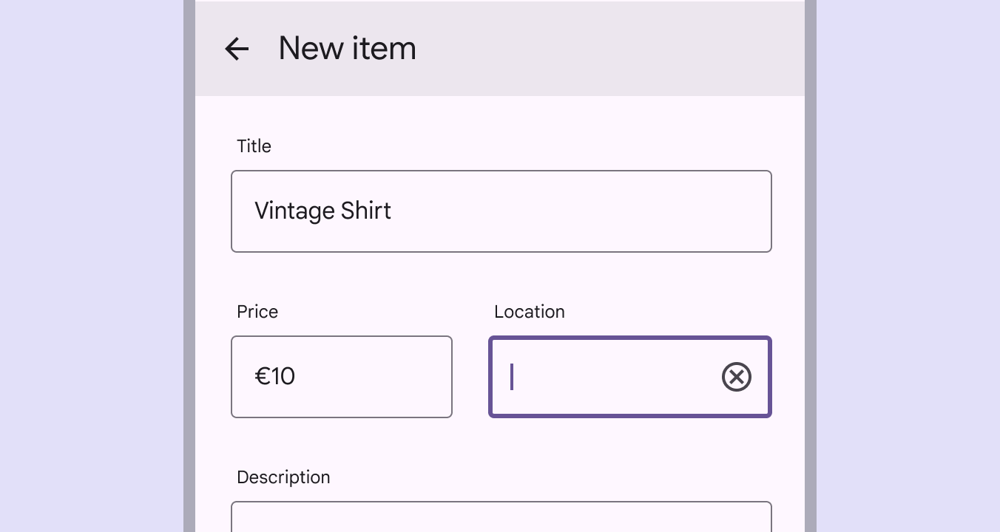

Text fields with adjacent labels

### Required text indicator

To show a field is required, display an asterisk (\*) next to the label text, and explain that asterisks indicate required fields in one of two ways:

- Supporting text
- A single note at the beginning of the form

Additional best practices include:

- Indicate all required fields
- If required text has a particular color, use the same color for the asterisk

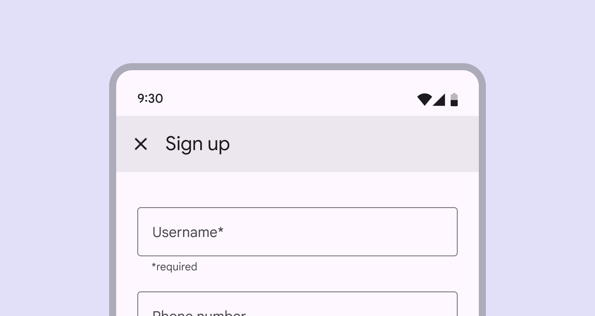

Asterisk with required supporting text

### Input text

Input text is text a person has entered into a text field. Text fields can display input text in the following ways:

- **Single line** text fields display only one line of text
- **Multi-line** text fields grow to accommodate multiple lines of text
- **Text areas** are fixed-height fields

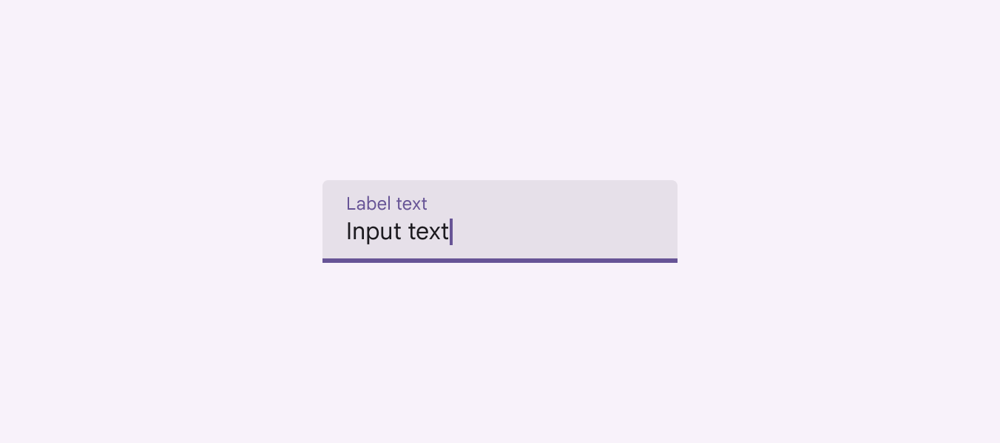

Input text in a filled text field

In **single-line** fields, as the cursor reaches the right field edge, text longer than the input line automatically scrolls left. Single-line fields are not suitable for collecting long responses; use a multi-line text field or text area instead. In **multi-line** fields, overflow text causes the text field to expand, shifting screen elements downward and text wraps onto a new line. These fields initially appear as single-line fields, which is useful for compact layouts that need to accommodate large amounts of text.

**Text areas** are taller than text fields and wrap overflow text onto a new line. They are a fixed height and scroll vertically when the cursor reaches the bottom of the field. The large initial size indicates that longer responses are possible and encouraged. These should be used instead of multi-line fields on the web. Ensure the height of a text area fits within mobile screen sizes.

### Prefix text

Text fields can contain prefix text such as currency symbol.

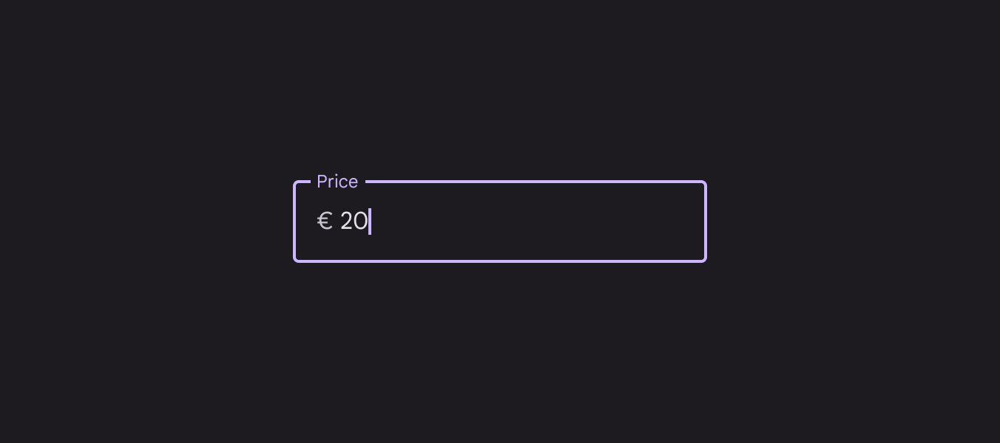

A text field with a currency symbol text prefix

### Suffix text

Text fields can contain suffix text such as unit of measurement or email domain.

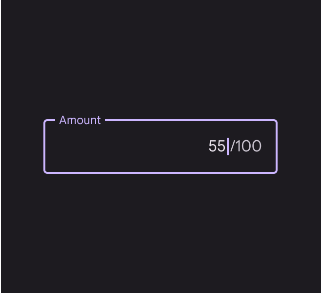

A text field with a grading scale as suffix

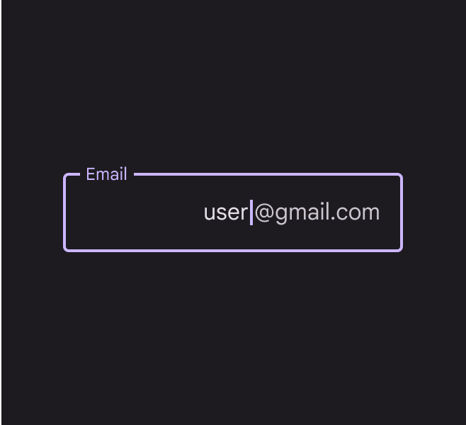

A text field with an email domain suffix

### Supporting text & character counter

Supporting text conveys additional information about the input field, such as how it will be used. It should ideally be one line, though may wrap to multiple lines if required. It can be either persistently visible or visible only on focus. If there is a character or word limit, include a character or word counter. They display the ratio of characters used and the total character limit.

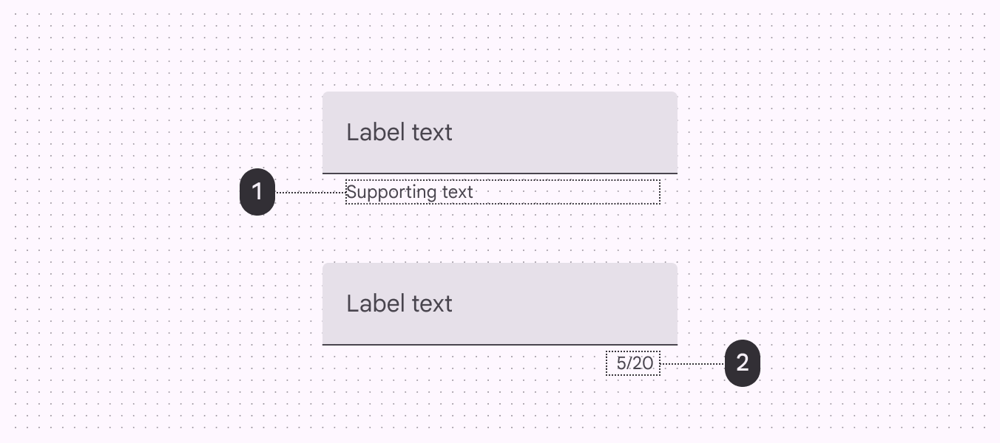

1. Supporting text
2. Character counter

### Error text

For text fields that validate their content such as passwords, replace supporting text with error text. Swapping supporting text with error text prevents new lines of text from bumping content and changing the layout.

- If only one error is possible, error text should describe how to avoid the error
- If multiple errors are possible, error text should describe how to avoid the most likely error

check Do

Swap supporting text with error text

close Don’t

Don't add error text in addition to supporting text, as their appearance will shift content

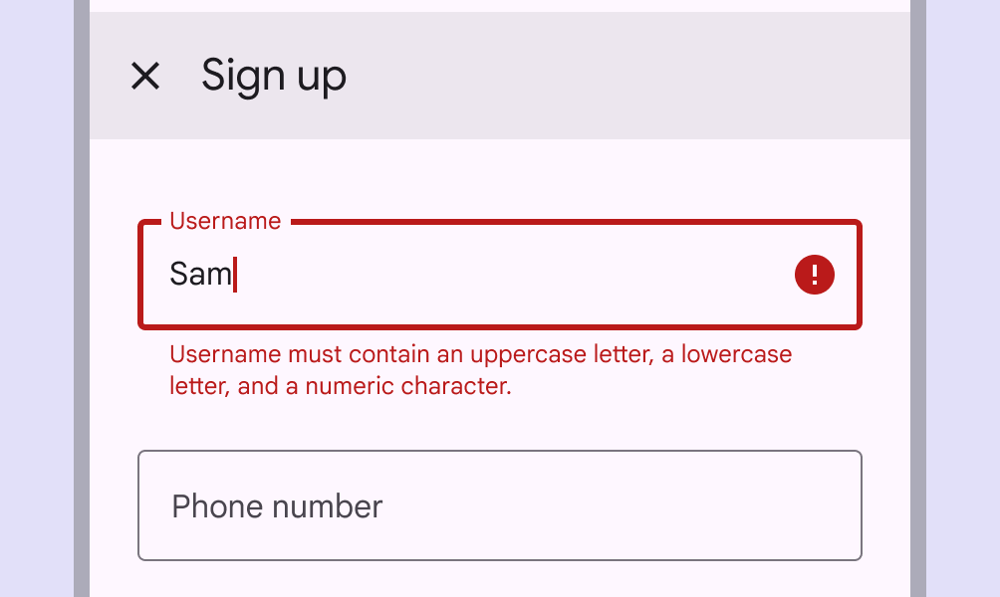

exclamation Caution

Long errors can wrap to multiple lines if there isn't enough space to clearly describe the error. In this case, ensure padding between text fields is sufficient to prevent multi-lined errors from bumping layout content.

### Error icon

It’s strongly recommended to show an error icon when the text field is in the error state. This highlights the error for people with visual impairments, and provides an additional sensory indicator.

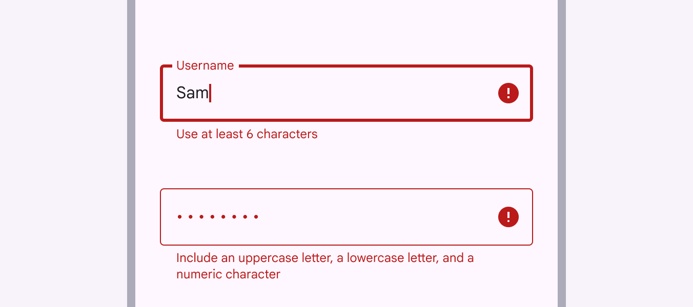

The error icon is an important second visual indicator that a text field has an error

### Icons & images

Icons in text fields are optional. Text field icons can: 

- Describe valid input methods such as a microphone icon
- Provide affordances to access additional functionality such as clearing the content of a field
- Express an error

Leading and trailing icons change their position based on LTR or RTL contexts. Images that are 24dp in height can be placed inside of text fields. This image height allows for optimal top and bottom padding within the field and is consistent with icon size recommendations.

1. **Icon signifier** Icon signifiers can describe the type of input a text field requires, and be touch targets for nested components. For example, a calendar icon may be tapped to reveal a date picker [More on date pickers](/m3/pages/date-pickers/overview).
2. **Valid or error icon
    **Iconography can indicate both valid and invalid inputs, making error states clear for colorblind users. 
3. **Clear icon
    **Clear icons let a person clear an entire input field. They appear only when input text is present.
4. **Voice input icon
    **A microphone icon signifies that people can input characters using voice. 
5. **Dropdown icon
    **A dropdown arrow indicates that a text field has a nested selection [More on selection](/m3/pages/selection) component.
6. **Image
    **An image can help contextualize the required input text such as a credit card number.

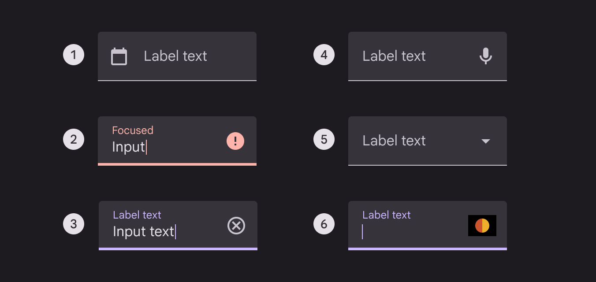

1. Icon signifier
2. Valid or error icon
3. Clear icon
4. Voice input icon
5. Dropdown icon
6. Image

### Read-only fields

Read-only text fields display pre-filled text that people cannot edit. A read-only text field is styled the same as a regular text field and is clearly labeled as read-only.

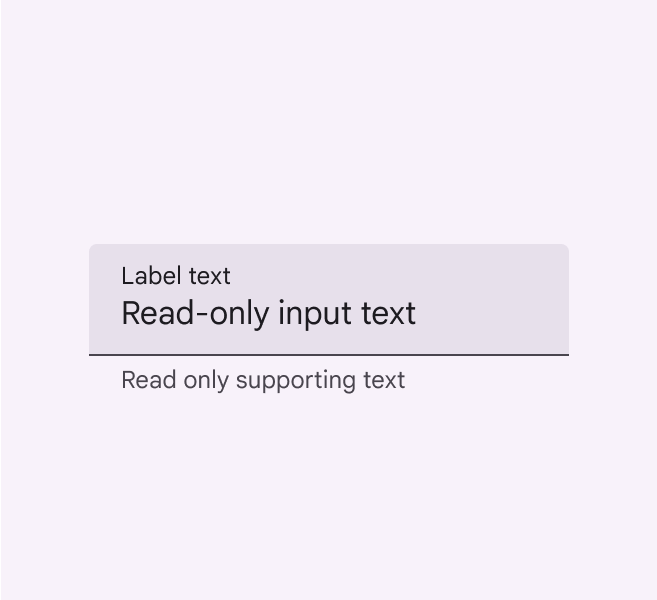

A filled read-only text field

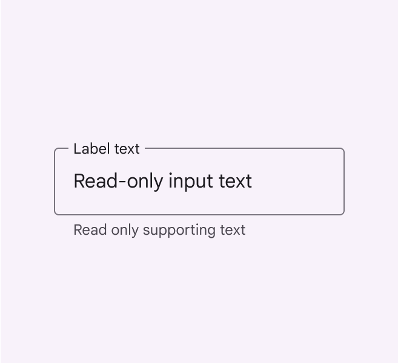

An outlined read-only text field

## Adaptive design

As layouts adapt to larger screens and different window size classes [More on window size classes](/m3/pages/applying-layout/window-size-classes), apply flexible container dimensions to text fields. Set minimum and maximum values for margins [More on margins](/m3/pages/understanding-layout/spacing#38a538d7-991f-4c39-8449-195d32caf397), padding, and container dimensions as layouts scale so that typography adjusts for better reading experiences.

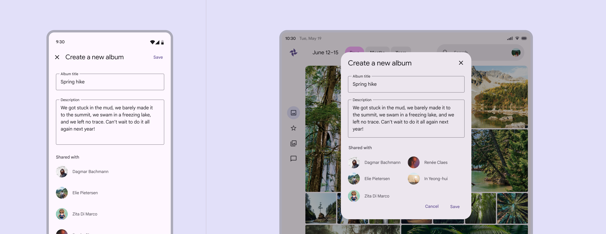

For compact window sizes, text fields can span the full width of the display. For medium and expanded window sizes, text fields should be bound by flexible margins or other containers. As text fields expand in fluid layouts, avoid maintaining fixed margins and typography properties. This can lead to extra long text fields. For example, text fields should not span the full width of a large screen.

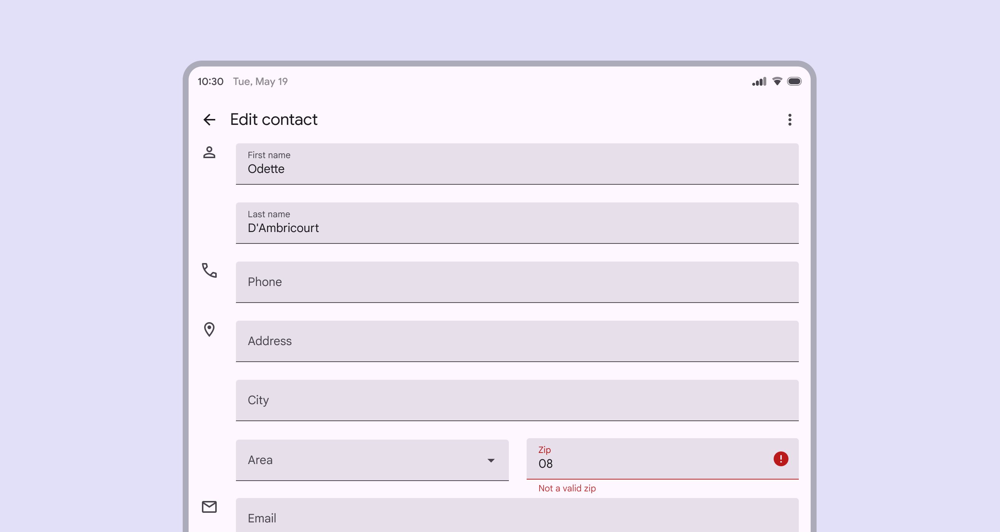

close Don’t

Don’t use fixed text field margins on large devices. Text fields shouldn’t span the full width of a large screen.

### Density

Dense text fields enable people to scan and take action on large amounts of information.

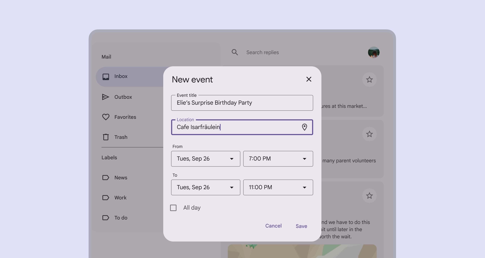

A form with dense text fields

#### **Avoid applying density by default**

Don't apply density to text fields by default. This lowers their targets below the recommended 48x48 CSS pixels. Instead, give people a way to choose a higher density, like selecting a denser layout or changing the theme. To ensure this density setting can be easily reverted when it's active, keep all the targets to change it at a minimum of 48x48 CSS pixels each.

