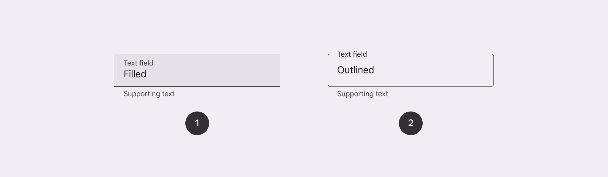
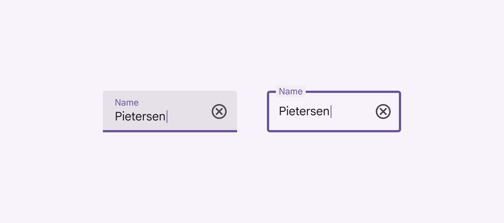

# Text fields

Text fields let users enter text into a UI

- Make sure text fields look interactive
- Two variants: filled and outlined
- The text field’s state [More on states](/m3/pages/interaction-states/overview) (blank, with input, error, etc) should be visible at a glance
- Keep labels and error messages brief and easy to act on
- Text fields commonly appear in forms and dialogs [More on dialogs](/m3/pages/dialogs/overview)

1. Filled text field
2. Outlined text field

## Availability & resources

| Type | Resource | Status |
| --- | --- | --- |
| Design | [Design Kit (Figma)](https://www.figma.com/community/file/1035203688168086460) | Available |
| Implementation |  | Available |
| Implementation | [Jetpack Compose](https://developer.android.com/reference/kotlin/androidx/compose/material3/package-summary#textfield) | Available |
| Implementation |  | Available |
| Implementation |  | Available |

## Differences from M2

- Color: New color mappings and compatibility with dynamic color [More on dynamic color](/m3/pages/dynamic/choosing-a-source)

Text fields have new color mappings

