# Text fields

Text fields let users enter text into a UI

## Tokens & specs

Browse the component elements, attributes, tokens, and their values. [Learn about design tokens](/m3/pages/design-tokens/overview)

```
Text field - Filled
```

```
Text field - Filled
```

```
Text field - Filled
```

```
Text field - Filled
```

Text field - Filled

Token

Default, Light

Enabled

Disabled

Hovered

Focused

Error

## Filled text field

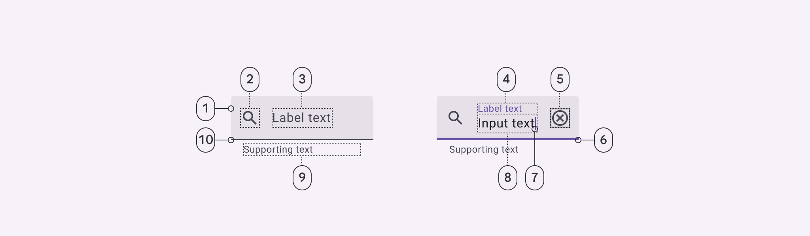

1. Container
2. Leading icon (optional)
3. Label text in empty field
4. Label text in populated field
5. Trailing icon (optional)
6. Focused active Indicator
7. Caret
8. Input text
9. Supporting text (optional)
10. Enabled active indicator

### Filled text field color

Color values are implemented through design tokens [More on tokens](/m3/pages/design-tokens/overview). For design, this means working with color values that correspond with tokens. For implementation, a color value will be a token that references a value. [Learn more about design tokens](/m3/pages/design-tokens/overview)

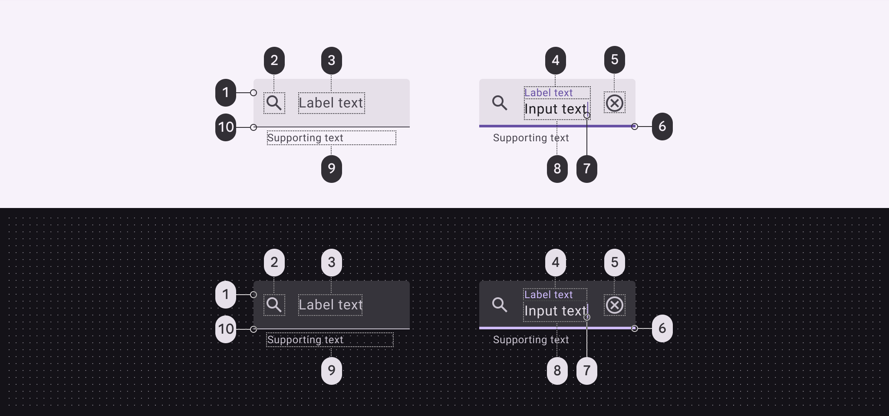

Filled text field color roles used for light and dark schemes:

1. Surface container highest
2. On surface variant
3. On surface variant
4. Primary
5. On surface variant
6. Primary
7. Primary
8. On surface
9. On surface variant
10. On surface

### Filled text field states

States are visual representations used to communicate the status of a component or interactive element. [Learn more about interaction states](/m3/pages/interaction-states/overview)

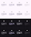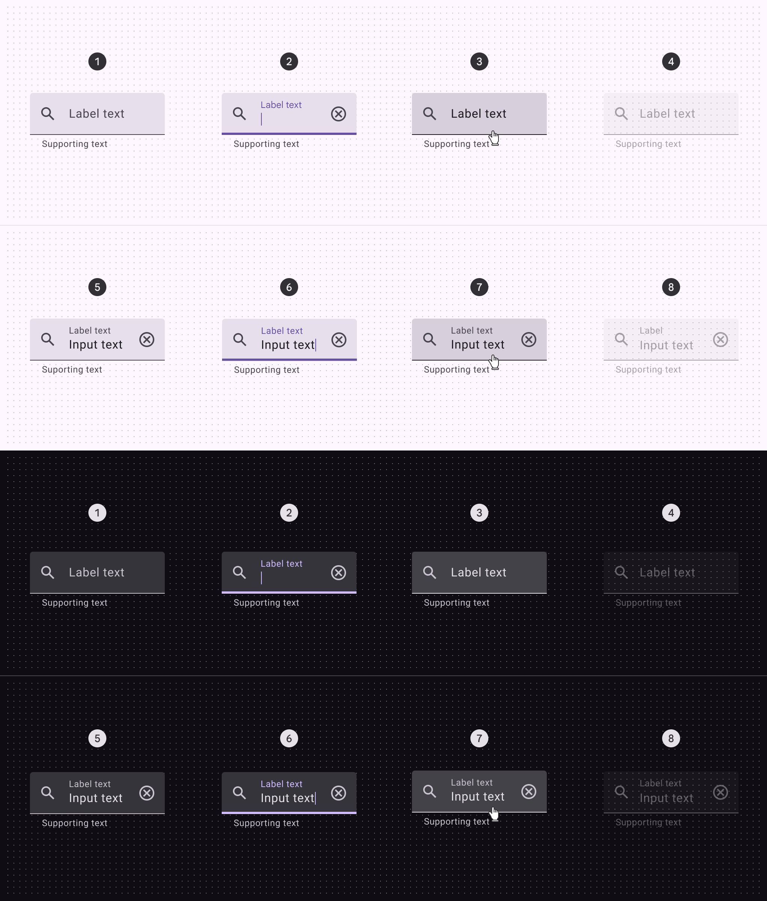

1. Enabled (empty)
2. Focused (empty)
3. Hovered (empty)
4. Disabled (empty)
5. Enabled (populated)
6. Focused (populated)
7. Hovered (populated)
8. Disabled (populated)

### Filled text field error states

Error states [More on states](/m3/pages/interaction-states/overview) are visual representations used to communicate the status of a component or interactive element. An error message can display instructions on how to fix it. Error messages are displayed below the text field as supporting text until fixed.

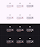

1. Enabled (empty)
2. Focused (empty)
3. Hovered (empty)
4. Enabled (populated)
5. Focused (populated)
6. Hovered (populated)

### Filled text field measurements

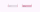

Padding and size measurements without icons

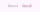

Padding and size measurements with icons

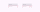

Padding and size measurements with supporting text and character count

| Attribute | Value |
| --- | --- |
| Default container height
 | 56dp |
| Label alignment (unpopulated)
 | Vertically centered |
| Top/bottom padding
 | 8dp |
| Left/right padding without icons
 | 16dp |
| Left/right padding with icons
 | 12dp |
| Icon alignment
 | Vertically centered |
| Padding between icons and text
 | 16dp |
| Supporting text and character counter top padding
 | 4dp |
| Padding between supporting text and character counter
 | 16dp |
| Target size | 56dp |

### Filled text field configurations

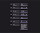

Empty and populated filled text fields with:

1. Supporting text
2. Trailing icon
3. Leading icon
4. Leading and trailing icons
5. Prefix
6. Suffix
7. Multi-line text field

## Outlined text field


1. Enabled container outline
2. Leading icon (optional)
3. Label text in empty field
4. Label text in populated field
5. Trailing icon (optional)
6. Focused container outline
7. Caret
8. Input text
9. Supporting text (optional)

### Outlined text field color

Color values are implemented through design tokens [More on tokens](/m3/pages/design-tokens/overview). For design, this means working with color values that correspond with tokens. For implementation, a color value will be a token that references a value. [Learn more about design tokens](/m3/pages/design-tokens/overview)

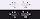

Outlined text field color roles used for light and dark schemes:

1. Outline
2. On surface variant
3. On surface variant
4. Primary
5. On surface variant
6. Primary
7. Primary
8. On surface
9. On surface variant

### Outlined text field states

States are visual representations used to communicate the status of a component or interactive element. [Learn more about interaction states](/m3/pages/interaction-states/overview)

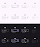

1. Enabled (empty)
2. Focused (empty)
3. Hovered (empty)
4. Disabled (empty)
5. Enabled (populated)
6. Focused (populated)
7. Hovered (populated)
8. Disabled (populated)

### Outlined text field error states

Error states [More on states](/m3/pages/interaction-states/overview) are visual representations used to communicate the status of a component or interactive element. An error message can display instructions on how to fix it. Error messages are displayed below the text field as supporting text until fixed.

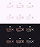

1. Enabled (empty)
2. Focused (empty)
3. Hovered (empty)
4. Enabled (populated)
5. Focused (populated)
6. Hovered (populated)

### Outlined text field measurements

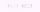

Padding and size measurements without icons

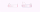

Padding and size measurements with icons

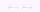

Padding and size measurements with supporting text and character count

| Attribute | Value |
| --- | --- |
| Container height
 | 56dp |
| Left/right padding without icons
 | 16dp |
| Left/right padding with icons
 | 12dp |
| Padding between icons and text
 | 16dp |
| Icon alignment
 | Vertically centered |
| Supporting text and character counter top padding
 | 4dp |
| Padding between supporting text and character counter
 | 16dp |
| Label alignment
 | Vertically centered |
| Left/right padding populated label text
 | 4dp |
| Target size | 56dp |

### Outlined text field configurations

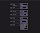

Empty and populated outlined text fields with:

1. Supporting text
2. Trailing icon
3. Leading icon
4. Leading and trailing icons
5. Prefix
6. Suffix
7. Multi-line text field

