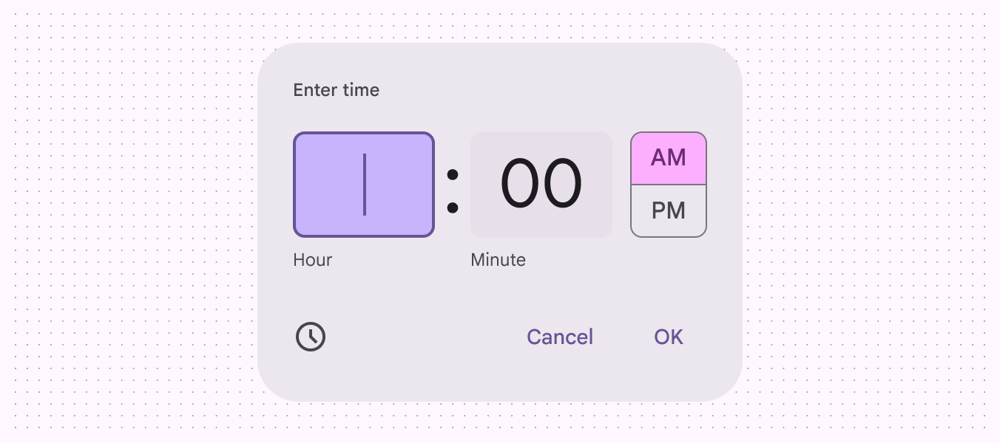
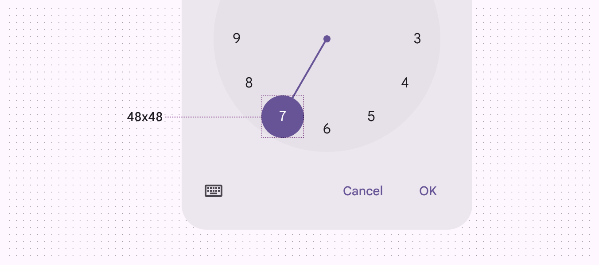
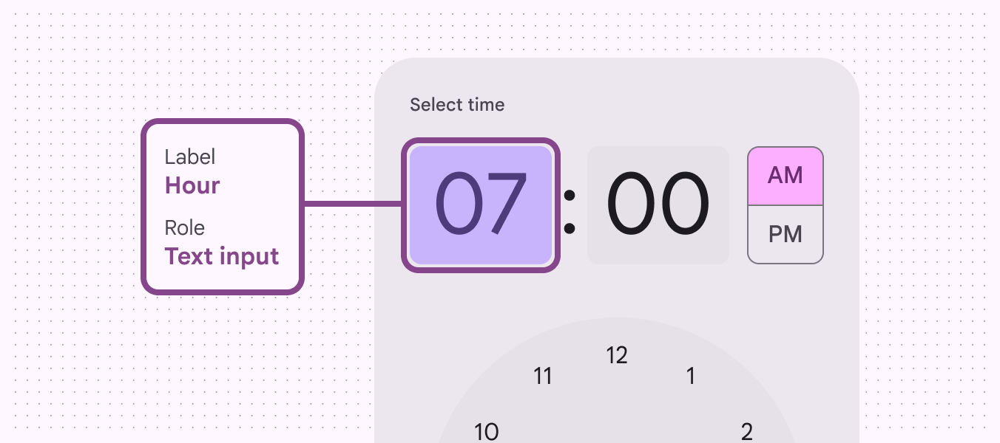
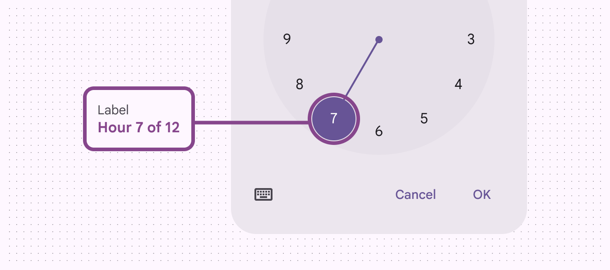

# Time pickers

Time pickers help people select and set a specific time

## Use cases

People should be able to use assistive technology to: 

- Select or enter hours/minutes, and in some cases, seconds/milliseconds
- Choose from multiple time formats, including 24-hour clock view and AM/PM
- Enter time selection manually using input fields

## Interaction & style

Time pickers should allow manual time entry through text input, rather than exclusively through the dial selector. This makes it easier for those using keyboard inputs rather than touchscreens. If a screen is not large enough to display the dial selector, consider displaying the input selector alone. Currently for Android Views, the dial selector is always visible. The input selector should be accessible from the dial selector via the keyboard icon. This interaction allows multiple input methods and makes the time picker accessible for assistive technology users.

For time selection that doesn’t require a dial view, make a time input picker the default option

### Targets

Targets for dial selectors should be 48x48dp.

Dial selector targets should be 48x48dp

## Keyboard navigation

| Keys | Actions |
| --- | --- |
| **Tab** | Focus lands on (non-disabled) time slot |
| **Space** or **Enter**
 | Activates the (non-disabled) time slot |

## Labeling elements

If the input text is correctly linked, assistive tech like a screenreader will read the component’s role first, then the UI text.

The hour and minute fields have the text input role

The dial selector will read a selection of total hours, such as **Hour 7 of 12**.

A screen reader reads the text label of a dial selector

### Dial selector

| Element
 | Accessibility label | Role (Wiz and Jetpack Compose)
 | Role (Android Views)
 |
| --- | --- | --- | --- |
| Hour input (input picker)
 | Hour | Text input | \- |
| Minutes input
 | Minute | Text input | \- |
| AM/PM selection 
 | AM or PM | Radio button (in list) | Checkbox (in list) |
| Keyboard button
 | Toggle input picker | Button | Button |
| Cancel button
 | Cancel | Button | Button |
| OK button
 | OK | Button | Button |
| Clock dial time selection (dial selector)
 | {Value} Hours or minutes of {Total} | Button | \- |

### Input selector

| Element
 | Accessibility label | Role (Wiz and Jetpack Compose)
 | Role (Android Views)
 |
| --- | --- | --- | --- |
| Hour input (input picker)
 | Hour | Text input | \- |
| Minutes input
 | Minute | Text input | \- |
| Clock button
 | Toggle dial picker | Button | Button |
| Cancel button
 | Cancel | Button | Button |
| OK button
 | OK | Button | Button |

