# Time pickers

Time pickers help people select and set a specific time

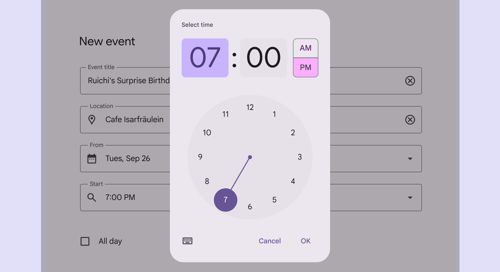

Dial selector time picker for a 12-hour clock

## Usage

Time pickers allow people to enter a specific time value. They’re displayed in dialogs [More on dialogs](/m3/pages/dialogs/overview) and can be used to select hours, minutes, or periods of time. They can be used for a wide range of scenarios. Common use cases include:

- Setting an alarm
- Scheduling a meeting

Time pickers are not ideal for nuanced or granular time selection [More on selection](/m3/pages/selection), such as milliseconds for a stopwatch application.

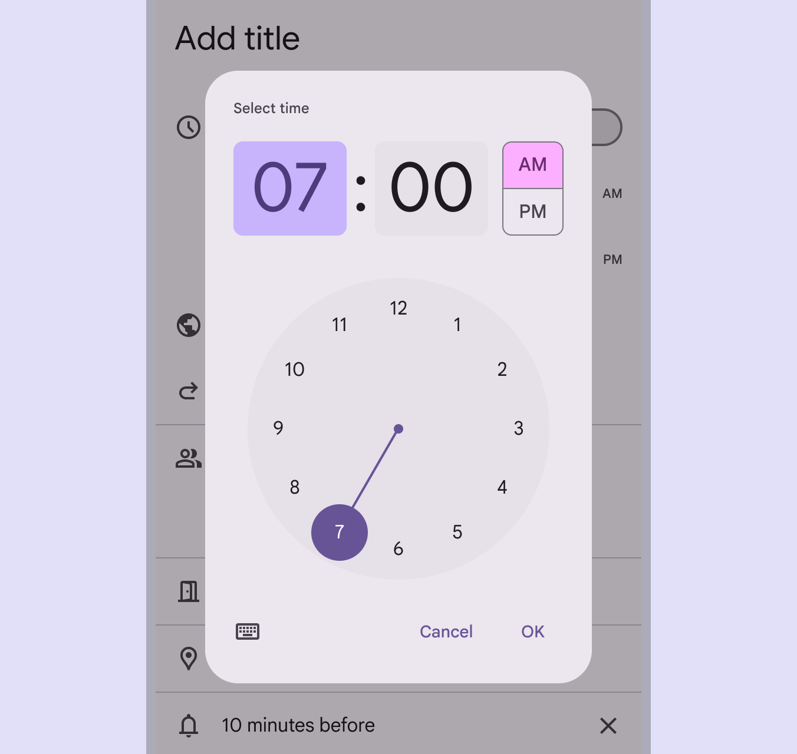

check Do

Hour selection in a mobile calendar picker

### Time input picker

Time input pickers allow people to specify a time using keyboard numbers. This input option should be accessible from any other mobile time picker interface by tapping the keyboard icon.

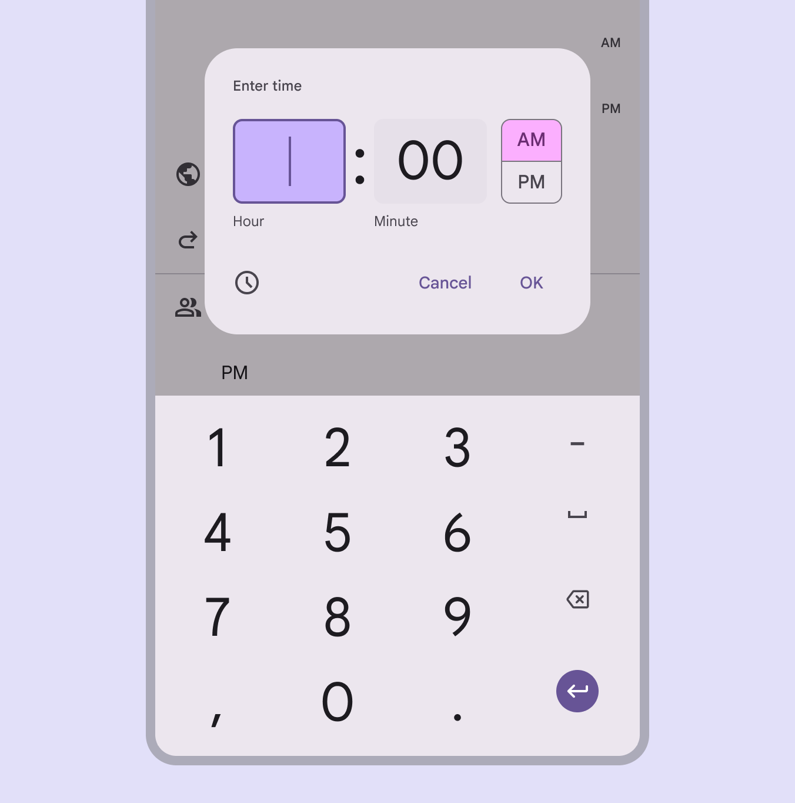

Hour input with keyboard entry

### 24-hour time selection

The dial view can be changed to reflect time selection [More on selection](/m3/pages/selection) across 24 hours. This option is set outside of the time picker component, typically through system settings.

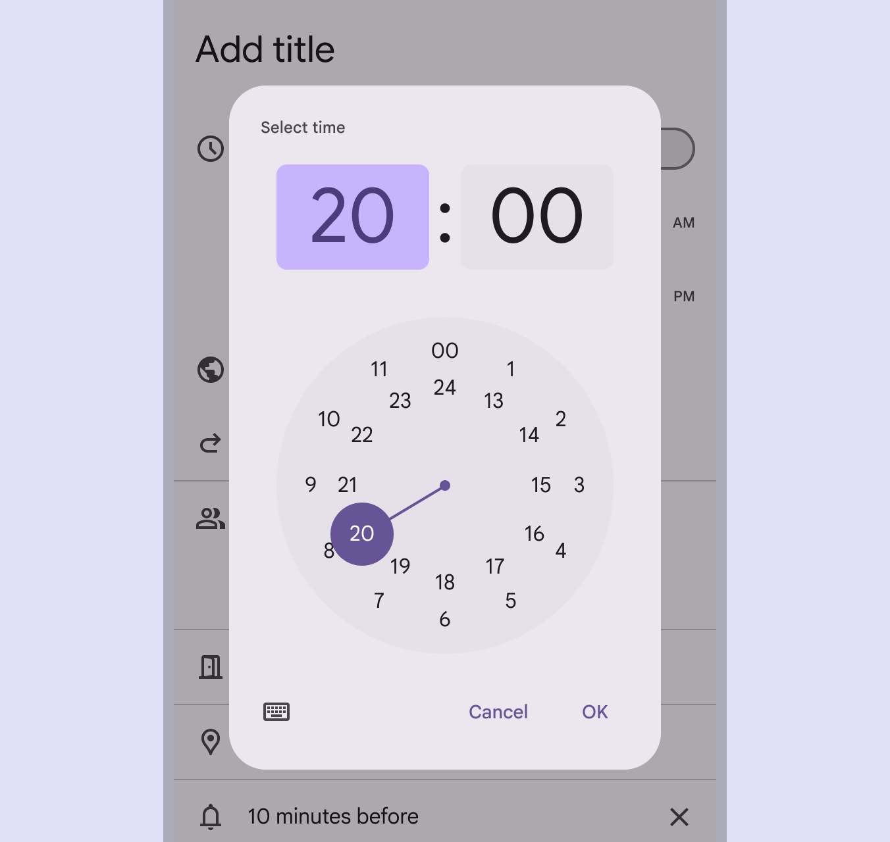

24-hour dial view

## Anatomy

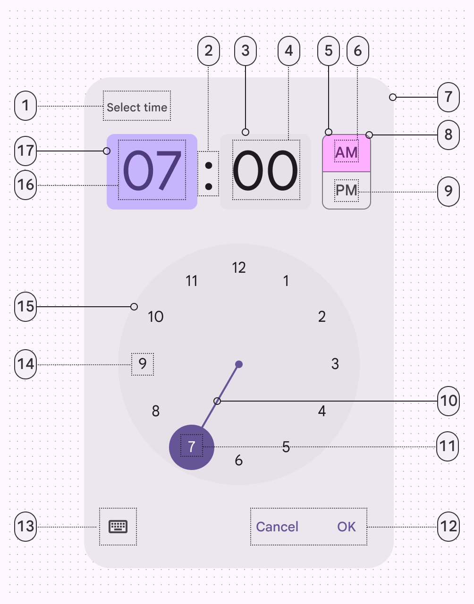

1. Label (headline)
2. Time selector separator
3. Input field
4. Input text
5. Period selector (selected)
6. Period selector text (selected)
7. Container
8. Period selector outline
9. Period selector text
10. Dial selector track
11. Dial label (selected)
12. Text buttons
13. Icon button
14. Dial label (unselected)
15. Clock dial
16. Input text (selected)
17. Input field (selected)

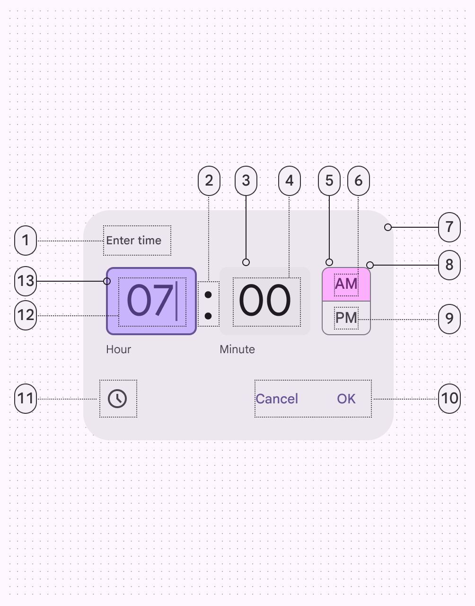

1. Label (headline)
2. Time selector separator
3. Input field
4. Input text
5. Period selector (selected)
6. Period selector text (selected)
7. Container
8. Period selector outline
9. Period selector text (unselected)
10. Text buttons
11. Icon button
12. Input text (selected)
13. Input field (selected)

### Container

Like dialogs [More on dialogs](/m3/pages/dialogs/overview), the container should appear above other screen elements. To focus attention, surfaces behind the container have a temporary scrim overlay to make them less prominent.

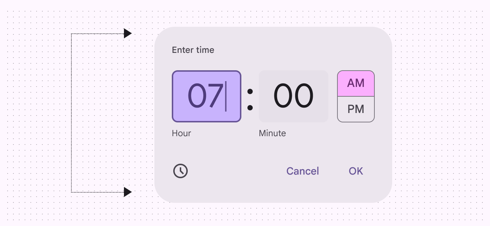

The container includes all time picker elements

### Input selector

The input selector is a unique kind of text field [More on text fields](/m3/pages/text-fields/overview) input. It differs from typical text field inputs in that it has:

- An added highlight to call attention to the selected field
- A larger shape, size, and font
- A label below the field

Hours and minutes should have separate inputs. For people using a 12-hour clock, an AM/PM selector appears to the right of minutes. For people using a 24-hour clock, the AM/PM selector shouldn’t appear.

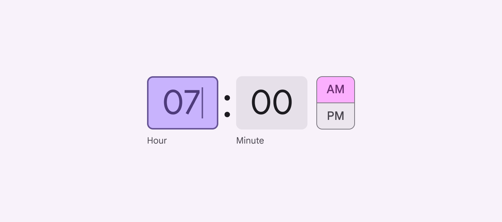

Input selector for a 12-hour clock

### Dial selector

Dial selectors always mimic a round watch face. Hours and minutes can be selected by tapping a number or dragging the dial selector track. When representing a 12-hour dial, all numbers appear in the outer ring. When representing a 24-hour dial, even numbers appear in an inner ring, and odd numbers appear in an outer ring.

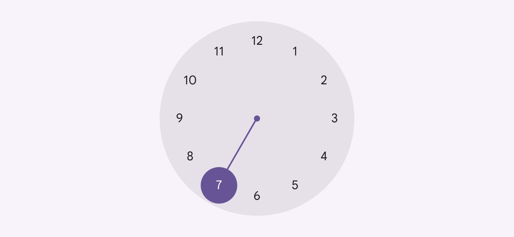

Dial selector for a 12-hour clock

### Text & icon buttons

Icon buttons [More on icon buttons](/m3/pages/icon-buttons/overview) are used to switch between the input selector, represented by a keyboard, and the dial selector, represented by a clock. Text buttons [More on buttons](/m3/pages/common-buttons/overview) are used to exit the dialog [More on dialogs](/m3/pages/dialogs/overview) (**Cancel**) and save the selector input (**OK**).

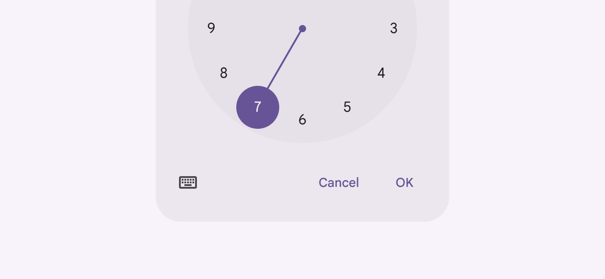

The keyboard icon allows people to switch between the dial selector (pictured) and the input selector

### Landscape orientation

The clock dial interface adapts to a device’s orientation. In landscape mode, the stacked input and selection options are positioned side-by-side.

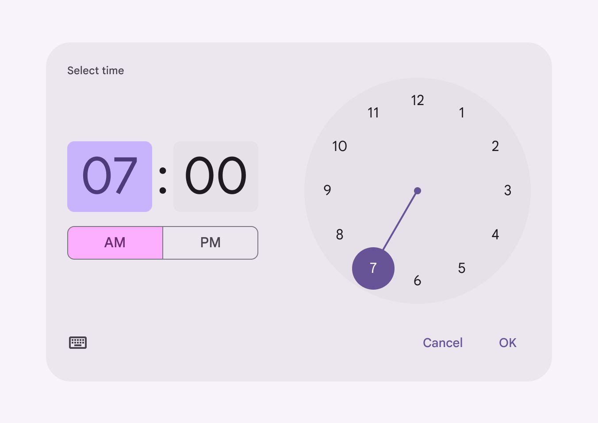

On mobile, the time picker can adapt to landscape orientation

## Placement

Time pickers shouldn’t be obscured by other elements. Time pickers should change orientation or variant to ensure they aren't cropped by the edge of the screen. Time pickers are modal windows above a scrim. This puts the time pickers at the forefront of a person's view, calling attention to make a selection [More on selection](/m3/pages/selection) of time.

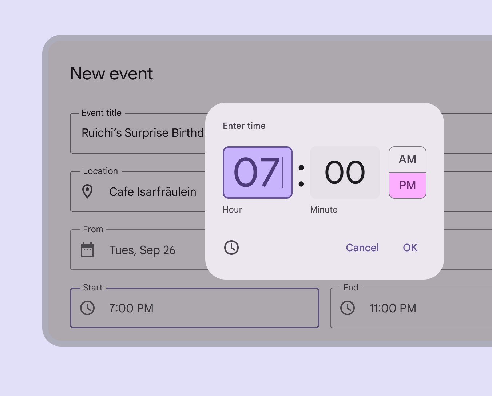

The time picker should change to fit the size of the screen so the time picker is always fully visible

## Adaptive design

Time pickers can swap between orientation or variant depending on device orientation and viewport constraints. For example, the time picker can change to landscape orientation on larger breakpoints or when viewport height is limited, to avoid scrolling the dial presentation. Time pickers can fallback to the input time picker when there isn’t enough vertical real estate to present the landscape orientation without scrolling.

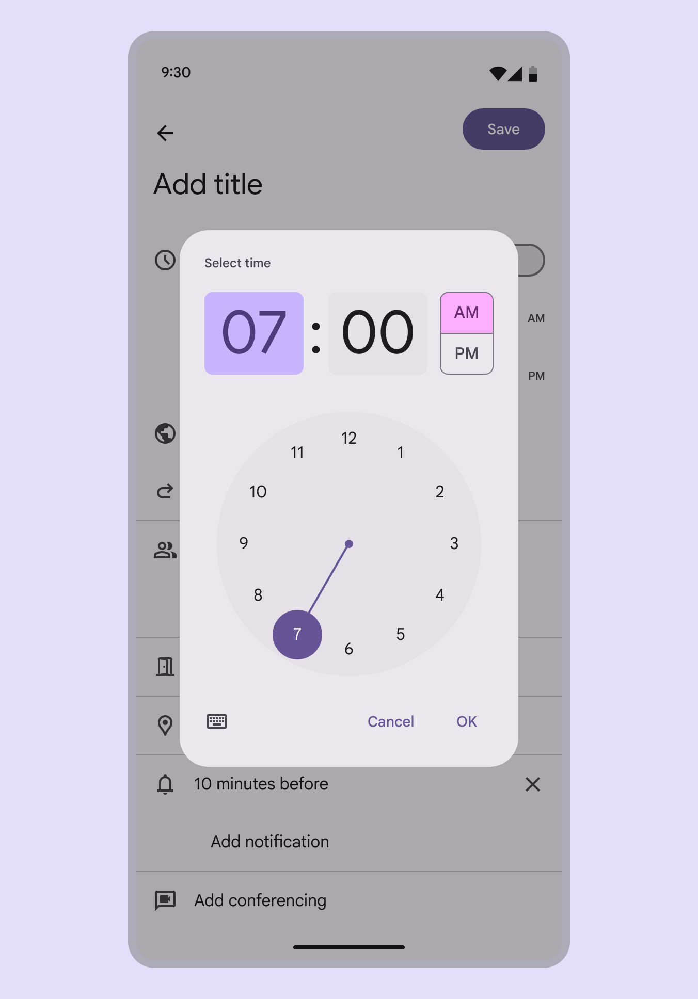

High-density time picker displayed on mobile

### Density

Don’t apply density to the time picker dial when the viewport is constrained. Instead, use an input picker.

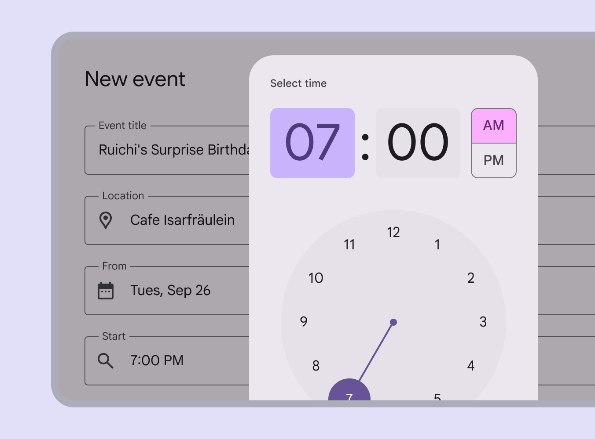

close Don’t

Don’t apply density to the time picker dial when the viewport is constrained. Instead, use an input picker.

## Behavior

There are two primary methods for selecting time with the mobile time picker. People can:

- Type in a specific value in the hour and minute fields
- Select the hour or minute field from the text input and adjust the clock dial to simultaneously change the corresponding time field above

The dial time picker supports both manual and dial input

### Appearing & disappearing

Like other kinds of dialogs [More on dialogs](/m3/pages/dialogs/overview), time pickers use an enter and exit transition pattern to appear on the screen. To exit a time picker, the input can either be confirmed (**OK**) or dismissed (**Cancel**). Interacting outside of the dialog will also dismiss the time picker. Unless one of these actions is taken, a time picker will continue to retain focus.

**OK** confirms the entry and closes the dialog

### Toggle between dial & input

Tapping the keyboard icon on a mobile time picker switches the view to the input picker . The keyboard icon in the lower left toggles between the input picker and the dial picker

### Scrolling

Time pickers should avoid scrolling, and swap component orientation or variant based on device orientation or viewport size. Time pickers don’t scroll with elements outside of the modal window, such as the background.

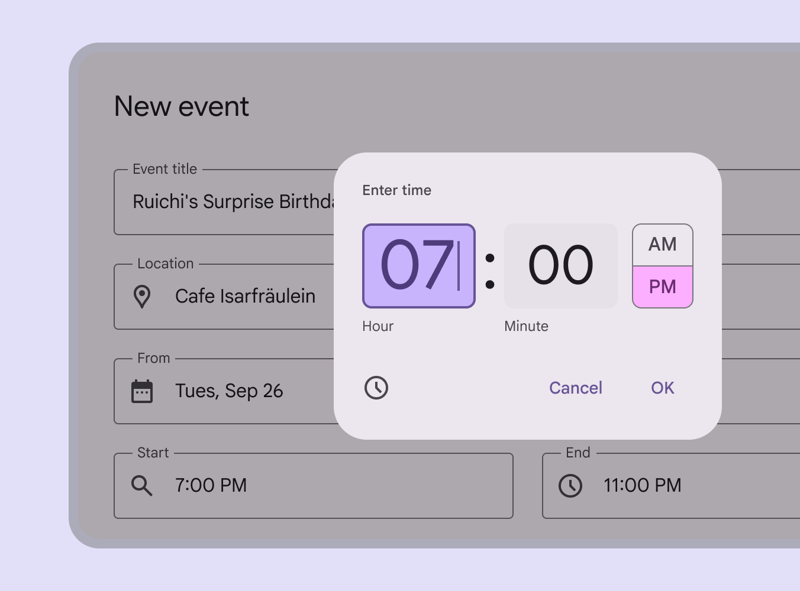

Time pickers shouldn’t scroll

