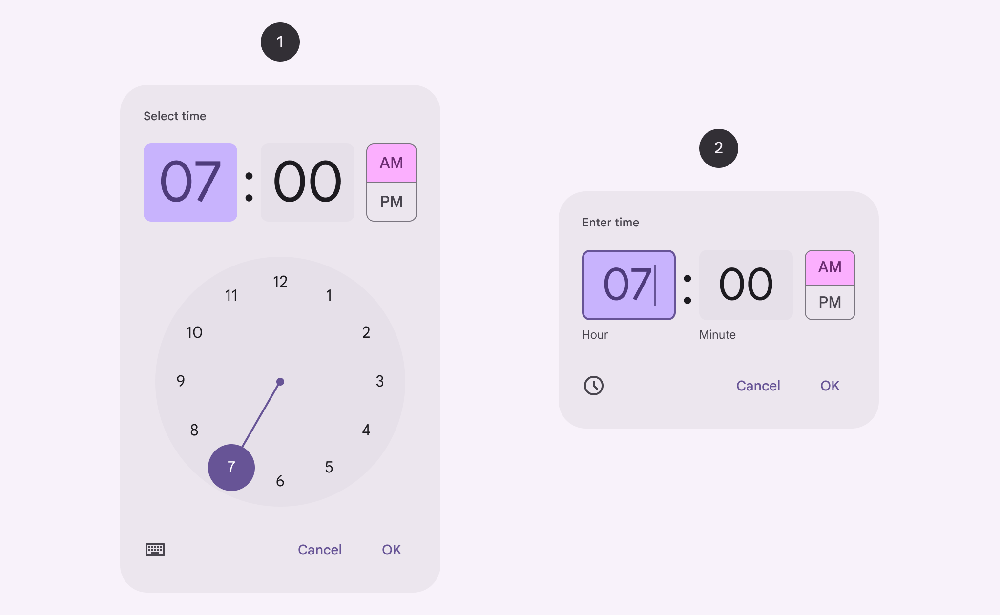
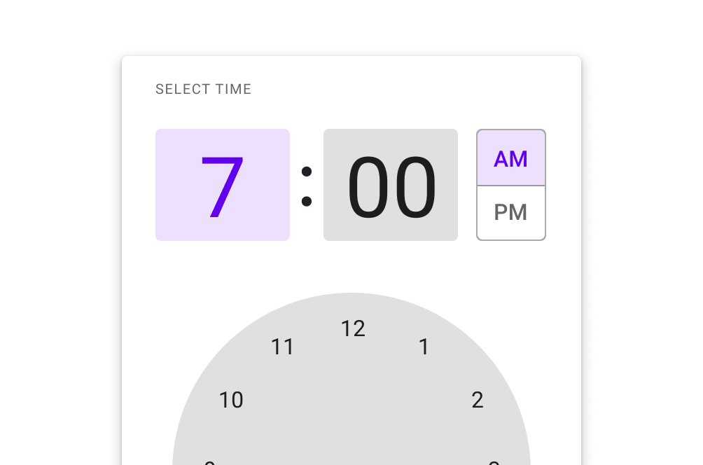
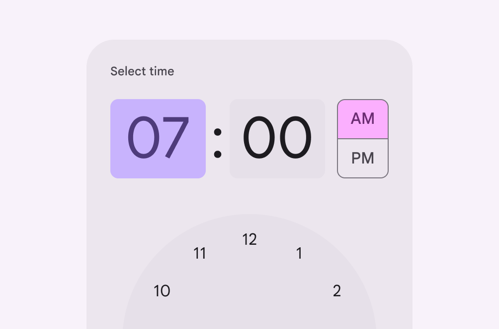

# Time pickers

Time pickers help people select and set a specific time

- Time pickers are modal and cover the main content
- Two variants: dial and input
- People can select hours, minutes, or periods of time
- Make sure time can easily be selected by hand on a mobile device

1. Time picker dial
2. Time picker input

## Availability & resources

| Type | Resource | Status |
| --- | --- | --- |
| Design | [Design Kit (Figma)](https://www.figma.com/community/file/1035203688168086460) | Available |
| Implementation |  | Available |
| Implementation | [Jetpack Compose](https://developer.android.com/develop/ui/compose/components/time-pickers) | Available |
| Implementation |  | Available |

## Differences from M2

- Color: New color mappings and compatibility with dynamic color [More on dynamic color](/m3/pages/dynamic/choosing-a-source)

M2: Time pickers had different color mappings

M3: Time pickers have new color mappings compatible with dynamic color

