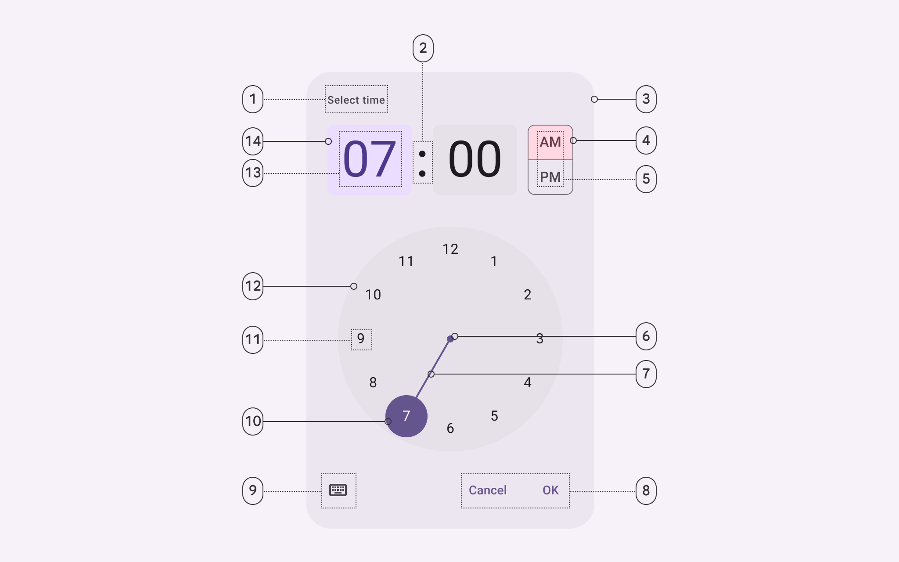
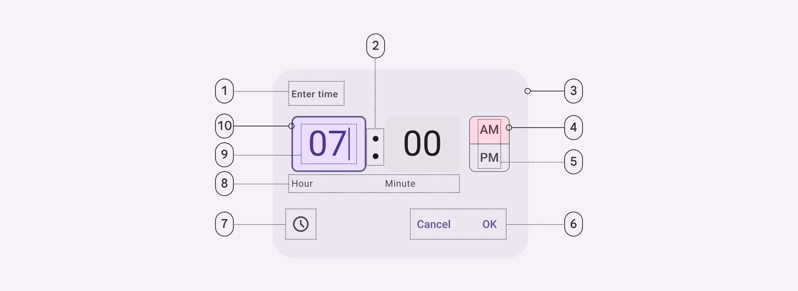
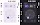
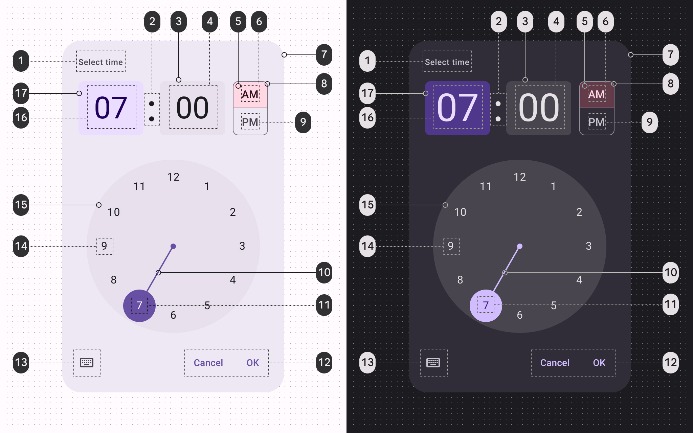
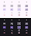
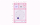
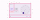

# Time pickers

Time pickers help people select and set a specific time

## Tokens & specs

Select a component variant below to see its elements, attributes, tokens, and their values. [Learn more about design tokens](/m3/pages/design-tokens/overview)

```
Time picker - Dial
```

```
Time picker - Dial
```

```
Time picker - Dial
```

```
Time picker - Dial
```

Time picker - Dial

Token

Default, Light

Enabled

Hovered

Focused

Pressed (ripple)

## Anatomy

### Time picker dial



1. Headline
2. Time selector separator
3. Container
4. Period selector container
5. Period selector label text
6. Clock dial selector center
7. Clock dial selector track
8. Text button
9. Icon button
10. Clock dial selector container
11. Clock dial label text
12. Clock dial container
13. Time selector label text
14. Time selector container

### Time picker input



1. Headline
2. Time input field seperator
3. Container
4. Period selector container
5. Period selector label text
6. Text button
7. Icon button
8. Time input field supporting text
9. Time input field label text
10. Time input field container

## Color

Color values are implemented through design tokens [More on tokens](/m3/pages/design-tokens/overview). For design, this means working with color values that correspond with tokens. For implementation, a color value will be a token that references a value. [Learn more about design tokens](/m3/pages/design-tokens/overview)

### Time picker dial color



Time picker dial color roles used for light and dark themes:

1. On surface variant
2. On surface
3. Surface container highest
4. On surface
5. Tertiary container
6. On tertiary container
7. Surface container high
8. Outline
9. On surface
10. Primary
11. On primary
12. Primary
13. On surface variant
14. On surface
15. Surface container highest
16. On primary container
17. Primary container

### Time picker input color


Time picker input color roles used for light and dark themes:

1. On surface variant
2. On surface
3. Surface container highest
4. On surface
5. Tertiary container
6. On tertiary container
7. Surface container high
8. Outline
9. On surface
10. Primary
11. On surface variant
12. On primary container
13. Primary container

## States



1. Enabled
2. Hover
3. Focus
4. Pressed

[States specs can be found in the token module above](/m3/pages/time-pickers/specs#2ccd9809-9246-4667-85fa-7747f4ac7349)

## Measurements

### Time picker dial - vertical



Vertical time picker dial padding and size measurements

| Element | Attribute | Value |
| --- | --- | --- |
|
Container

 |

Width

 |

Dynamic

 |
|

Height

 |

Dynamic

 |
|

Headline alignment

 |

Left

 |
|

Top/bottom padding

 |

24dp

 |
|

Left/right padding

 |

24dp

 |
|

Time selector container

 |

Width

 |

96dp

 |
|

Width (24h vertical)

 |

114dp

 |
|

Height

 |

80dp

 |
|

Period selector container

 |

Width (vertical layout)

 |

52dp

 |
|

Height (vertical layout)

 |

80dp

 |
|

Width (horizontal layout)

 |

216dp

 |
|

Height (horizontal layout)

 |

38dp

 |
|

Clock dial container

 |

Size

 |

256dp

 |
|

Clock dial selector handle

 |

Size

 |

48dp

 |
|

Clock dial selector center

 |

Size

 |

8dp

 |
|

Clock dial selector track

 |

Width

 |

2dp

 |

### Time picker dial - horizontal



Horizontal time picker dial padding and size measurements

| Element | Attribute | Value |
| --- | --- | --- |
|
Container

 |

Width

 |

Dynamic

 |
|

Height

 |

Dynamic

 |
|

Headline alignment

 |

Left

 |
|

Top/bottom padding

 |

24dp

 |
|

Left/right padding

 |

24dp

 |
|

Time selector container

 |

Width

 |

96dp

 |
|

Width (24h vertical)

 |

114dp

 |
|

Height

 |

80dp

 |
|

Period selector container

 |

Width (vertical layout)

 |

52dp

 |
|

Height (vertical layout)

 |

80dp

 |
|

Width (horizontal layout)

 |

216dp

 |
|

Height (horizontal layout)

 |

38dp

 |
|

Clock dial container

 |

Size

 |

256dp

 |
|

Clock dial selector handle

 |

Size

 |

48dp

 |
|

Clock dial selector center

 |

Size

 |

8dp

 |
|

Clock dial selector track

 |

Width

 |

2dp

 |

### Time picker input


Time picker input padding and size measurements

| Element
 | Attribute | Value |
| --- | --- | --- |
|
Container

 |

Width

 |

Dynamic

 |
|

Height

 |

Dynamic

 |
|

Headline alignment

 |

Left

 |
|

Top/bottom padding

 |

24dp

 |
|

Left/right padding

 |

24dp

 |
|

Time input field container

 |

Width

 |

96dp

 |
|

Height

 |

72dp

 |
|

Period selector container

 |

Width

 |

52dp

 |
|

Height

 |

72dp

 |

## Configurations

### Vertical orientation and horizontal orientation


1. Vertical layout (default on mobile)
2. Horizontal layout

### 24-hour time picker dial


1. 24h dial in vertical layout (default on mobile)
2. 24h dial in horizontal layout

### 12-hour and 24-hour time picker inputs


1. 12h input
2. 24h input

