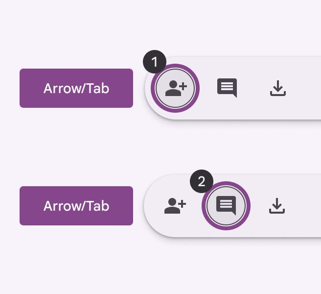
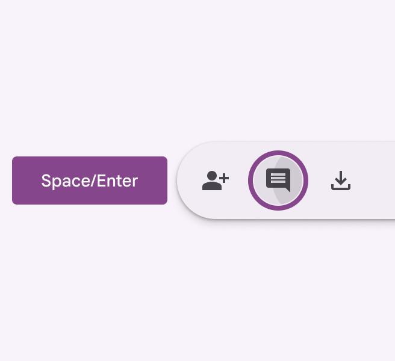
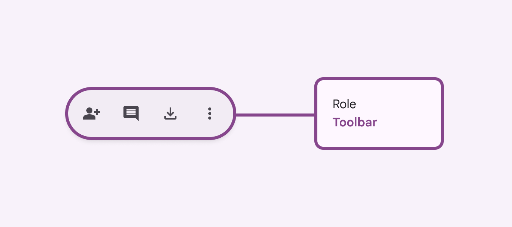

# Toolbars

Toolbars display frequently used actions relevant to the current page

## Use cases

People should be able to the following with assistive technology:

- Navigate and activate any actions in the toolbar
- Select a destination from a menu
- Activate a back button
- Maintain access to toolbar controls when the content is scrolled or collapsed

## Interaction & style

The toolbar has no interactions by default. All interactions are with the elements placed inside. 

**Touch**

- When tapping on an icon button in the toolbar, a touch ripple appears, indicating interaction feedback. Touch: Tap

**Cursor**

- When hovered, the hover state provides a visual cue to the user that the element is interactive.
- When clicked (in both active and inactive states), a ripple appears, showing the user feedback. Cursor: Hover, Click

### Initial focus

Focus lands on the first interactive element. Use **Tab** to navigate through all other actions.

Use **Tab** to navigate through interactive elements

Use **Space** or **Enter** to activate actions

## Keyboard navigation

<table style="width:100%"><tbody><tr><th>Keys</th><td>Actions</td></tr><tr><th>Tab or Arrows </th><td>Navigate between interactive elements</td></tr><tr><th>Space or&nbsp;Enter </th><td>Activate the focused element</td></tr></tbody></table>

### Labeling elements

On web, the toolbar container should have the **toolbar** role. On mobile, it can be a generic container. All actions inside the toolbar should follow their respective accessibility guidelines.

On web, use the **toolbar** role

