# Toolbars

Toolbars display frequently used actions relevant to the current page

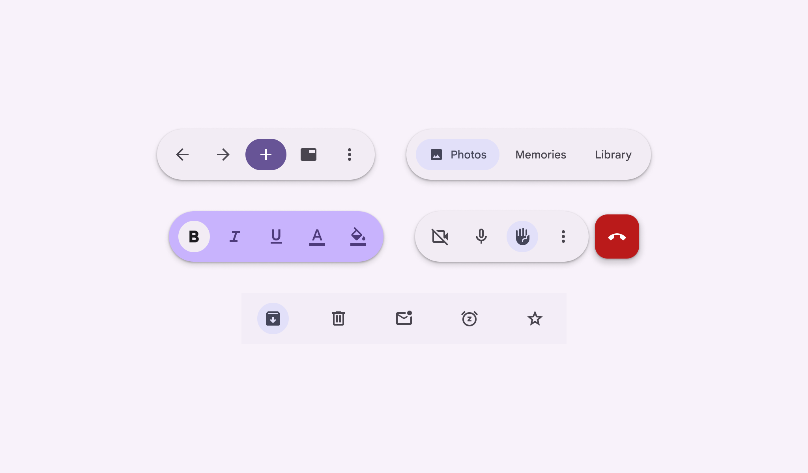

Toolbars can be used for a wide variety of use cases

## Usage

Use a toolbar to provide actions related to the current page. Toolbars can contain many actions and can scale to show more actions in larger windows.

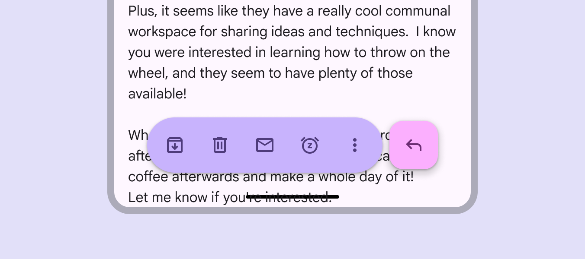

A toolbar provides actions related to the current page

There are two variants of toolbars:

- **Docked toolbar**
    Spans the full width of the window. It’s best used for global actions that remain the same across multiple pages.

- **Floating toolbar**
    Floats above the body content. It’s best used for contextual actions relevant to the body content or the specific page. The baseline **bottom app bar** is no longer recommended, but is still supported.

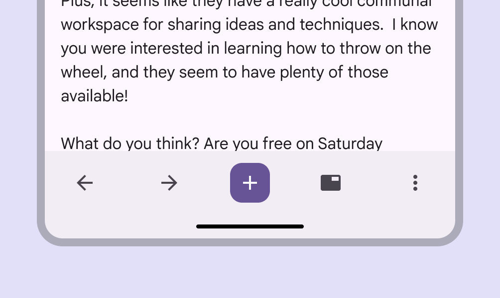

Docked toolbar shows global controls

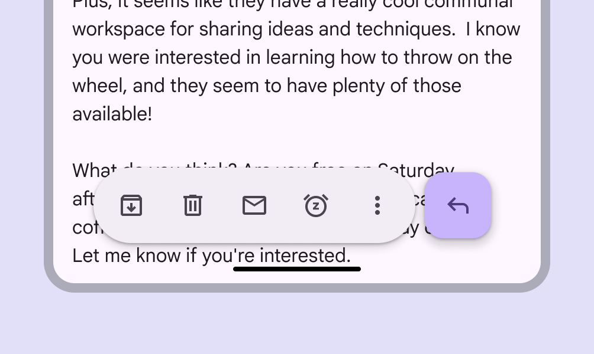

Floating toolbar show controls relevant to the current page

When actions don’t fit in a toolbar, add a Menus display a list of choices on a temporary surface. More on menus [More on menus](/m3/pages/menus/overview).

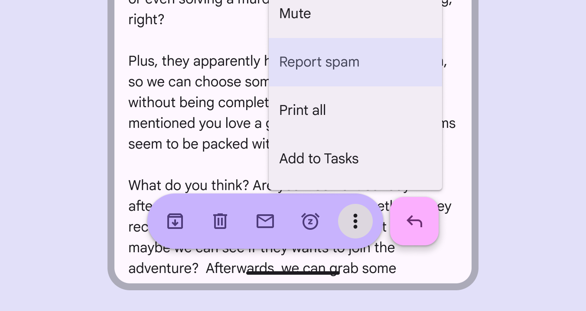

Toolbar actions can open a menu

There are two color configurations:

- **Standard**
    A low-emphasis color scheme best used for focusing attention on the body content.

- **Vibrant**
    A high-emphasis color scheme that draws attention to the controls. It can also indicate a temporary change in the page behavior, such as entering edit mode. Consider using alternative color roles to create greater or lesser emphasis depending on the needs of the app. Experiment with different color roles to achieve different effects. 

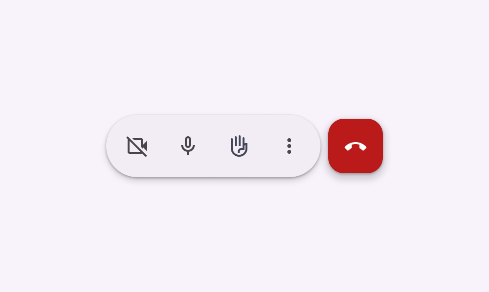

Use the standard color scheme to draw focus to content outside the toolbar

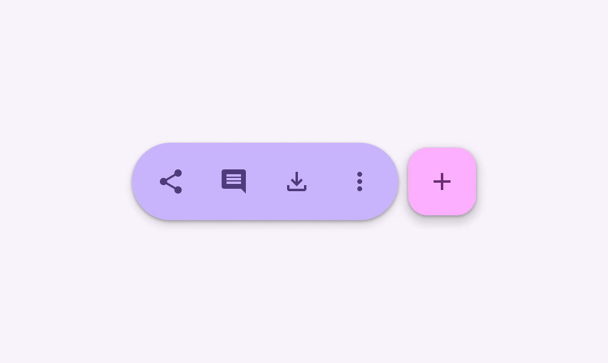

Use the vibrant color scheme to emphasize controls or actions

### Toolbars & navigation bars

The toolbar and navigation bar [More on navigation bars](/m3/pages/navigation-bar/overview) are both placed at the bottom of the window, so should **not** be shown at the same time. Show the navigation bar on primary pages, and toolbars on subsequent pages with actions.

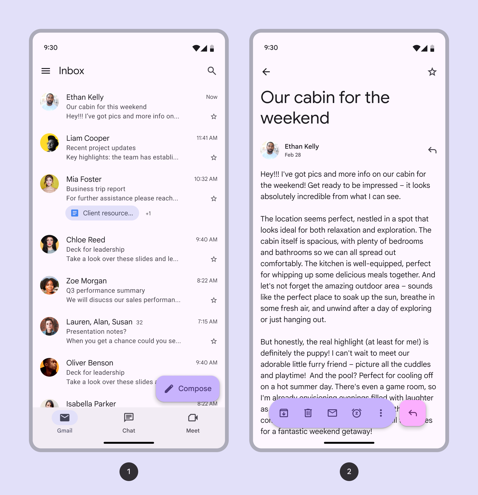

1. Navigation bar on a primary page
2. Toolbar on a secondary page with contextual actions

Floating toolbars can be used as tabs between related subsequent pages in the product hierarchy. This helps group similar pages together, and shows that the selection affects the body content underneath.

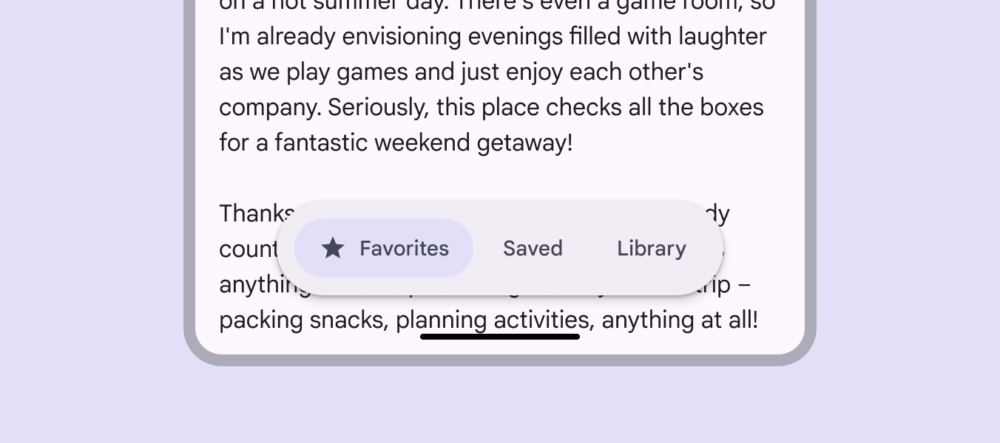

check Do

Keep navigation distinct, and use a toolbar to display local navigation on a specific page

Consider the existing app hierarchy when using a toolbar for local navigation. Avoid redundant or confusing navigation combinations in the same view.

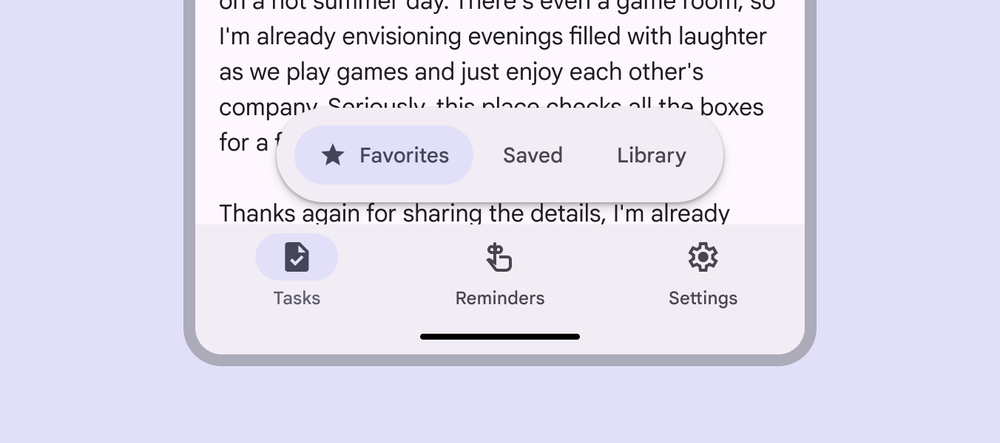

close Don’t

Don’t show a navigation bar and a toolbar with navigation controls at the same time

## Anatomy

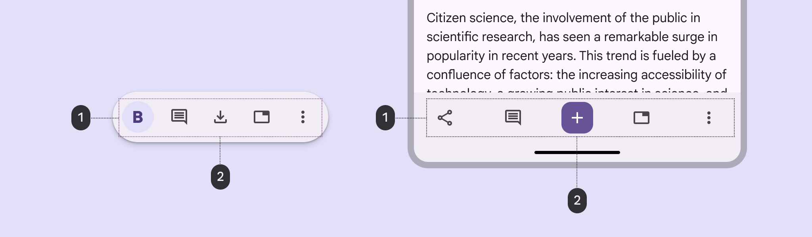

1. Container
2. Elements

### Container

The docked toolbar’s container spans the full width of the window. Avoid applying rounded corners to the container. This can imply the container expands or changes upon interaction.

check Do

Use straight corners for docked toolbars

close Don’t

Avoid modifying the container shape

As long as there's a minimum of 16dp padding on the leading and trailing edge, arrange controls inside however you see fit. The 32dp padding between items is just the default. All elements need a minimum 48x48dp target area to be accessible. Be cautious of including too many controls as it can be overwhelming.

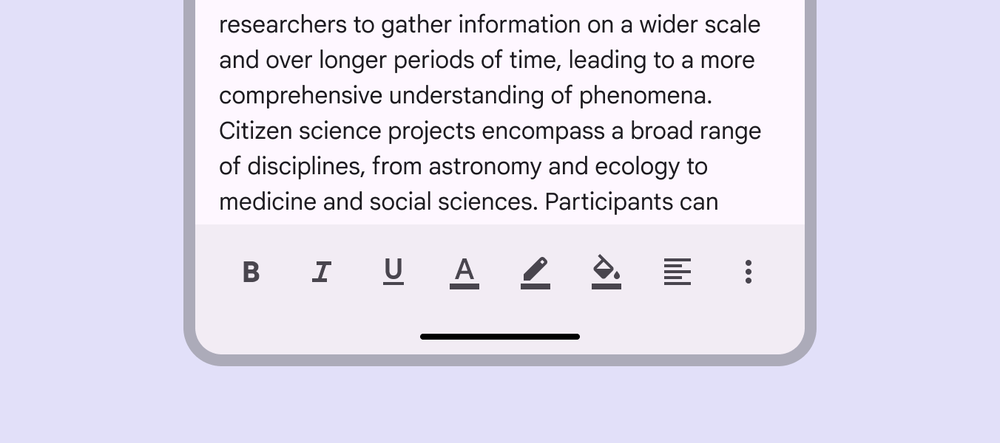

close Don’t

Don’t overwhelm people with too many controls

The floating toolbar’s container should be fully visible on screen. If more actions are needed, use an overflow menu.

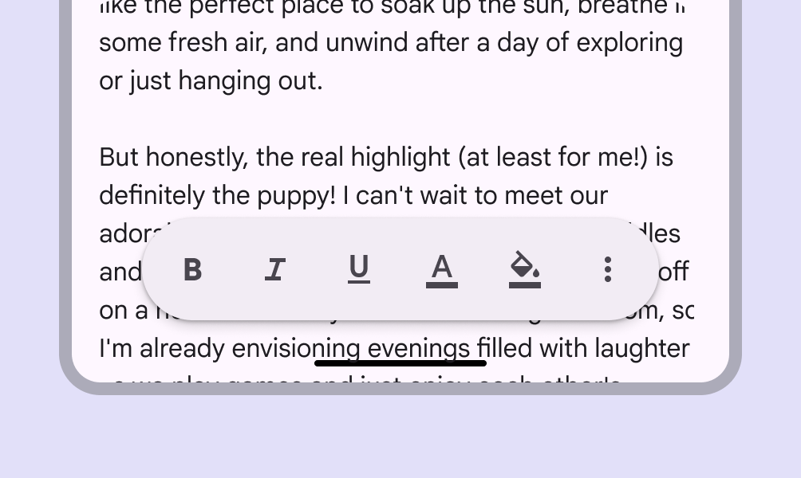

check Do

Choose the most essential actions to show on screen by default

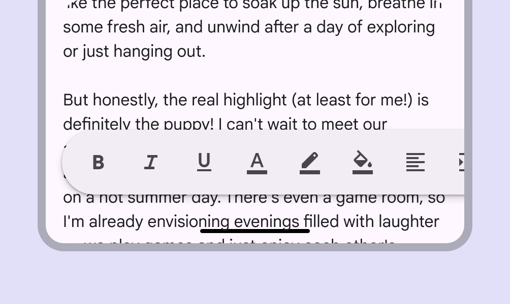

close Don’t

Floating toolbars shouldn’t exceed the edge of the window or pane

#### Elevation

Floating toolbars have elevation by default. If the content beneath the toolbar is visually distinct, elevation can be removed.

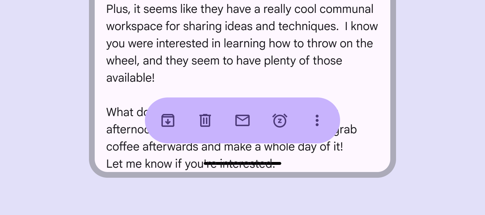

The elevation on floating toolbars can be removed if on a visually distinct background

### Flexibility & slots

When configuring a toolbar, think of it as a container with several slots. These slots can be populated by buttons [More on buttons](/m3/pages/common-buttons/overview), icon buttons [More on icon buttons](/m3/pages/icon-buttons/overview), images, text fields [More on text fields](/m3/pages/text-fields/overview), or any kind of custom component. Icon buttons provide an even hierarchy of controls. Mixing in a filled icon button can help add emphasis to a single action.

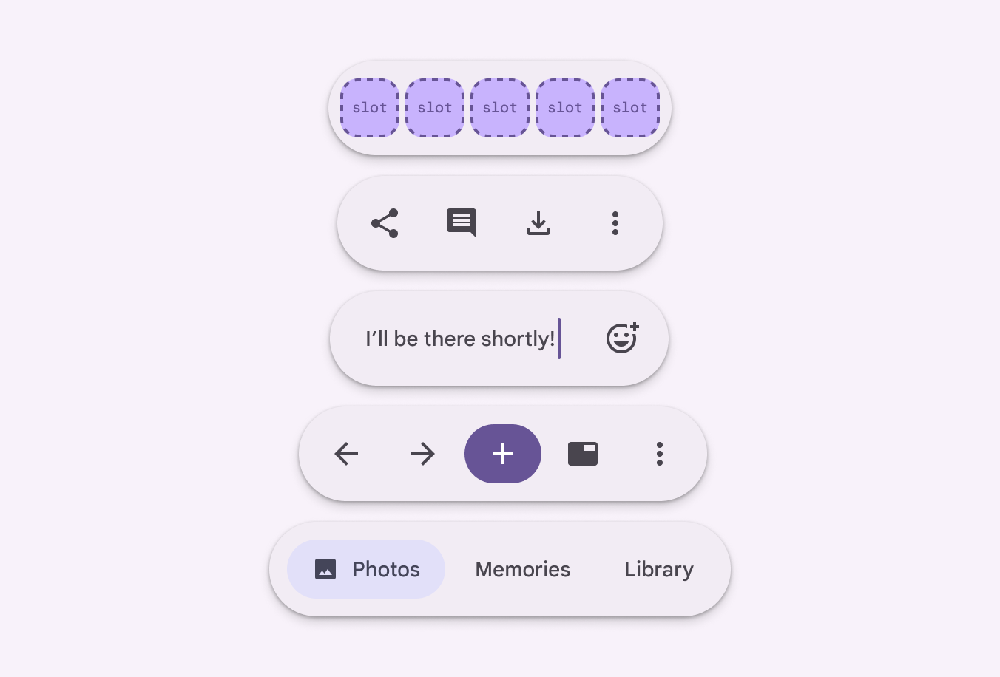

Toolbars are made of slots that can contain many kinds of actions

Visually emphasizing a single action more than others is an effective way to create hierarchy and guide people to controls they use most often. Avoid emphasizing more than one action at a time. Some common ways to add emphasis to toolbar actions include:

- Use different icon button [More on icon buttons](/m3/pages/icon-buttons/overview) color styles, such as filled, tonal, and standard
- Customize the color roles [More on color roles](/m3/pages/color-roles/) of a single action, such as a primary or secondary palette
- Use wide and narrow icon buttons
- Pair the toolbar with a FAB [More on FABs](/m3/pages/fab/overview)

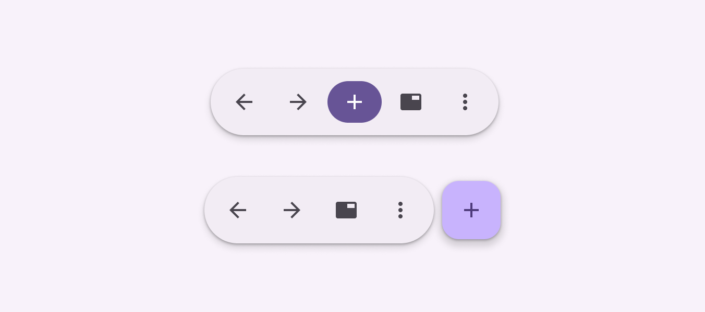

Two different ways to create a high emphasis action in toolbars

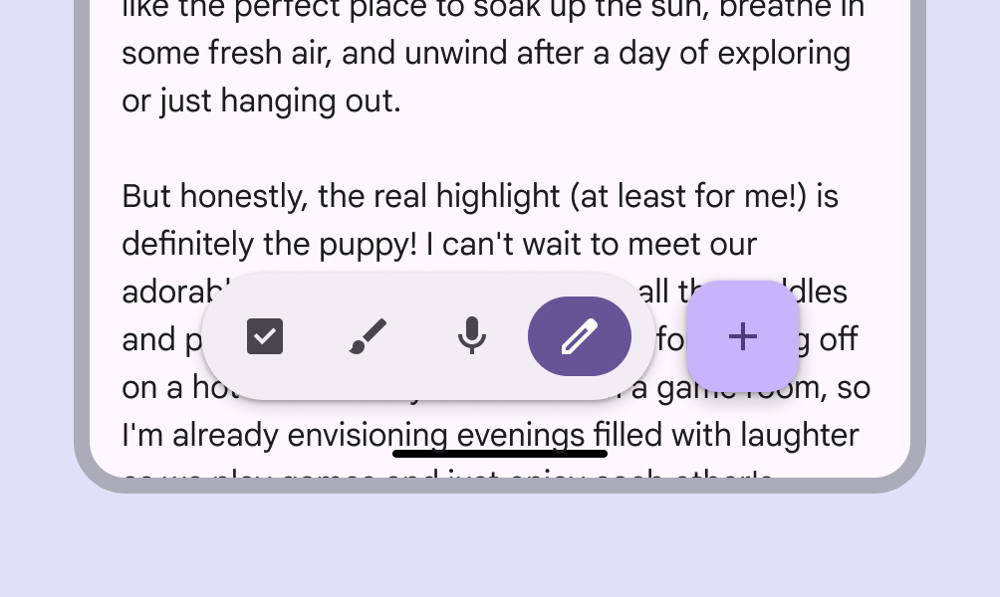

close Don’t

Don’t emphasize multiple buttons with bold, primary colors, such as a button and FAB together. Emphasize one action at a time.

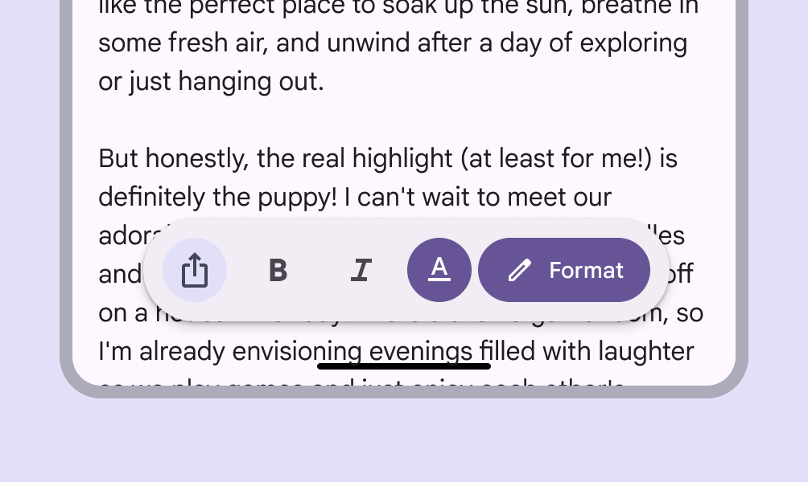

close Don’t

Avoid mixing too many different controls in the same toolbar. A consistent control design keeps things clear. Avoid using square icon buttons in floating toolbars. Their square shape conflicts with the fully-rounded shape of the floating toolbar container. Square buttons can be used in the docked toolbar.

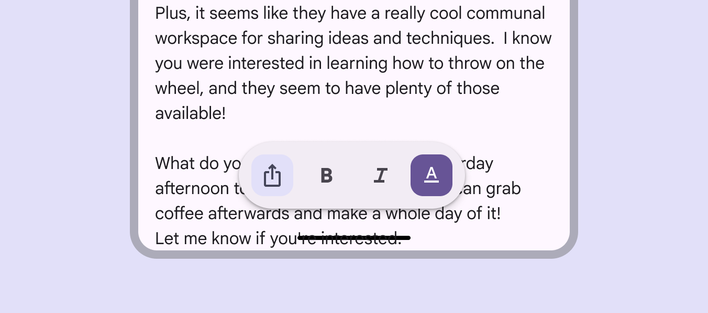

close Don’t

Don’t use square filled icon buttons in floating toolbars

### Floating toolbar with FAB

A FAB [More on FABs](/m3/pages/fab/overview) can be placed next to a floating toolbar to present one high-priority action alongside a unified set of toolbar actions. Use a FAB for the highest-priority action in the view, or to complement the controls.

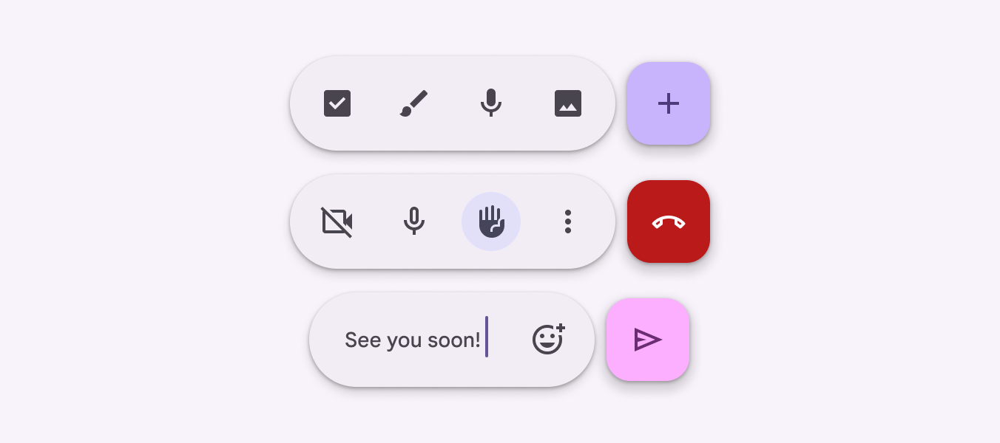

Floating toolbars can be paired with FABs

## Position & orientation

Only place docked toolbars at the bottom of the window. If using other bottom-aligned elements, such as a navigation bar, don't use a docked toolbar.

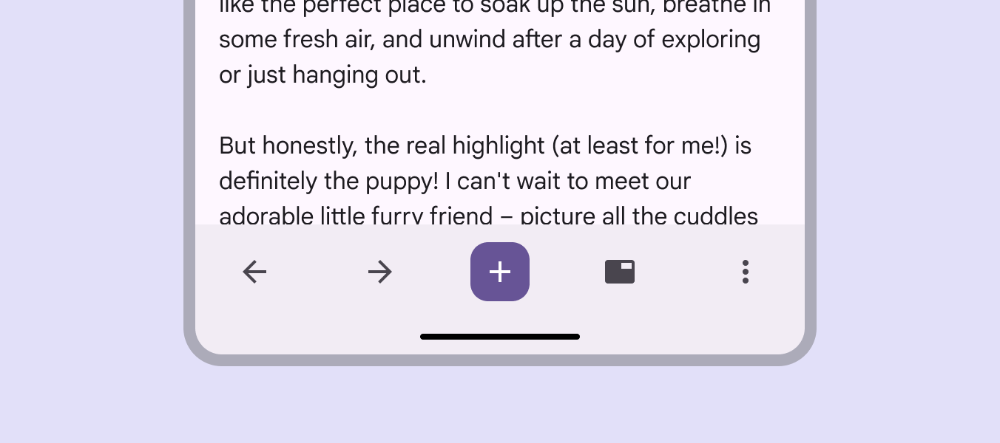

Docked toolbars are always at the bottom of the window

Floating toolbars can be horizontal or vertical. Horizontal toolbars should have a minimum 16dp margin from the edge of the window.

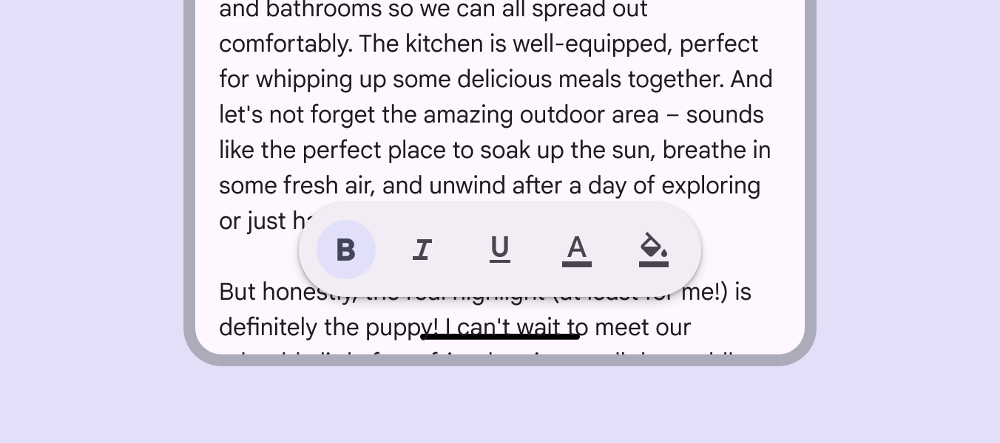

Horizontal floating toolbars should be at least 16dp from the edge of the window

In larger window sizes, floating toolbars can be vertical and placed on either side of the screen. Vertical toolbars should have a minimum 24dp margin.

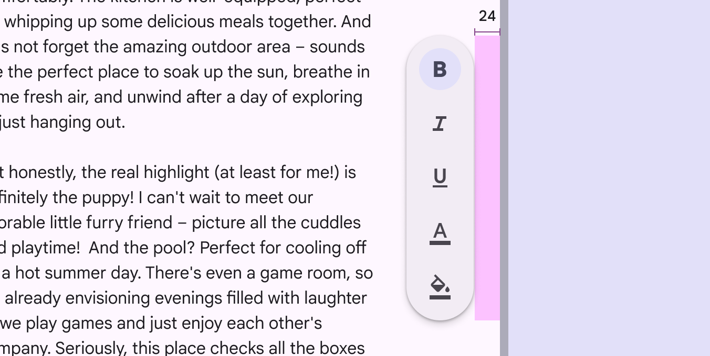

Maintain at least a 24dp margin for vertical toolbars

To keep vertical toolbars compact, don’t use wide icon buttons. Use narrow or default icon buttons instead.

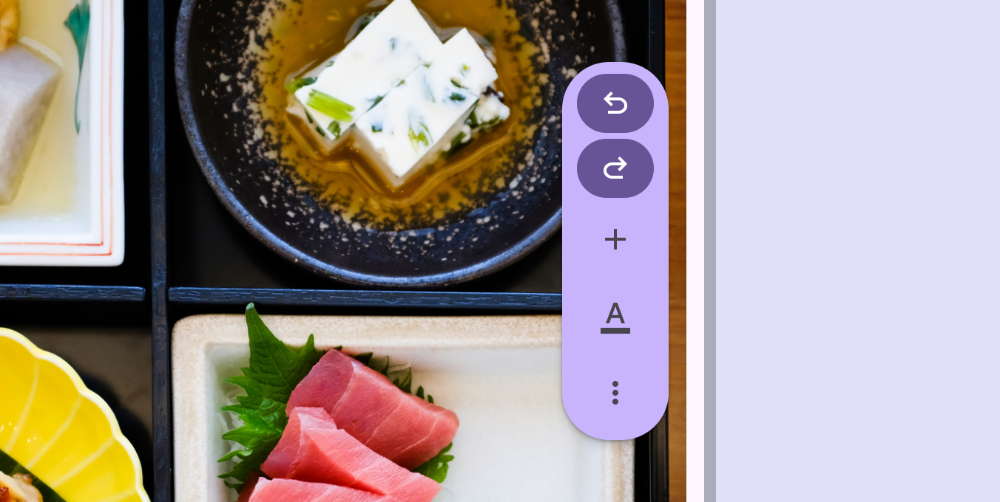

close Don’t

Using wide buttons with vertical toolbars can unnecessarily widen toolbar containers and hide other UI elements

Vertical toolbars should be positioned opposite the navigation rail [More on navigation rails](/m3/pages/navigation-rail/overview) to balance out the screen and keep actions easy to access. When showing a navigation rail and vertical floating toolbar at once, use the centered configuration of the navigation rail.

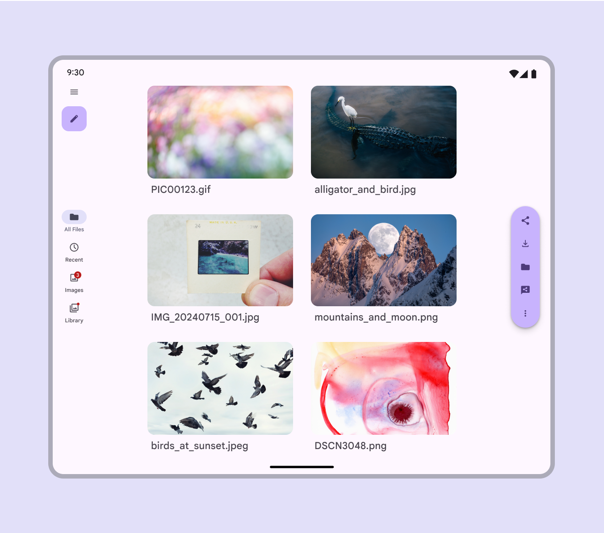

When a nav rail is visible, the floating toolbar should be vertical on the opposite edge of the window

## Adaptive design

Adaptive design allows an interface to respond or change based on context, such as the user, device, and usage. [More on adaptive design](/m3/pages/adaptive-design)

### Resizing

#### Docked

The docked toolbar should always span 100% of the screen width. In compact window sizes [More on compact window size class](/m3/pages/breakpoints/compact), elements in the toolbar should be evenly spaced. In medium window sizes [More on medium window size class](/m3/pages/breakpoints/medium) and larger, adjust the padding between controls to create a comfortable layout. This can be achieved by: 

- Centering all elements
- Customizing to center a key action, and aligning other elements to the edges

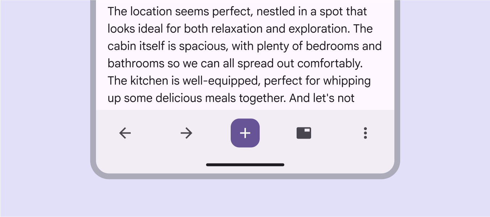

Docked toolbar items should be evenly spaced in compact windows

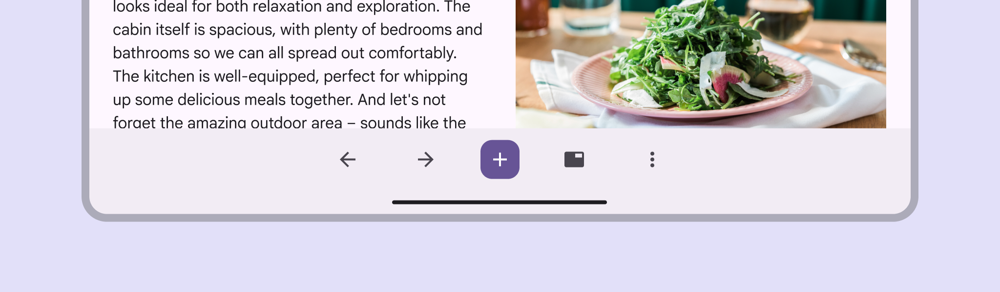

In medium window sizes and larger, create a spacious layout by centering all elements

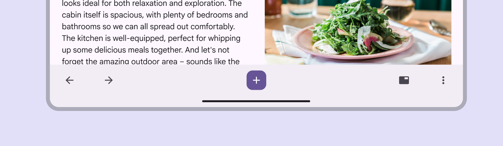

Align controls to the edge of the screen to make them easier to reach on tablets, and to better highlight a primary action in the middle

On web and large screens, the docked toolbar can be rounded. Dividers can be used to organize large amounts of items. Only shrink the height and use extra small buttons if vertical space is limited.

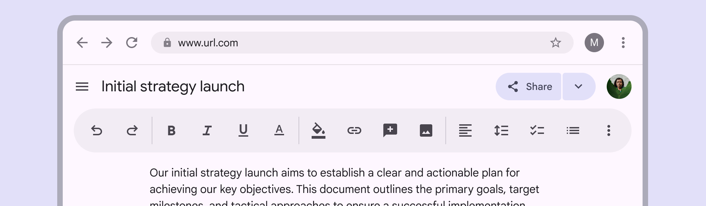

On web and other large screens, docked toolbars can be rounded and placed in different parts of the page

#### Floating

The container should only be as big as needed to hold the items inside before reaching the 16dp margin. If there’s not enough space for all items, put them in an overflow menu in the trailing slot. As the window size expands, more actions can be revealed. The floating toolbar width can also be capped to keep it smaller and hide more elements.

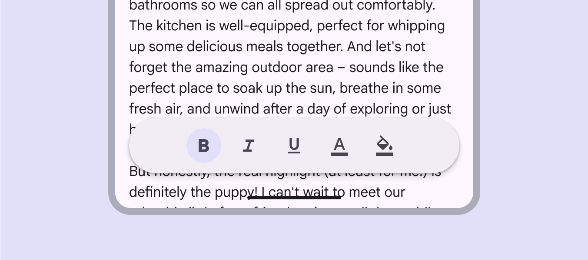

close Don’t

Don’t add extra space to a toolbar beyond its necessary items

.png?alt=media&token=415f33b0-19f9-4b55-87e1-d94689e61122)

At larger screen sizes, the container can display more controls before hitting the 16dp margin

Vertical toolbars aren’t recommended for compact windows. They take up a significant area of the screen and may feel visually overwhelming, especially on screens with complex layouts. Only use them when the screen is simple or when the toolbar has a few controls.

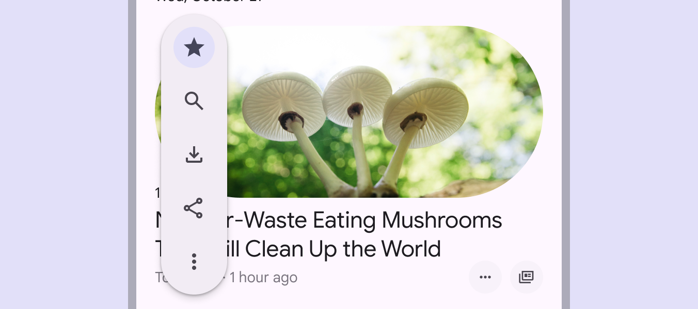

exclamation Caution

Vertical toolbars can cover important content in compact windows

### Presentation

In larger window sizes, floating toolbars can be aligned to opposite edges of the screen so they're easy to reach and group similar actions. For example, consider placing the undo and redo actions in one toolbar, and editing controls like highlight, erase, and select in another. Stylistic differences can help emphasize each toolbar’s purpose and clarify hierarchy.

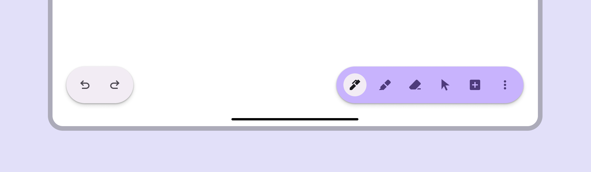

Multiple toolbars with different stylistic treatments can create hierarchy and distinguish different kinds of actions

Don’t use multiple toolbars in compact windows. There typically isn’t enough room on screen. Instead, use one toolbar for all actions.

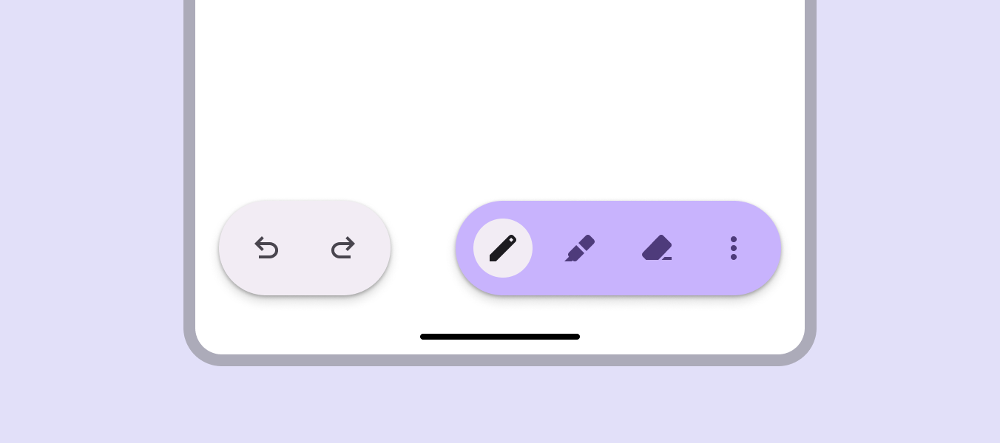

close Don’t

Avoid using multiple toolbars in smaller windows

Actions at the trailing edge of the toolbar can collapse into an overflow menu at smaller window sizes, and become visible again at larger sizes. Actions at the trailing edge collapse into an overflow menu

### Right-to-left languages

In right-to-left (RTL) languages, mirror individual items that need it, like icons and text direction. If the order of actions is important, flip the order of the actions as well.

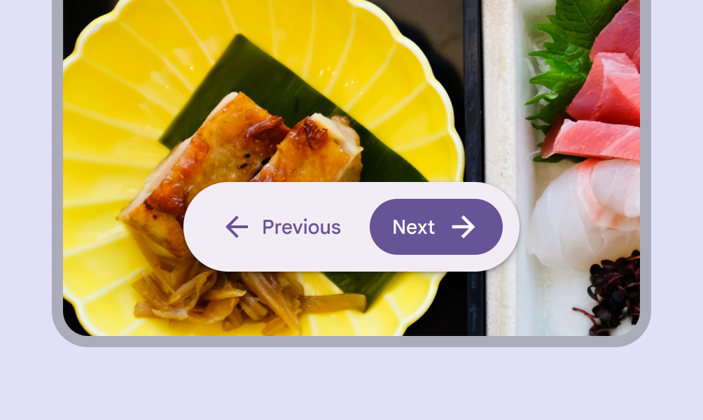

In LTR languages, the **Next** button is intentionally placed on the trailing (right) edge

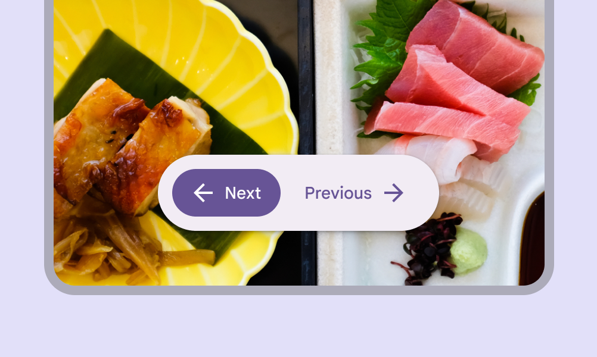

In RTL languages, reverse the order so **Next** remains on the trailing edge when flipped, now on the left. Text is not translated to illustrate mirroring.

## Behavior

### Scrolling

Docked toolbars can either remain on the screen during scroll, or animate offscreen. Docked toolbars can animate offscreen

Floating toolbars can remain on the screen, animate offscreen, or collapse into a single, high-emphasis action on scroll. Floating toolbars can animate off screen

On Jetpack Compose, the floating toolbar can collapse to a FAB or key action on scroll. Floating toolbars can be customized to do other actions on scroll, like collapse into a single action

Don't collapse actions and scroll at the same time.

close Don’t

Toolbars shouldn't both collapse and transition off page

