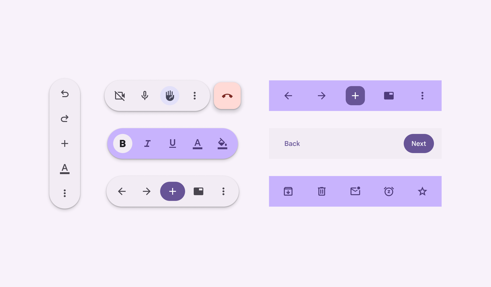
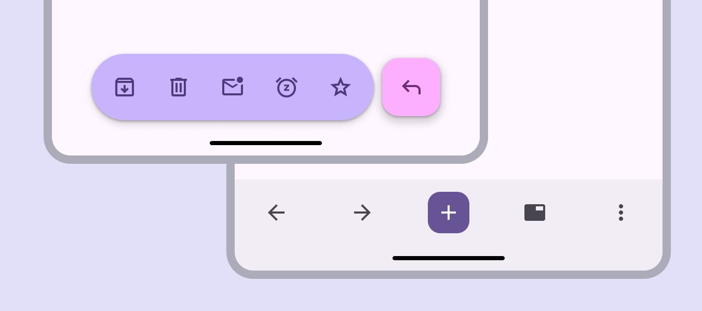
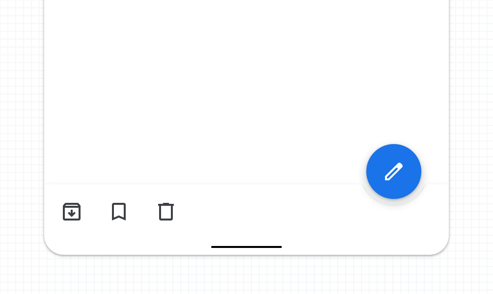
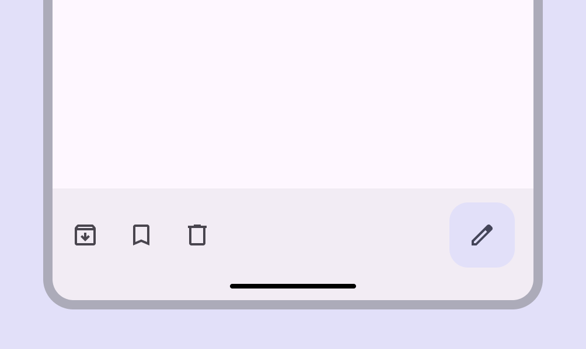

# Toolbars

Toolbars display frequently used actions relevant to the current page

- Two expressive variants: **docked toolbar** and **floating toolbar**
- Use the vibrant color style for greater emphasis
- Can display a wide variety of control types, like buttons, icon buttons, and text fields
- Can be paired with FABs to emphasize certain actions
- Don’t show at the same time as a navigation bar

Configurations of floating toolbars

## Availability & resources

| Type | Resource | Status |
| --- | --- | --- |
| Design | [Design Kit (Figma)](https://www.figma.com/community/file/1035203688168086460) | Available |
| Implementation | [Jetpack Compose - Bottom app bar](https://developer.android.com/develop/ui/compose/components/app-bars#bottom) | Available |
| Implementation | [Jetpack Compose: Expressive - Docked toolbar](https://developer.android.com/reference/kotlin/androidx/compose/material3/FlexibleBottomAppBar.composable) | Available |
| Implementation | [Jetpack Compose: Expressive - Floating toolbar](https://developer.android.com/reference/kotlin/androidx/compose/material3/HorizontalFloatingToolbar.composable) | Available |
| Implementation |  | Available |
| Implementation |  | Available |
| Implementation |  | Available |
| Implementation |  | Available |

## M3 Expressive update

The **bottom app bar** is no longer recommended and should be replaced with the **docked toolbar**, which functions similarly, but is shorter and has more flexibility. The **floating toolbar** was created for more versatility, greater amounts of actions, and more variety in where it's placed. [More on GM3 Expressive](https://m3.material.io/blog/building-with-m3-expressive)

Variants and naming:

- Added **docked toolbar** to replace **bottom app bar**

    - Size: Shorter height
    - Color: Standard or vibrant
    - Flexibility: More layout and element options
- Added **floating toolbar** with the following configurations:

    - Layout: Horizontal or vertical
    - Color: Standard or vibrant
    - Flexibility: Can hold many elements and components. Can be paired with FAB.
- **Bottom app bar** is still available, but not recommended

1. Floating, vibrant color scheme and paired with FAB
2. Docked with embedded primary action instead of FAB

## Differences from M2

- Color: New color mappings and compatibility with dynamic color
- Elevation: No shadow
- Layout: Container height is taller and the FAB is now contained within the app bar container

M2: Bottom app bar had higher elevation of 8dp and didn't contain the FAB

M3: Bottom app bar has new colors, a taller container, no elevation or shadow, and contains the FAB

