# Toolbars

Toolbars display frequently used actions relevant to the current page

## Variants

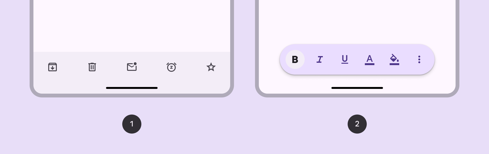

1. Docked toolbar
2. Floating toolbar

### Baseline variant

The baseline bottom app bar is no longer recommended. It should be replaced with the docked toolbar, which is very similar and more flexible.

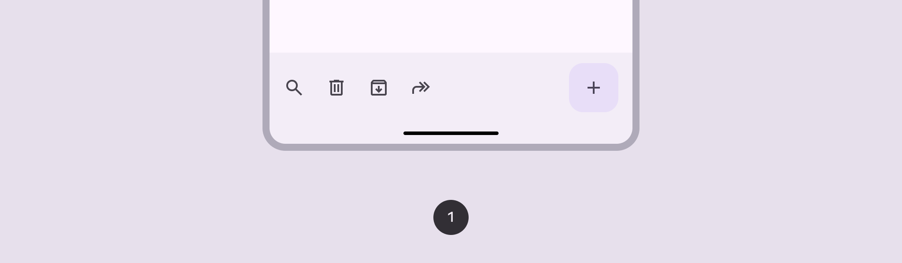

1. Bottom app bar (not recommended)

|
Variant

 |

M3

 |

M3 Expressive

 |
| --- | --- | --- |
|

Docked toolbar

 |

\--

 |

Available

 |
|

Floating toolbar

 |

\--

 |

Available

 |
|

Bottom app bar

 |

Available

 |

Not recommended. Use **docked toolbar**.

 |

star

Note:

Implementation differs per platform. On Jetpack Compose, the floating toolbar is a separate component from the docked toolbar and bottom app bar.

## Configurations

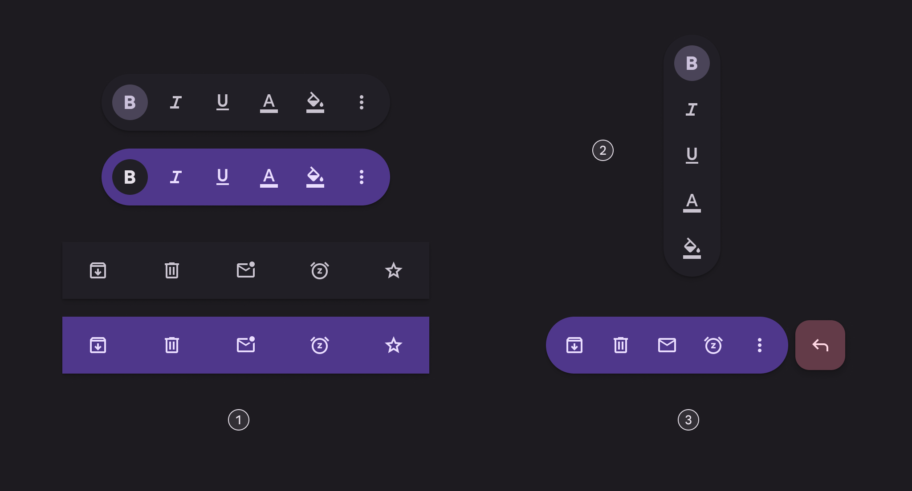

1. Standard and vibrant toolbars
2. Vertical floating toolbar
3. Floating toolbar with FAB

|
Category

 |

Configuration

 |

M3

 |

M3 Expressive

 |
| --- | --- | --- | --- |
|

Color

 |

Standard (default)

 |

Available as bottom app bar

 |

Available

 |
|

Vibrant

 |

\--

 |

Available

 |
|

Floating toolbar layout

 |

Horizontal (default)

 |

\--

 |

Available

 |
|

Vertical

 |

\--

 |

Available

 |
|

Other elements

 |

With FAB

 |

Available as bottom app bar

 |

Available\*

 |

star

Note:

\*Implementation differs per platform. On Jetpack Compose, floating toolbar with FAB is [fully supported](https://developer.android.com/reference/kotlin/androidx/compose/material3/package-summary#HorizontalFloatingToolbar\(kotlin.Boolean,androidx.compose.ui.Modifier,androidx.compose.material3.FloatingToolbarColors,androidx.compose.foundation.layout.PaddingValues,androidx.compose.material3.FloatingToolbarScrollBehavior,androidx.compose.ui.graphics.Shape,kotlin.Function1,kotlin.Function1,androidx.compose.ui.unit.Dp,androidx.compose.ui.unit.Dp,kotlin.Function1\)). On other platforms, each component needs to be added separately. 

## Tokens & specs

Browse the component elements, attributes, tokens, and their values. [Jump to baseline bottom app bar specs](/m3/pages/toolbars/specs#ad142675-3e3b-43b8-ba53-12c1f0b7138d)

```
Toolbar - Color - Standard
```

```
Toolbar - Color - Standard
```

```
Toolbar - Color - Standard
```

```
Toolbar - Color - Standard
```

Toolbar - Color - Standard

Token

Default, Light

Enabled

Disabled

Hovered

Focused

Pressed

## Anatomy

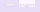

1. Container
2. Placed components

### Flexibility & slots

When configuring a toolbar, think of it as a container with several slots. Each slot can be a different element. The most common elements are icon buttons [More on icon buttons](/m3/pages/icon-buttons/specs), buttons [More on buttons](/m3/pages/common-buttons/specs), and text fields [More on text fields](/m3/pages/text-fields/overview).

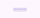

A toolbar is essentially a container with configurable slots

## Color

Color values are implemented through design tokens. For design, this means working with color values that correspond with tokens. For implementation, a color value will be a token that references a value. [Learn more about design tokens](/m3/pages/design-tokens/overview)

### Standard

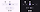

Standard color schemes and icon button types:

1. Surface container
2. Filled button (Primary, On primary)
3. Toggle tonal button (Secondary container, On secondary container)
4. Standard button (Primary)

### Vibrant

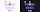

Vibrant color scheme and icon button types:

1. Primary container
2. Filled button (Primary, On primary)
3. Toggle tonal button: (Surface container, On surface)
4. Standard button (On primary container)

## Measurements

By default all toolbars are 64dp high, center-aligned, have equal padding between items, and have a minimum outside padding of 16dp.

### Docked toolbar

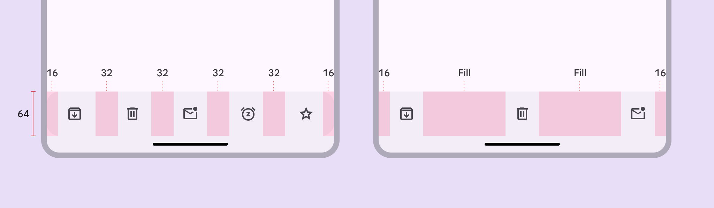

1. Default margins and padding
2. Margins and padding with leading, middle, and trailing content

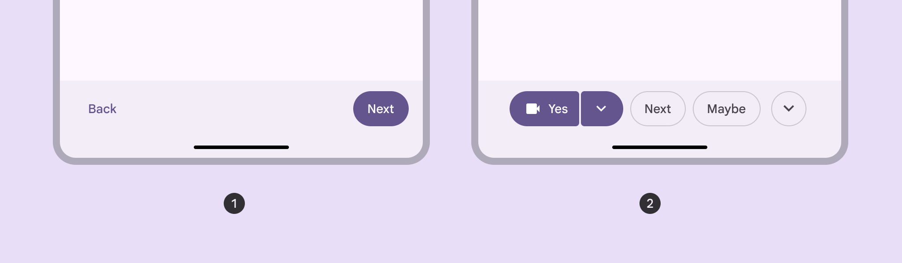

Alignment and padding can be configured to create unique layouts:

1. Left and right alignment
2. Center-aligned, 8dp padding between items

### Floating toolbar

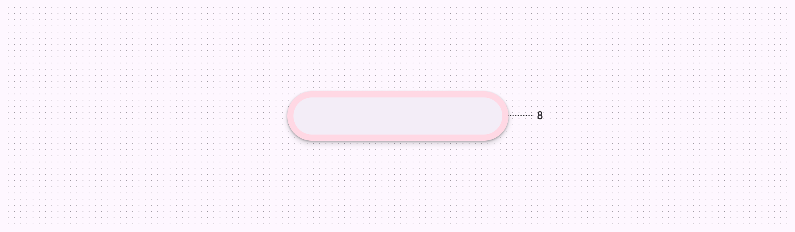

Default padding of floating toolbar

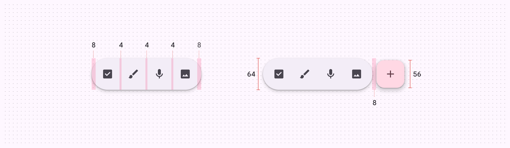

Floating toolbar size and padding measurements

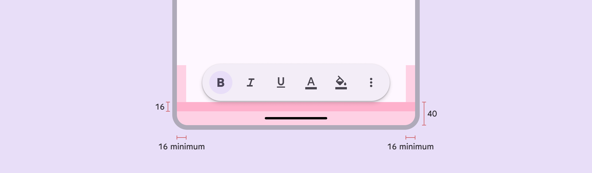

Floating toolbar margins

* * *

## Bottom app bar (baseline)

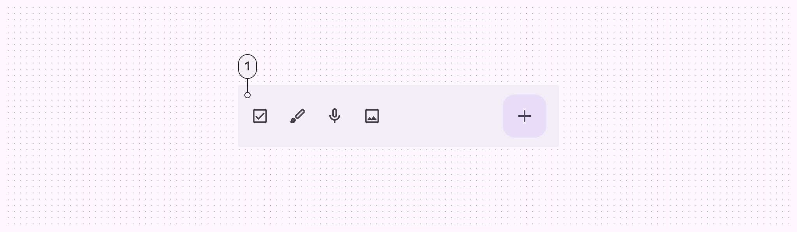

1. Container

### Tokens & specs

Bottom app bar tokens are in one token set. Bottom app bar (baseline)

Token

Value

Enabled

### Color

Color values are implemented through design tokens. For designers, this means working with color values that correspond with tokens. In implementation, a color value will be a token that references a value. [Learn more about design tokens](/m3/pages/design-tokens/overview)

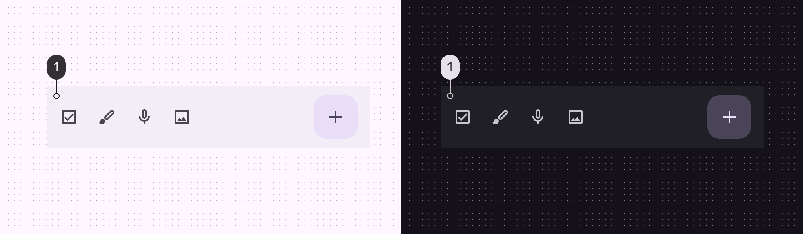

Bottom app bar color role used for light and dark themes:

1. Surface container

### Measurements

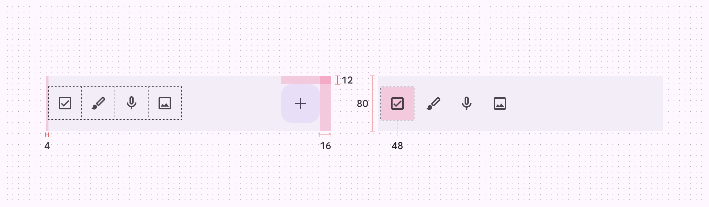

Bottom app bar padding and size measurements

### Common layouts

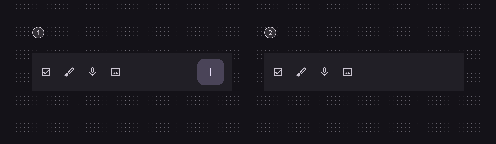

1. Icon buttons and FAB
2. Icon buttons and no FAB

