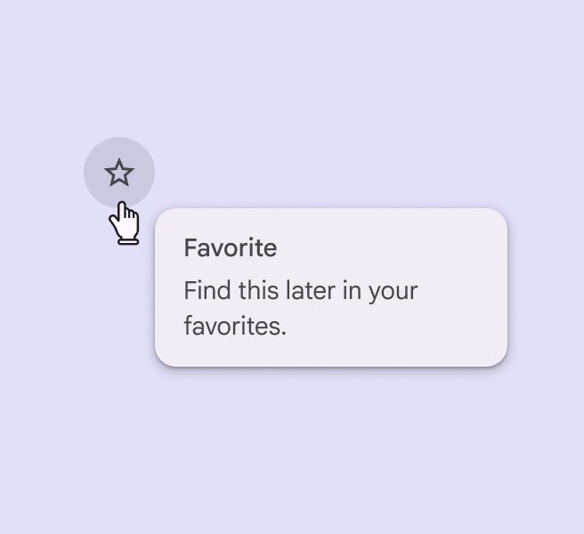
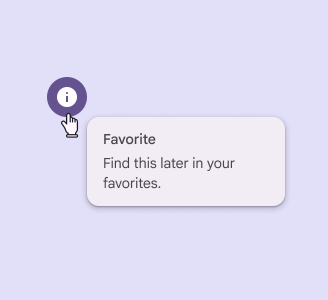
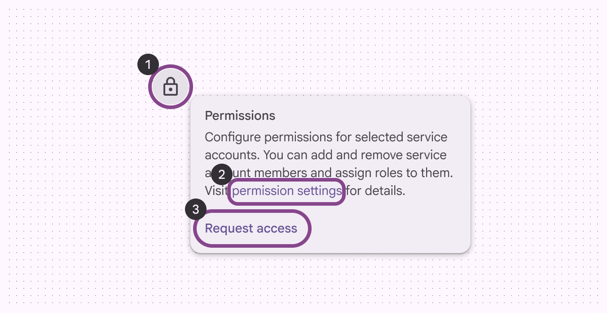
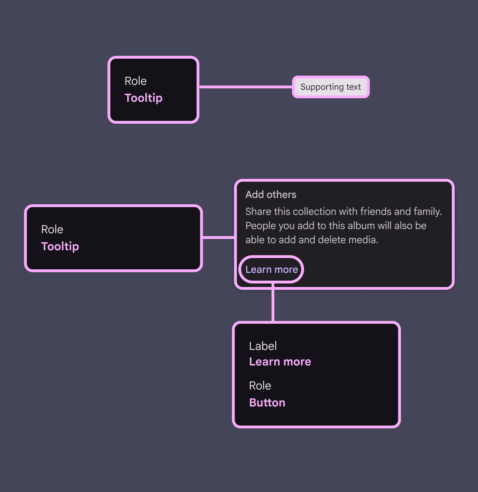

# Tooltips

Tooltips display brief labels or messages

## Use cases

People should be able to do the following using assistive technology:

- Receive a tooltip message
- Activate a tooltip with a keyboard or switch input

## Interaction & style

Plain and rich tooltips without required actions should remain on screen long enough for people to receive the information without disrupting their existing flow or task.

check Do

Plain tooltips should remain on the screen temporarily after the cursor moves away

Tooltips can appear when an actionable element, like a button or navigation rail, is hovered or focused. However, this tooltip shouldn’t hide crucial information. Rich tooltips can also appear by selecting an element instead of hovering or focusing on it.

Tooltips can appear on hover or focus to explain actions

Rich tooltips can appear when an element is selected

## Focus order

Tooltip containers should not block important information or prevent a person from completing an action. Focus order within the rich tooltip moves top to bottom between interactive elements. Avoid trapping screen reader and keyboard focus on rich tooltips. People should be able to move linearly through the rest of the page.

1. Parent element
2. Inline link
3. Text button

## Keyboard navigation

|
**Keys**

 |

**Actions**

 |
| --- | --- |
|

**Tab**

 |

Focus lands on button, if available

 |
|

**Space** or **Enter**

 |

Activates the focused element

 |

## Labeling elements

Tooltips should have the **Tooltip** role, or similar. Label all elements in the tooltip according to their own accessibility guidance.

The tooltip container should have the **Tooltip** role

