# Tooltips

Tooltips display brief labels or messages

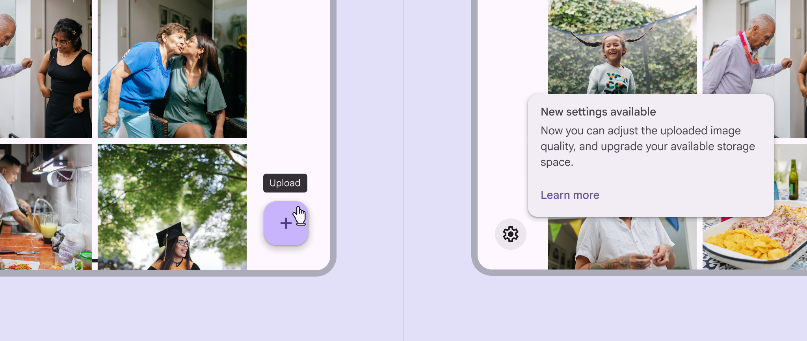

Plain and rich tooltips serve different purposes

## Usage

A tooltip provides additional context for a UI element. 

**Plain tooltips**
Plain tooltips briefly describe a UI element. They're best used for labelling UI elements with no text, like icon-only buttons [More on buttons](/m3/pages/common-buttons/overview) and fields.

**Rich tooltips**
Rich tooltips provide additional context about a UI element. They can optionally contain a subhead, buttons, and hyperlinks. Rich tooltips are best used for longer text like definitions or explanations.

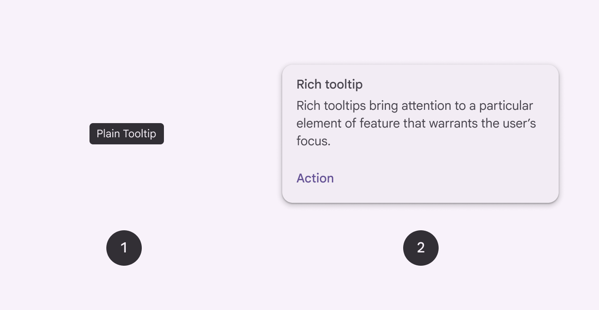

1. Plain tooltip
2. Rich tooltip

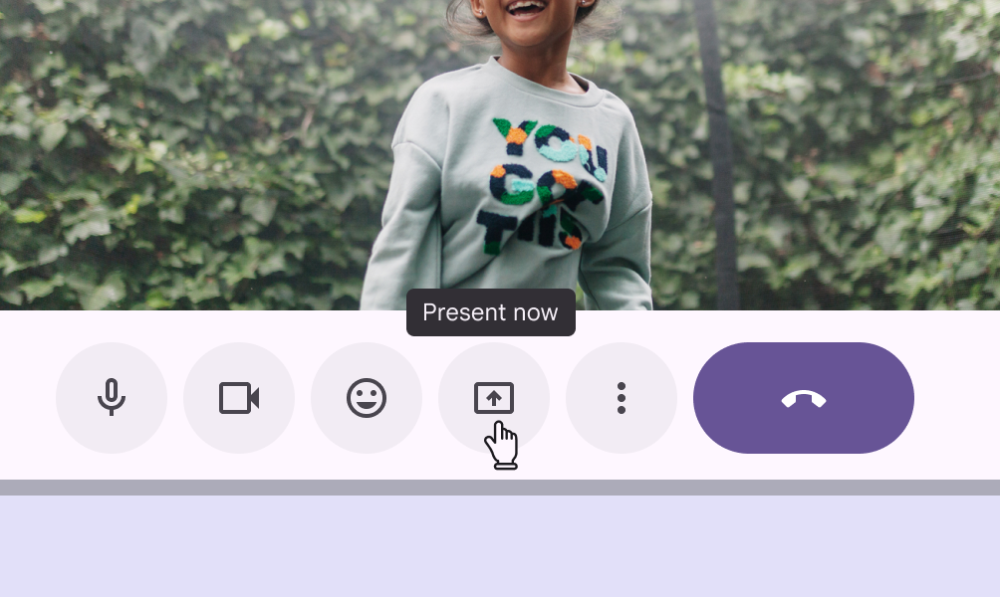

check Do

Use plain tooltips to label icon-only buttons

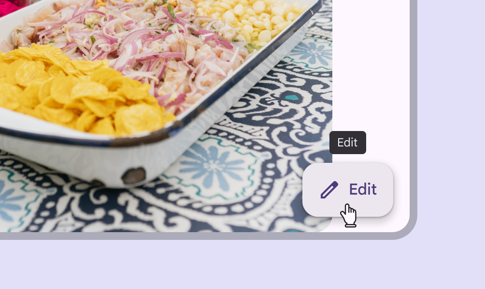

close Don’t

Plain tooltips aren't needed when the UI element already has label text

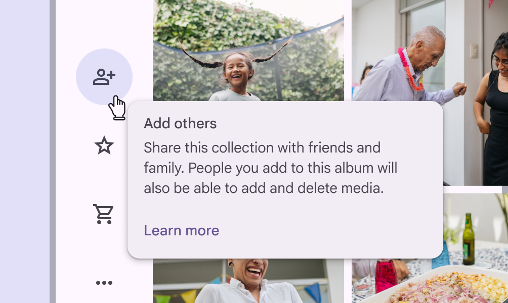

check Do

Use rich tooltips to provide extra information and actions about a UI element or new feature

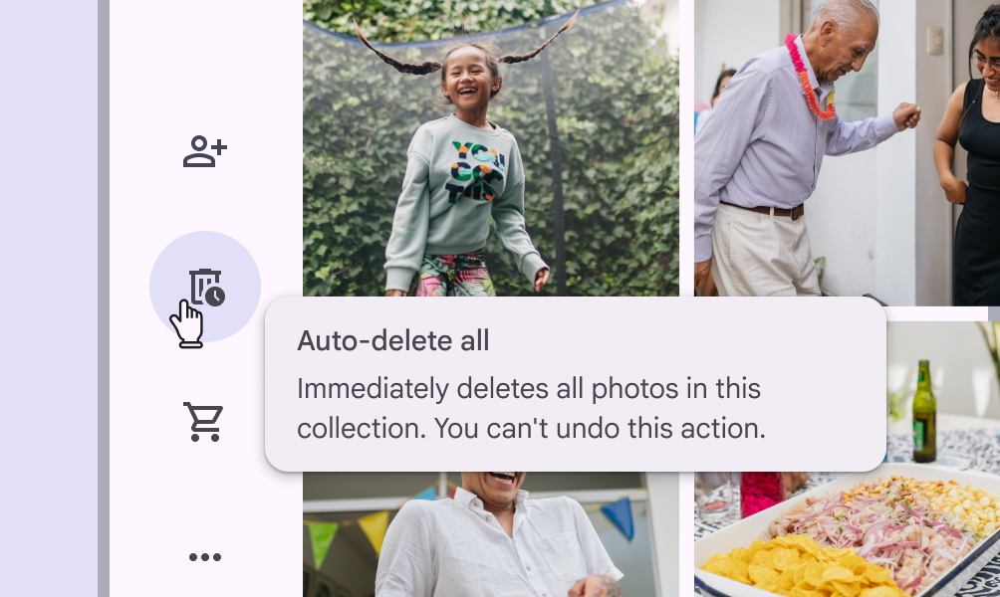

close Don’t

Don't hide critical information within tooltips as it’s easy to miss. Use an interruptive dialog instead.

## Anatomy

### Plain tooltip

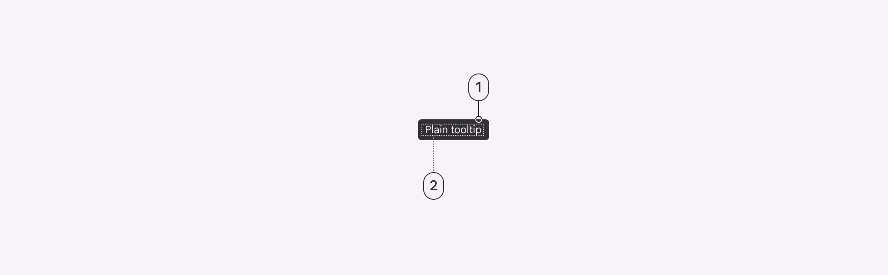

1. Container
2. Supporting text

### Supporting text

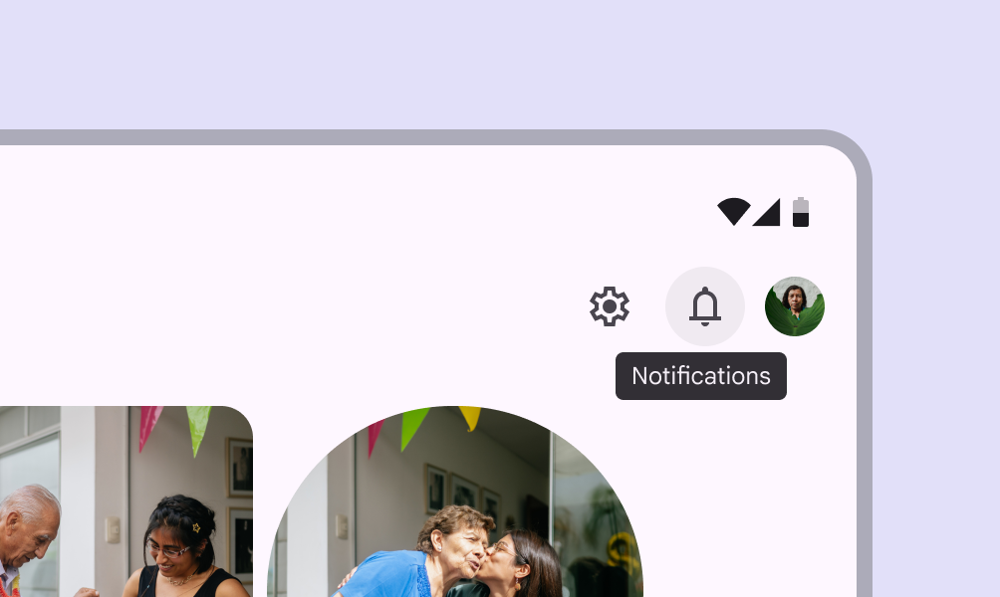

check Do

Briefly describe a UI element

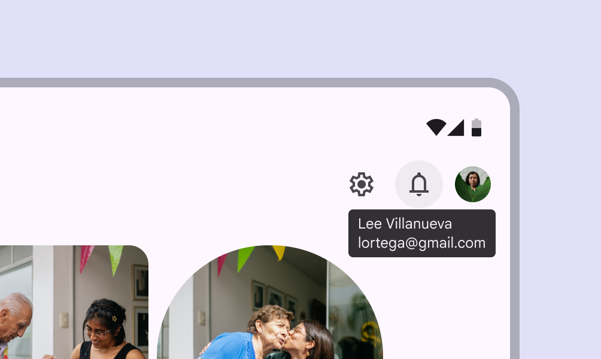

exclamation Caution

Avoid wrapping text to multiple lines or including many pieces of information

### Rich tooltip

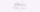

1. Subhead (optional)
2. Container
3. Supporting text
4. Text button (optional)

### Subhead (optional)

Keep subheads brief, ideally to one line. They should summarize or describe the message of the rich tooltip . Subheads are important to include when the rich tooltip appears automatically, like when the page loads.

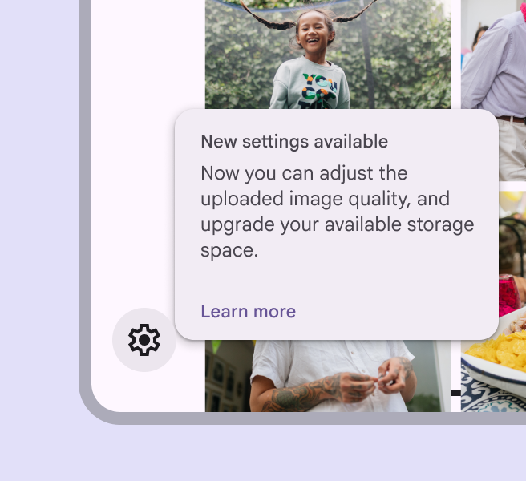

check Do

Summarize the message in a few words

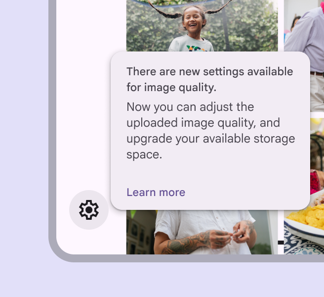

close Don’t

Avoid wrapping to more than one line

### Text buttons (optional)

Rich tooltips can have up to two text buttons [More on buttons](/m3/pages/common-buttons/overview). These should be brief and relevant to the message in the supporting text. Keep buttons short so they can be side by side. Avoid stacking them when possible.

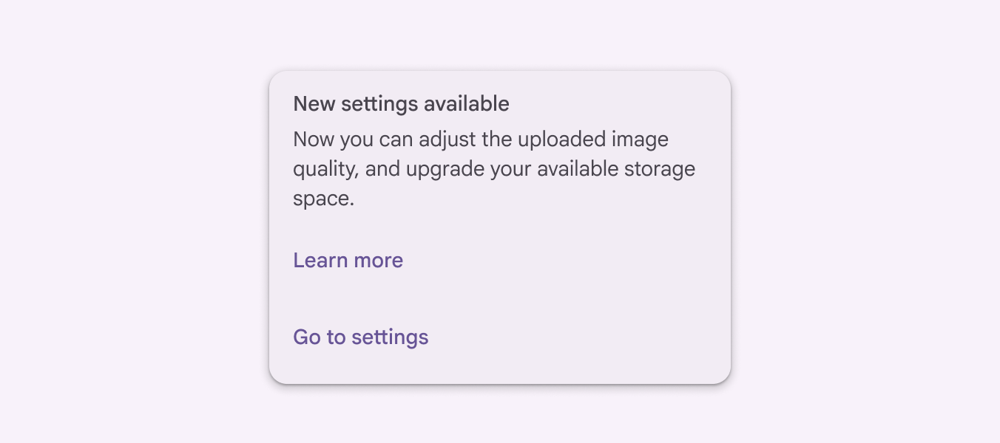

exclamation Caution

Avoid stacking buttons

## Placement

### Plain tooltips

By default, plain tooltips are positioned directly above the parent element. 

- If there's a visual boundary, like a button, the distance is 4dp
- If there's no visual boundary, like with text baselines, the distance is 8dp

If the element is in an app bar [More on app bars](/m3/pages/app-bars/overview), the plain tooltip appears below the element at the same distance.

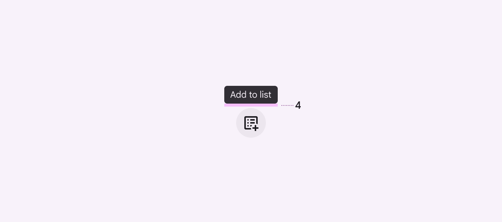

Plain tooltip with a 4dp distance between the target and tooltip

### Rich tooltips

By default, rich tooltips are positioned to the bottom right of the parent element. They adjust position to avoid going off screen. Tooltips shouldn't cover the parent element. 

**Dynamic positioning**
The position of the tooltip adjusts in increments of 8dp to avoid going off-screen.

**Desktop placement**
On desktop, tooltips may appear centered below the parent element and remain visible while moving within the target region.

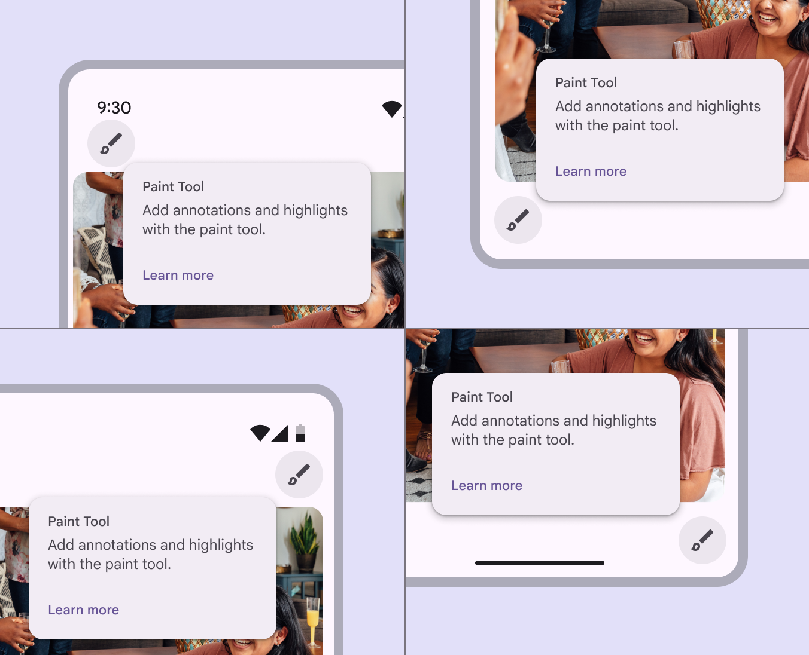

Four different rich tooltip locations based on dynamic positioning

## Behavior

To show a tooltip, hover [More on hover state](/m3/pages/interaction-states/applying-states#71c347c2-dd75-485b-892e-04d2900bd844) on the parent element on desktop, or tap and hold the element on mobile. Persistent rich tooltips only appear when clicked or tapped.

### Transient by default

Both plain and rich tooltips disappear 1.5 seconds after navigating away from the target region. Triggering a new tooltip immediately closes any other open tooltip. Tooltips disappear after a 1.5 second delay when no other element is hovered

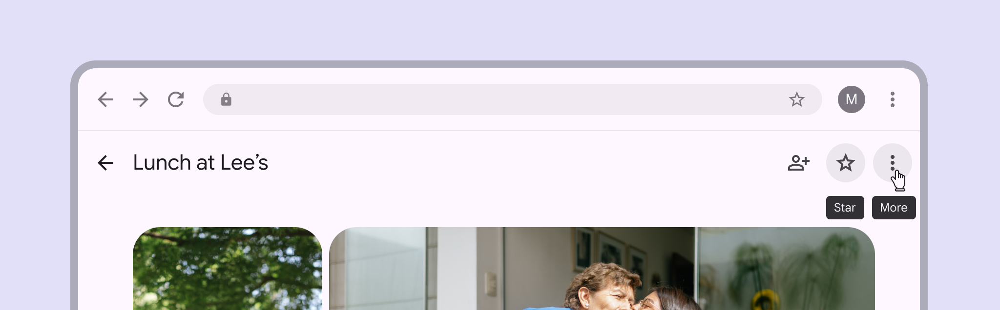

close Don’t

Only display one tooltip at a time

### Persistent rich tooltips

Persistent rich tooltips appear when either:

- The parent element is clicked
- The page loads and a new feature is being explained

Persistent rich tooltips remain active even when leaving the target region. They only disappear once a person interacts with another UI element. Hovering doesn't trigger the tooltip. When appearing on page load, the tooltip can introduce and explain new features on various parent elements. Avoid using persistent rich tooltips on icon buttons.

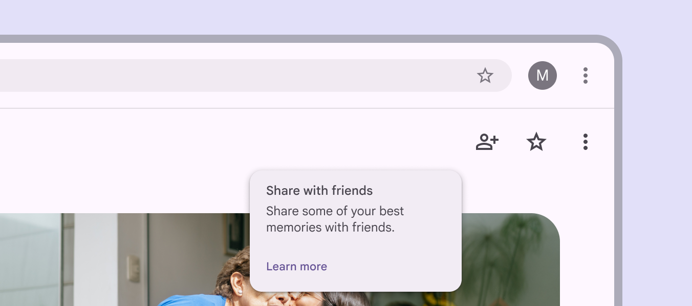

close Don’t

Don’t use a persistent rich tooltip on icon buttons

