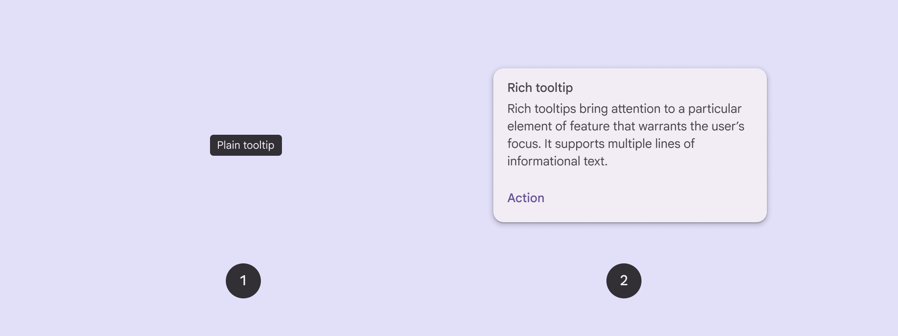
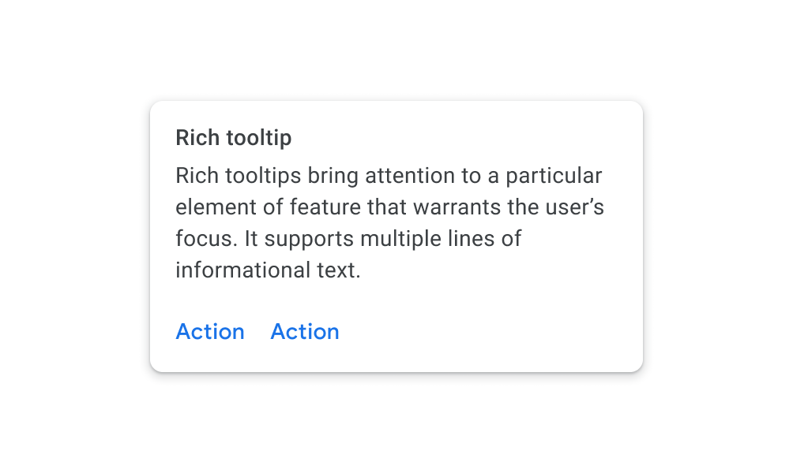
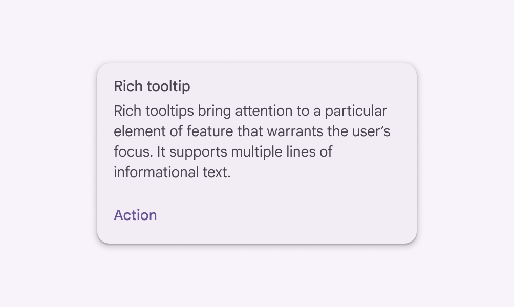

# Tooltips

Tooltips display brief labels or messages

- Use tooltips to add additional context to a button [More on buttons](/m3/pages/common-buttons/overview) or other UI element
- Two variants: plain and rich
- Use plain tooltips to describe elements or actions of icon buttons [More on icon buttons](/m3/pages/icon-buttons/overview)
- Use rich tooltips to provide more details, like describing the value of a feature
- Rich tooltips can include an optional title, link, and buttons

1. Plain tooltip
2. Rich tooltip

## Availability & resources

| Type | Resource | Status |
| --- | --- | --- |
| Design | [Design Kit (Figma)](https://www.figma.com/community/file/1035203688168086460) | Available |
| Implementation | [Jetpack Compose](https://developer.android.com/develop/ui/compose/components/tooltip) | Available |

## Differences from M2

- **Color**: New color mappings and compatibility with dynamic color [More on dynamic color](/m3/pages/dynamic/choosing-a-source)
- **Shape**: Rich tooltips have more rounded corners

M2: Rich tooltips have slightly rounded corners

M3: Rich tooltips have more rounded corners and support dynamic color

