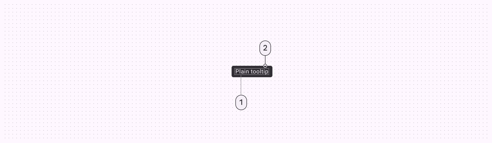
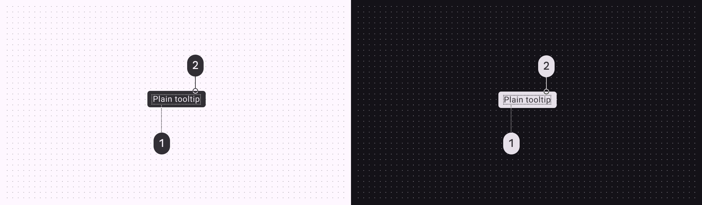
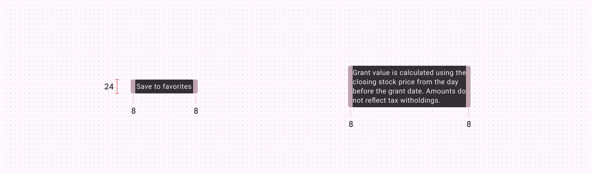
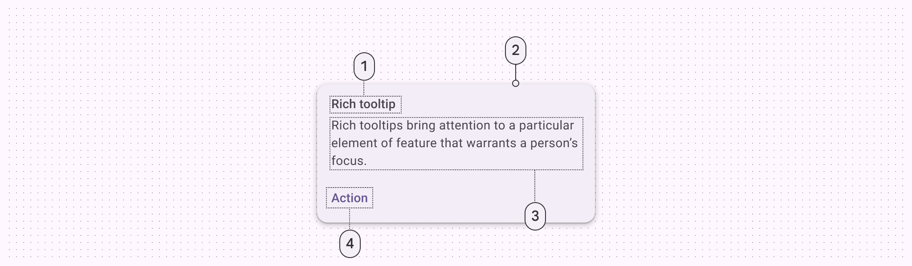
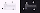
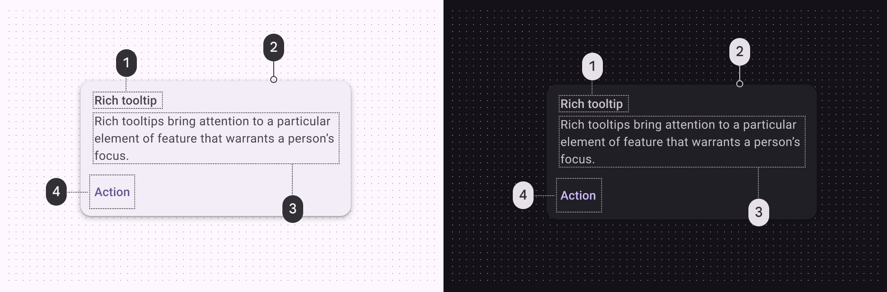
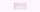
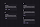

# Tooltips

Tooltips display brief labels or messages

## Tokens & specs

Select a component variant below to see its attributes, tokens, and values.

```
Tooltip - Plain
```

```
Tooltip - Plain
```

```
Tooltip - Plain
```

```
Tooltip - Plain
```

Tooltip - Plain

Token

Default, Light

Enabled

## Plain tooltip



1. Supporting text
2. Container

### Plain tooltip colors

Color values are implemented through design tokens [More on tokens](/m3/pages/design-tokens/overview). For design, this means working with color values that correspond with tokens. For implementation, a color value will be a token that references a value. [Learn more about design tokens](/m3/pages/design-tokens/overview)



Plain tooltip color roles used for light and dark themes:

1. Inverse on surface
2. Inverse surface

### Plain tooltip measurements



Plain tooltip padding and size measurements

|
Attribute

 |

Value

 |
| --- | --- |
|

Container height

 |

24dp

 |
|

Padding

 |

8dp

 |

## Rich tooltip



1. Subhead
2. Container
3. Supporting text
4. Text button

### Rich tooltip colors

Color values are implemented through design tokens [More on tokens](/m3/pages/design-tokens/overview). For design, this means working with color values that correspond with tokens. For implementation, a color value will be a token that references a value. [Learn more about design tokens](/m3/pages/design-tokens/overview)



Rich tooltip color roles used for light and dark themes:

1. On surface variant
2. Surface container
3. On surface variant
4. Primary

### Rich tooltip measurements



Rich tooltip padding and size measurements

| Attribute | Value |
| --- | --- |
| Top padding | 12dp |
| Bottom padding | 8dp |
| Left and right padding | 16dp |

### Rich tooltip configurations

Rich tooltips can have a headline, body, and up to two buttons [More on buttons](/m3/pages/common-buttons/overview). The headline and number of buttons can be configured.



1. Subhead, supporting text, and two buttons
2. Subhead, supporting text, and one button
3. Subhead and supporting text
4. Supporting text and one button
5. Supporting text and two buttons

